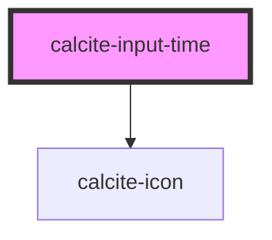

# calcite-input-time

<!-- Auto Generated Below -->

## Usage

### Basic

```html
<calcite-input-time lang="en" name="light" step="1" value="12:21"></calcite-input-time>
```

## Properties

| Property       | Attribute       | Description                                                                        | Type                | Default         |
| -------------- | --------------- | ---------------------------------------------------------------------------------- | ------------------- | --------------- |
| `disabled`     | `disabled`      | The disabled state of the time input                                               | `boolean`           | `false`         |
| `iconFlipRtl`  | `icon-flip-rtl` | When true, the icon is flipped in RTL.                                             | `boolean`           | `false`         |
| `intlHour`     | `intl-hour`     | aria-label for the hour input                                                      | `string`            | `TEXT.hour`     |
| `intlMeridiem` | `intl-meridiem` | aria-label for the meridiem (am/pm) input                                          | `string`            | `TEXT.meridiem` |
| `intlMinute`   | `intl-minute`   | aria-label for the minute input                                                    | `string`            | `TEXT.minute`   |
| `intlSecond`   | `intl-second`   | aria-label for the second input                                                    | `string`            | `TEXT.second`   |
| `name`         | `name`          | The name of the time input                                                         | `string`            | `undefined`     |
| `readOnly`     | `read-only`     | When true, still focusable but controls are gone and the value cannot be modified. | `boolean`           | `false`         |
| `scale`        | `scale`         | The scale (size) of the time input                                                 | `"l" \| "m" \| "s"` | `"m"`           |
| `step`         | `step`          | number (seconds) that specifies the granularity that the value must adhere to      | `number`            | `60`            |
| `value`        | `value`         | The selected time in UTC (always 24-hour format)                                   | `string`            | `null`          |

## Methods

### `setFocus(target?: TimePart) => Promise<void>`

Sets focus on the component.

#### Returns

Type: `Promise<void>`

## Dependencies

### Depends on

- [calcite-icon](../icon)

### Graph



---

_Built with [StencilJS](https://stenciljs.com/)_
