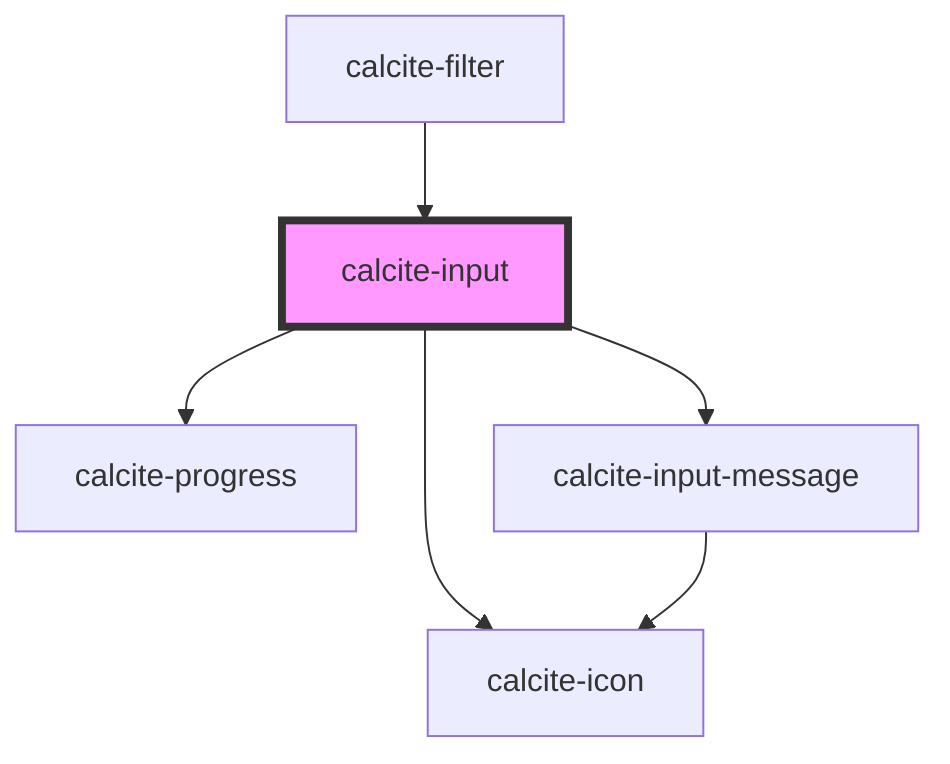

# calcite-input

For comprehensive guidance on using and implementing `calcite-input`, refer to the [documentation page](https://developers.arcgis.com/calcite-design-system/components/input/).

<!-- Auto Generated Below -->

## Properties

| Property            | Attribute            | Description                                                                                                                                                                                                               | Type                                                                                                                                                                                                                                                | Default                                                                                                                                                                                                                                                                     |
| ------------------- | -------------------- | ------------------------------------------------------------------------------------------------------------------------------------------------------------------------------------------------------------------------- | --------------------------------------------------------------------------------------------------------------------------------------------------------------------------------------------------------------------------------------------------- | --------------------------------------------------------------------------------------------------------------------------------------------------------------------------------------------------------------------------------------------------------------------------- |
| `accept`            | `accept`             | Specifies a comma separated list of unique file type specifiers for limiting accepted file types. This property only has an effect when `type` is "file". Read the native attribute's documentation on MDN for more info. | `string`                                                                                                                                                                                                                                            | `undefined`                                                                                                                                                                                                                                                                 |
| `alignment`         | `alignment`          | Specifies the text alignment of the component's value.                                                                                                                                                                    | `"end" \| "start"`                                                                                                                                                                                                                                  | `"start"`                                                                                                                                                                                                                                                                   |
| `autocomplete`      | `autocomplete`       | Specifies the type of content to autocomplete, for use in forms. Read the native attribute's documentation on MDN for more info.                                                                                          | `string`                                                                                                                                                                                                                                            | `undefined`                                                                                                                                                                                                                                                                 |
| `autofocus`         | `autofocus`          | Adds global prop, missing from Stencil's `HTMLElement` type, see <https://github.com/ionic-team/stencil/issues/5726>                                                                                                      | `boolean`                                                                                                                                                                                                                                           | `undefined`                                                                                                                                                                                                                                                                 |
| `clearable`         | `clearable`          | When `true`, a clear button is displayed when the component has a value. The clear button shows by default for `"search"`, `"time"`, and `"date"` types, and will not display for the `"textarea"` type.                  | `boolean`                                                                                                                                                                                                                                           | `false`                                                                                                                                                                                                                                                                     |
| `disabled`          | `disabled`           | When `true`, interaction is prevented and the component is displayed with lower opacity.                                                                                                                                  | `boolean`                                                                                                                                                                                                                                           | `false`                                                                                                                                                                                                                                                                     |
| `files`             | --                   | When `type` is `"file"`, specifies the component's selected files.                                                                                                                                                        | `FileList`                                                                                                                                                                                                                                          | `undefined`                                                                                                                                                                                                                                                                 |
| `form`              | `form`               | The `id` of the form that will be associated with the component. When not set, the component will be associated with its ancestor form element, if any.                                                                   | `string`                                                                                                                                                                                                                                            | `undefined`                                                                                                                                                                                                                                                                 |
| `groupSeparator`    | `group-separator`    | When `true`, number values are displayed with a group separator corresponding to the language and country format.                                                                                                         | `boolean`                                                                                                                                                                                                                                           | `false`                                                                                                                                                                                                                                                                     |
| `icon`              | `icon`               | When `true`, shows a default recommended icon. Alternatively, pass a Calcite UI Icon name to display a specific icon.                                                                                                     | `boolean \| IconName`                                                                                                                                                                                                                               | `undefined`                                                                                                                                                                                                                                                                 |
| `iconFlipRtl`       | `icon-flip-rtl`      | When `true`, the icon will be flipped when the element direction is right-to-left (`"rtl"`).                                                                                                                              | `boolean`                                                                                                                                                                                                                                           | `false`                                                                                                                                                                                                                                                                     |
| `label`             | `label`              | Accessible name for the component.                                                                                                                                                                                        | `string`                                                                                                                                                                                                                                            | `undefined`                                                                                                                                                                                                                                                                 |
| `loading`           | `loading`            | When `true`, a busy indicator is displayed.                                                                                                                                                                               | `boolean`                                                                                                                                                                                                                                           | `false`                                                                                                                                                                                                                                                                     |
| `max`               | `max`                | Specifies the maximum value for type "number".                                                                                                                                                                            | `number`                                                                                                                                                                                                                                            | `undefined`                                                                                                                                                                                                                                                                 |
| `maxLength`         | `max-length`         | Specifies the maximum length of text for the component's value.                                                                                                                                                           | `number`                                                                                                                                                                                                                                            | `undefined`                                                                                                                                                                                                                                                                 |
| `messageOverrides`  | `message-overrides`  | Use this property to override individual strings used by the component.                                                                                                                                                   | `InputMessages`                                                                                                                                                                                                                                     | `undefined`                                                                                                                                                                                                                                                                 |
| `min`               | `min`                | Specifies the minimum value for `type="number"`.                                                                                                                                                                          | `number`                                                                                                                                                                                                                                            | `undefined`                                                                                                                                                                                                                                                                 |
| `minLength`         | `min-length`         | Specifies the minimum length of text for the component's value.                                                                                                                                                           | `number`                                                                                                                                                                                                                                            | `undefined`                                                                                                                                                                                                                                                                 |
| `multiple`          | `multiple`           | When `true`, the component can accept more than one value. This property only has an effect when `type` is "email" or "file". Read the native attribute's documentation on MDN for more info.                             | `boolean`                                                                                                                                                                                                                                           | `false`                                                                                                                                                                                                                                                                     |
| `name`              | `name`               | Specifies the name of the component. Required to pass the component's `value` on form submission.                                                                                                                         | `string`                                                                                                                                                                                                                                            | `undefined`                                                                                                                                                                                                                                                                 |
| `numberButtonType`  | `number-button-type` | Specifies the placement of the buttons for `type="number"`.                                                                                                                                                               | `"horizontal" \| "none" \| "vertical"`                                                                                                                                                                                                              | `"vertical"`                                                                                                                                                                                                                                                                |
| `numberingSystem`   | `numbering-system`   | Specifies the Unicode numeral system used by the component for localization.                                                                                                                                              | `"arab" \| "arabext" \| "latn"`                                                                                                                                                                                                                     | `undefined`                                                                                                                                                                                                                                                                 |
| `pattern`           | `pattern`            | Specifies a regex pattern the component's `value` must match for validation. Read the native attribute's documentation on MDN for more info.                                                                              | `string`                                                                                                                                                                                                                                            | `undefined`                                                                                                                                                                                                                                                                 |
| `placeholder`       | `placeholder`        | Specifies placeholder text for the component.                                                                                                                                                                             | `string`                                                                                                                                                                                                                                            | `undefined`                                                                                                                                                                                                                                                                 |
| `prefixText`        | `prefix-text`        | Adds text to the start of the component.                                                                                                                                                                                  | `string`                                                                                                                                                                                                                                            | `undefined`                                                                                                                                                                                                                                                                 |
| `readOnly`          | `read-only`          | When `true`, the component's value can be read, but cannot be modified.                                                                                                                                                   | `boolean`                                                                                                                                                                                                                                           | `false`                                                                                                                                                                                                                                                                     |
| `required`          | `required`           | When `true`, the component must have a value in order for the form to submit.                                                                                                                                             | `boolean`                                                                                                                                                                                                                                           | `false`                                                                                                                                                                                                                                                                     |
| `scale`             | `scale`              | Specifies the size of the component.                                                                                                                                                                                      | `"l" \| "m" \| "s"`                                                                                                                                                                                                                                 | `"m"`                                                                                                                                                                                                                                                                       |
| `status`            | `status`             | Specifies the status of the input field, which determines message and icons.                                                                                                                                              | `"idle" \| "invalid" \| "valid"`                                                                                                                                                                                                                    | `"idle"`                                                                                                                                                                                                                                                                    |
| `step`              | `step`               | Specifies the granularity the component's `value` must adhere to.                                                                                                                                                         | `"any" \| number`                                                                                                                                                                                                                                   | `undefined`                                                                                                                                                                                                                                                                 |
| `suffixText`        | `suffix-text`        | Adds text to the end of the component.                                                                                                                                                                                    | `string`                                                                                                                                                                                                                                            | `undefined`                                                                                                                                                                                                                                                                 |
| `type`              | `type`               | Specifies the component type. Note that the following `type`s add type-specific icons by default: `"date"`, `"email"`, `"password"`, `"search"`, `"tel"`, `"time"`.                                                       | `"color" \| "date" \| "datetime-local" \| "email" \| "file" \| "image" \| "month" \| "number" \| "password" \| "search" \| "tel" \| "text" \| "textarea" \| "time" \| "url" \| "week"`                                                              | `"text"`                                                                                                                                                                                                                                                                    |
| `validationIcon`    | `validation-icon`    | Specifies the validation icon to display under the component.                                                                                                                                                             | `boolean \| IconName`                                                                                                                                                                                                                               | `undefined`                                                                                                                                                                                                                                                                 |
| `validationMessage` | `validation-message` | Specifies the validation message to display under the component.                                                                                                                                                          | `string`                                                                                                                                                                                                                                            | `undefined`                                                                                                                                                                                                                                                                 |
| `validity`          | --                   | The current validation state of the component.                                                                                                                                                                            | `{ valid: boolean; badInput: boolean; customError: boolean; patternMismatch: boolean; rangeOverflow: boolean; rangeUnderflow: boolean; stepMismatch: boolean; tooLong: boolean; tooShort: boolean; typeMismatch: boolean; valueMissing: boolean; }` | `{     valid: false,     badInput: false,     customError: false,     patternMismatch: false,     rangeOverflow: false,     rangeUnderflow: false,     stepMismatch: false,     tooLong: false,     tooShort: false,     typeMismatch: false,     valueMissing: false,   }` |
| `value`             | `value`              | The component's value.                                                                                                                                                                                                    | `string`                                                                                                                                                                                                                                            | `""`                                                                                                                                                                                                                                                                        |

## Events

| Event                | Description                                           | Type                |
| -------------------- | ----------------------------------------------------- | ------------------- |
| `calciteInputChange` | Fires each time a new `value` is typed and committed. | `CustomEvent<void>` |
| `calciteInputInput`  | Fires each time a new `value` is typed.               | `CustomEvent<void>` |

## Methods

### `selectText() => Promise<void>`

Selects the text of the component's `value`.

#### Returns

Type: `Promise<void>`

### `setFocus() => Promise<void>`

Sets focus on the component.

#### Returns

Type: `Promise<void>`

## Slots

| Slot       | Description                                                      |
| ---------- | ---------------------------------------------------------------- |
| `"action"` | A slot for positioning a `calcite-button` next to the component. |

## Dependencies

### Used by

- [calcite-filter](../filter)

### Depends on

- [calcite-progress](../progress)
- [calcite-icon](../icon)
- [calcite-input-message](../input-message)

### Graph

---

*Built with [StencilJS](https://stenciljs.com/)*
