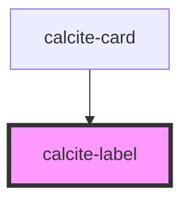

# calcite-label

For comprehensive guidance on using and implementing `calcite-label`, refer to the [documentation page](https://developers.arcgis.com/calcite-design-system/components/label/).

<!-- Auto Generated Below -->

## Properties

| Property    | Attribute   | Description                                                                                                                                   | Type                                              | Default     |
| ----------- | ----------- | --------------------------------------------------------------------------------------------------------------------------------------------- | ------------------------------------------------- | ----------- |
| `alignment` | `alignment` | Specifies the text alignment of the component.                                                                                                | `"center" \| "end" \| "start"`                    | `"start"`   |
| `for`       | `for`       | Specifies the `id` of the component the label is bound to. Use when the component the label is bound to does not reside within the component. | `string`                                          | `undefined` |
| `layout`    | `layout`    | Defines the layout of the label in relation to the component. Use `"inline"` positions to wrap the label and component on the same line.      | `"default" \| "inline" \| "inline-space-between"` | `"default"` |
| `scale`     | `scale`     | Specifies the size of the component.                                                                                                          | `"l" \| "m" \| "s"`                               | `"m"`       |

## Slots

| Slot | Description                                                 |
| ---- | ----------------------------------------------------------- |
|      | A slot for adding text and a component that can be labeled. |

## CSS Custom Properties

| Name                            | Description                      |
| ------------------------------- | -------------------------------- |
| `--calcite-label-margin-bottom` | The spacing below the component. |

## Dependencies

### Used by

- [calcite-card](../card)

### Graph

---

*Built with [StencilJS](https://stenciljs.com/)*
