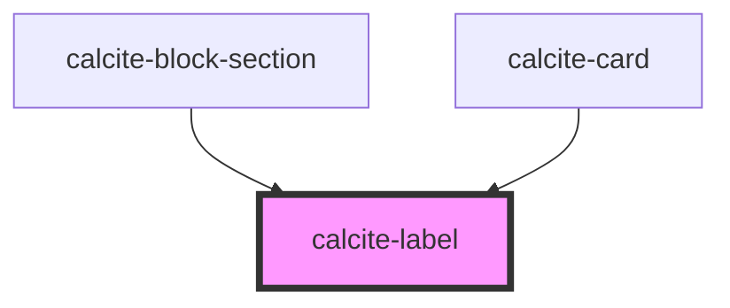

# calcite-label

Renders a `<label>` around its children and can be used with any [labelable native](https://developer.mozilla.org/en-US/docs/Web/Guide/HTML/Content_categories#Form_labelable) or labelable calcite element.

<!-- Auto Generated Below -->

## Usage

### Basic

```html
<calcite-label>
  Email address
  <calcite-input
    status="invalid"
    type="email"
    placeholder="Enter your email address"
    value="invalidemailformat.com"
  ></calcite-input>
  <calcite-input-message icon status="invalid">Enter a valid email address</calcite-input-message>
</calcite-label>
```

### Browser-caveat

When using the `default`, `inline` or `inline-space-between` layout option with [browsers that do not support the CSS `gap` property when used with flexbox](https://caniuse.com/flexbox-gap), you will need to use the `--calcite-label-margin-bottom` CSS variable and apply spacing manually to the label by wrapping it in a styled span like so:

```html
<calcite-label layout="inline" style="--calcite-label-margin-bottom:0;">
  <span style="margin-right: 0.75rem">Text leading inline</span>
  <calcite-checkbox></calcite-checkbox>
</calcite-label>
```

## Properties

| Property    | Attribute   | Description                                                                                                                                   | Type                                              | Default     |
| ----------- | ----------- | --------------------------------------------------------------------------------------------------------------------------------------------- | ------------------------------------------------- | ----------- |
| `alignment` | `alignment` | Specifies the text alignment of the component.                                                                                                | `"center" \| "end" \| "start"`                    | `"start"`   |
| `for`       | `for`       | Specifies the `id` of the component the label is bound to. Use when the component the label is bound to does not reside within the component. | `string`                                          | `undefined` |
| `layout`    | `layout`    | Defines the layout of the label in relation to the component. Use `"inline"` positions to wrap the label and component on the same line.      | `"default" \| "inline" \| "inline-space-between"` | `"default"` |
| `scale`     | `scale`     | Specifies the size of the component.                                                                                                          | `"l" \| "m" \| "s"`                               | `"m"`       |

## Slots

| Slot | Description                                                 |
| ---- | ----------------------------------------------------------- |
|      | A slot for adding text and a component that can be labeled. |

## CSS Custom Properties

| Name                            | Description                      |
| ------------------------------- | -------------------------------- |
| `--calcite-label-margin-bottom` | The spacing below the component. |

## Dependencies

### Used by

- [calcite-block-section](../block-section)
- [calcite-card](../card)

### Graph



---

*Built with [StencilJS](https://stenciljs.com/)*
