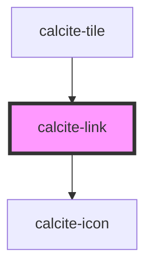

# calcite-link

<!-- Auto Generated Below -->

## Usage

### Basic

```html
<div style="font-size: 16px; font-weight: 400;">
  Checkout the
  <calcite-link href="https://developers.arcgis.com/calcite-design-system/" icon-end="launch" target="_blank">
    Calcite Design System
  </calcite-link>
  website for comprehensive information about Calcite
</div>
```

### Focusing

You can programmatically focus a `calcite-link` with the `setFocus()` method:

```html
<div onclick=document.querySelector('#my-link').setFocus()>Focus!</div>
```

## Properties

| Property      | Attribute       | Description                                                                                                                                                                                                                                               | Type                         | Default     |
| ------------- | --------------- | --------------------------------------------------------------------------------------------------------------------------------------------------------------------------------------------------------------------------------------------------------- | ---------------------------- | ----------- |
| `disabled`    | `disabled`      | When `true`, interaction is prevented and the component is displayed with lower opacity.                                                                                                                                                                  | `boolean`                    | `false`     |
| `download`    | `download`      | Prompts the user to save the linked URL instead of navigating to it. Can be used with or without a value: Without a value, the browser will suggest a filename/extension See <https://developer.mozilla.org/en-US/docs/Web/HTML/Element/a#attr-download>. | `boolean \| string`          | `false`     |
| `href`        | `href`          | Specifies the URL of the linked resource, which can be set as an absolute or relative path.                                                                                                                                                               | `string`                     | `undefined` |
| `iconEnd`     | `icon-end`      | Specifies an icon to display at the end of the component.                                                                                                                                                                                                 | `string`                     | `undefined` |
| `iconFlipRtl` | `icon-flip-rtl` | Displays the `iconStart` and/or `iconEnd` as flipped when the element direction is right-to-left (`"rtl"`).                                                                                                                                               | `"both" \| "end" \| "start"` | `undefined` |
| `iconStart`   | `icon-start`    | Specifies an icon to display at the start of the component.                                                                                                                                                                                               | `string`                     | `undefined` |
| `rel`         | `rel`           | Specifies the relationship to the linked document defined in `href`.                                                                                                                                                                                      | `string`                     | `undefined` |
| `target`      | `target`        | Specifies the frame or window to open the linked document.                                                                                                                                                                                                | `string`                     | `undefined` |

## Methods

### `setFocus() => Promise<void>`

Sets focus on the component.

#### Returns

Type: `Promise<void>`

## Slots

| Slot | Description             |
| ---- | ----------------------- |
|      | A slot for adding text. |

## Dependencies

### Used by

- [calcite-tile](../tile)

### Depends on

- [calcite-icon](../icon)

### Graph



---

*Built with [StencilJS](https://stenciljs.com/)*
