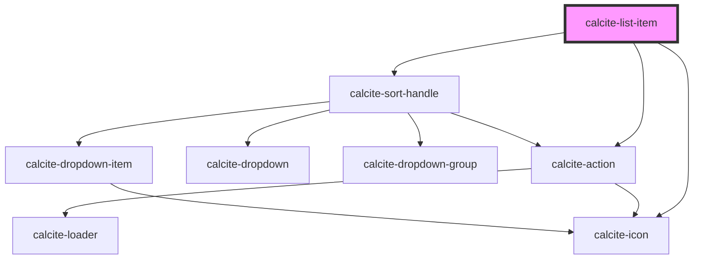

# calcite-list-item

For comprehensive guidance on using and implementing `calcite-list-item`, refer to the [documentation page](https://developers.arcgis.com/calcite-design-system/components/list-item/).

<!-- Auto Generated Below -->

## Properties

| Property           | Attribute           | Description                                                                                                                               | Type                        | Default     |
| ------------------ | ------------------- | ----------------------------------------------------------------------------------------------------------------------------------------- | --------------------------- | ----------- |
| `closable`         | `closable`          | When `true`, a close button is added to the component.                                                                                    | `boolean`                   | `false`     |
| `closed`           | `closed`            | When `true`, hides the component.                                                                                                         | `boolean`                   | `false`     |
| `description`      | `description`       | A description for the component. Displays below the label text.                                                                           | `string`                    | `undefined` |
| `disabled`         | `disabled`          | When `true`, interaction is prevented and the component is displayed with lower opacity.                                                  | `boolean`                   | `false`     |
| `dragDisabled`     | `drag-disabled`     | When `true`, the item is not draggable.                                                                                                   | `boolean`                   | `false`     |
| `label`            | `label`             | The label text of the component. Displays above the description text.                                                                     | `string`                    | `undefined` |
| `messageOverrides` | `message-overrides` | Use this property to override individual strings used by the component.                                                                   | `ListItemMessages`          | `undefined` |
| `metadata`         | --                  | Provides additional metadata to the component. Primary use is for a filter on the parent `calcite-list`.                                  | `{ [x: string]: unknown; }` | `undefined` |
| `open`             | `open`              | When `true`, the item is open to show child components.                                                                                   | `boolean`                   | `false`     |
| `selected`         | `selected`          | When `true` and the parent `calcite-list`'s `selectionMode` is `"single"`, `"single-persist"', or`"multiple"`, the component is selected. | `boolean`                   | `false`     |
| `sortHandleOpen`   | `sort-handle-open`  | When `true`, displays and positions the sort handle.                                                                                      | `boolean`                   | `false`     |
| `unavailable`      | `unavailable`       | When `true`, the component's content appears inactive.                                                                                    | `boolean`                   | `false`     |
| `value`            | `value`             | The component's value.                                                                                                                    | `any`                       | `undefined` |

## Events

| Event                                  | Description                                                                                                | Type                |
| -------------------------------------- | ---------------------------------------------------------------------------------------------------------- | ------------------- |
| `calciteListItemClose`                 | Fires when the close button is clicked.                                                                    | `CustomEvent<void>` |
| `calciteListItemSelect`                | Fires when the component is selected.                                                                      | `CustomEvent<void>` |
| `calciteListItemSortHandleBeforeClose` | Fires when the sort handle is requested to be closed and before the closing transition begins.             | `CustomEvent<void>` |
| `calciteListItemSortHandleBeforeOpen`  | Fires when the sort handle is added to the DOM but not rendered, and before the opening transition begins. | `CustomEvent<void>` |
| `calciteListItemSortHandleClose`       | Fires when the sort handle is closed and animation is complete.                                            | `CustomEvent<void>` |
| `calciteListItemSortHandleOpen`        | Fires when the sort handle is open and animation is complete.                                              | `CustomEvent<void>` |
| `calciteListItemToggle`                | Fires when the open button is clicked.                                                                     | `CustomEvent<void>` |

## Methods

### `setFocus() => Promise<void>`

Sets focus on the component.

#### Returns

Type: `Promise<void>`

## Slots

| Slot               | Description                                                                                                    |
| ------------------ | -------------------------------------------------------------------------------------------------------------- |
|                    | A slot for adding `calcite-list`, `calcite-list-item` and `calcite-list-item-group` elements.                  |
| `"actions-end"`    | A slot for adding actionable `calcite-action` elements after the content of the component.                     |
| `"actions-start"`  | A slot for adding actionable `calcite-action` elements before the content of the component.                    |
| `"content"`        | A slot for adding non-actionable, centered content in place of the `label` and `description` of the component. |
| `"content-bottom"` | A slot for adding content below the component's `label` and `description`.                                     |
| `"content-end"`    | A slot for adding non-actionable elements after the label and description of the component.                    |
| `"content-start"`  | A slot for adding non-actionable elements before the label and description of the component.                   |

## Dependencies

### Depends on

- [calcite-icon](../icon)
- [calcite-sort-handle](../sort-handle)
- [calcite-action](../action)

### Graph

---

*Built with [StencilJS](https://stenciljs.com/)*
