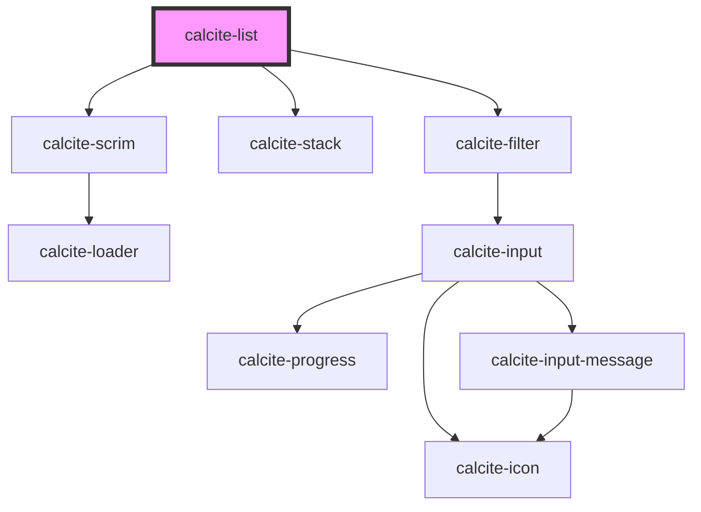

# calcite-list

<!-- Auto Generated Below -->

## Overview

A general purpose list that enables users to construct list items that conform to Calcite styling.

## Usage

### Advanced

```html
<calcite-list>
  <calcite-list-item
    label="Dog"
    description="Also known as Canis familiaris, a carnivorous mammal closely related to the gray wolf that has been domesticated as a pet."
  >
    <calcite-action icon="information" label="information" scale="s" slot="actions-start"></calcite-action>
    <calcite-icon scale="l" icon="layer" slot="content-start"></calcite-icon>
    <calcite-avatar scale="l" slot="content-start" thumbnail="https://placedog.net/300/300"></calcite-avatar>
    <calcite-icon
      scale="s"
      icon="check"
      slot="content-end"
      style="color: var(--calcite-color-status-success)"
    ></calcite-icon>
    <calcite-action icon="ellipsis" label="menu" slot="actions-end"></calcite-action>
    <calcite-action icon="x" label="remove" slot="actions-end"></calcite-action>
  </calcite-list-item>
  <calcite-list-item
    label="Cat"
    description="Also known as Felis catus, a carnivorous mammal that has long been domesticated as a pet and for catching rats and mice."
  >
    <calcite-action icon="information" label="information" scale="s" slot="actions-start"></calcite-action>
    <calcite-icon scale="l" icon="layer" slot="content-start"></calcite-icon>
    <calcite-avatar scale="l" slot="content-start" thumbnail="my-thumbnail.png"></calcite-avatar>
    <calcite-icon
      scale="s"
      icon="check"
      slot="content-end"
      style="color: var(--calcite-color-status-success)"
    ></calcite-icon>
    <calcite-action icon="ellipsis" label="menu" slot="actions-end"></calcite-action>
    <calcite-action icon="x" label="remove" slot="actions-end"></calcite-action>
  </calcite-list-item>
  <calcite-list-item label="Bear" description="Carnivorous mammals of the family Ursidae.">
    <calcite-action icon="information" label="information" scale="s" slot="actions-start"></calcite-action>
    <calcite-icon scale="l" icon="layer" slot="content-start"></calcite-icon>
    <calcite-avatar scale="l" slot="content-start" thumbnail="https://placebear.com/g/400/400"></calcite-avatar>
    <calcite-icon
      scale="s"
      icon="exclamation-mark-triangle"
      slot="content-end"
      style="color: var(--calcite-color-status-danger)"
    ></calcite-icon>
    <calcite-action icon="ellipsis" label="menu" slot="actions-end"></calcite-action>
    <calcite-action icon="x" label="remove" slot="actions-end"></calcite-action>
  </calcite-list-item>
</calcite-list>
```

### Basic

```html
<calcite-list>
  <calcite-list-item
    label="Comet"
    description="Cosmic snowballs of frozen gases, rock, and dust that orbit the Sun."
  ></calcite-list-item>
  <calcite-list-item
    label="Meteoroid"
    description="A small body of matter from outer space that enters Earth's atmosphere and appears like a streak of light."
  ></calcite-list-item>
  <calcite-list-item
    label="Asteroid"
    description="A celestial body made of rock and metal that orbits the Sun."
  ></calcite-list-item>
</calcite-list>
```

### DragEnabled

```html
<calcite-list drag-enabled>
  <calcite-list-item
    label="Don Quixote"
    value="1"
    description="Don Quixote is a Spanish epic novel by Miguel de Cervantes."
  >
    <calcite-icon icon="book" slot="content-start"></calcite-icon>
  </calcite-list-item>
  <calcite-list-item
    label="A Tale of Two Cities"
    value="2"
    description="A historical novel published in 1859 by Charles Dickens, set in London and Paris before and during the French Revolution."
  >
    <calcite-icon icon="book" slot="content-start"></calcite-icon>
  </calcite-list-item>
  <calcite-list-item
    label="The Lord of the Rings"
    value="3"
    description="An epic high-fantasy novel by the English author and scholar J. R. R. Tolkien."
  >
    <calcite-icon icon="book" slot="content-start"></calcite-icon>
  </calcite-list-item>
</calcite-list>
```

### DragEnabledNested

```html
<calcite-list drag-enabled group="Birds">
  <calcite-list-item open label="Eagles">
    <calcite-list>
      <calcite-list-item
        label="Bald Eagle"
        description="The bald eagle is a bird of prey found in North America."
      ></calcite-list-item>
      <calcite-list-item
        label="Golden Eagle"
        description="The golden eagle is a bird of prey living in the Northern Hemisphere."
      ></calcite-list-item>
    </calcite-list>
  </calcite-list-item>
  <calcite-list-item open label="Owls">
    <calcite-list>
      <calcite-list-item
        label="Great Horned Owl"
        description="The great horned owl, also known as the tiger owl, or the hoot owl, is a large owl native to the Americas."
      ></calcite-list-item>
      <calcite-list-item
        label="Snow Owl"
        description="The snowy owl, also known as the polar owl, the white owl and the Arctic owl, is a large, white owl of the true owl family."
      ></calcite-list-item>
    </calcite-list>
  </calcite-list-item>
</calcite-list>
```

### Grouped

```html
<calcite-list>
  <calcite-list-item-group heading="Continents in order of size">
    <calcite-list-item
      label="Asia"
      description="Asia is the largest continent in the world by both land area and population."
    ></calcite-list-item>
    <calcite-list-item
      label="Africa"
      description="Africa is the world's second-largest and second-most populous continent, after Asia in both aspects."
    ></calcite-list-item>
    <calcite-list-item
      label="North America"
      description="North America is the third largest continent, after Asia and Africa."
    ></calcite-list-item>
  </calcite-list-item-group>
  <calcite-list-item-group heading="Mountains in order of height">
    <calcite-list-item
      label="Mount Everest"
      description="Mount Everest is the highest of the Himalayan mountains, and at 8,850 meters considered the highest point on Earth."
    ></calcite-list-item>
    <calcite-list-item
      label="Godwin Austen (K2)"
      description="Mount Godwin-Austen also known as K2 is the second highest mountain in the world at 8,611 meters above sea level."
    ></calcite-list-item>
    <calcite-list-item
      label="Kangchenjunga"
      description="Mount Kanchenjunga Main is the third highest mountain peak in the world with an elevation of 8,586 meters."
    ></calcite-list-item>
  </calcite-list-item-group>
</calcite-list>
```

### MultipleSelections

```html
<calcite-list selection-mode="multiple">
  <calcite-list-item-group heading="Sports">
    <calcite-list-item
      label="Tennis"
      description="Tennis is a racket sport that is played either individually against a single opponent or between two teams of two players each."
    ></calcite-list-item>
    <calcite-list-item
      label="Baseball"
      description="Baseball is a bat-and-ball sport played between two teams of nine players each, taking turns batting and fielding."
    ></calcite-list-item>
    <calcite-list-item
      label="Golf"
      description="Golf is a sport in which a small ball is struck with a club into a series of small holes in the ground, the object being to use the fewest possible strokes to complete the course."
    ></calcite-list-item>
  </calcite-list-item-group>
</calcite-list>
```

### Nested

```html
<calcite-list>
  <calcite-list-item
    label="United States of America"
    description="A country located in North America consisting of 50 states."
  >
    <calcite-list>
      <calcite-list-item label="California" description="A state on the western coast of the United States.">
        <calcite-list>
          <calcite-list-item
            label="Redlands"
            description="A city in California and the hometown of Esri."
          ></calcite-list-item>
        </calcite-list>
      </calcite-list-item>
    </calcite-list>
  </calcite-list-item>
</calcite-list>
```

## Properties

| Property              | Attribute              | Description                                                                                                                                                                                                                                              | Type                                                                                          | Default     |
| --------------------- | ---------------------- | -------------------------------------------------------------------------------------------------------------------------------------------------------------------------------------------------------------------------------------------------------- | --------------------------------------------------------------------------------------------- | ----------- |
| `canPull`             | --                     | When provided, the method will be called to determine whether the element can move from the list.                                                                                                                                                        | `(detail: ListDragDetail) => boolean`                                                         | `undefined` |
| `canPut`              | --                     | When provided, the method will be called to determine whether the element can be added from another list.                                                                                                                                                | `(detail: ListDragDetail) => boolean`                                                         | `undefined` |
| `disabled`            | `disabled`             | When `true`, interaction is prevented and the component is displayed with lower opacity.                                                                                                                                                                 | `boolean`                                                                                     | `false`     |
| `dragEnabled`         | `drag-enabled`         | When `true`, `calcite-list-item`s are sortable via a draggable button.                                                                                                                                                                                   | `boolean`                                                                                     | `false`     |
| `filterEnabled`       | `filter-enabled`       | When `true`, an input appears at the top of the component that can be used by end users to filter `calcite-list-item`s.                                                                                                                                  | `boolean`                                                                                     | `false`     |
| `filterPlaceholder`   | `filter-placeholder`   | Placeholder text for the component's filter input field.                                                                                                                                                                                                 | `string`                                                                                      | `undefined` |
| `filterText`          | `filter-text`          | Text for the component's filter input field.                                                                                                                                                                                                             | `string`                                                                                      | `undefined` |
| `filteredData`        | --                     | The currently filtered `calcite-list-item` data.                                                                                                                                                                                                         | `{ label: string; description: string; metadata: Record<string, unknown>; value: string; }[]` | `[]`        |
| `filteredItems`       | --                     | The currently filtered `calcite-list-item`s.                                                                                                                                                                                                             | `HTMLCalciteListItemElement[]`                                                                | `[]`        |
| `group`               | `group`                | The list's group identifier. To drag elements from one list into another, both lists must have the same group value.                                                                                                                                     | `string`                                                                                      | `undefined` |
| `label`               | `label`                | Specifies an accessible name for the component.                                                                                                                                                                                                          | `string`                                                                                      | `undefined` |
| `loading`             | `loading`              | When `true`, a busy indicator is displayed.                                                                                                                                                                                                              | `boolean`                                                                                     | `false`     |
| `messageOverrides`    | --                     | Use this property to override individual strings used by the component.                                                                                                                                                                                  | `{ filterEnabled?: string; total?: string; }`                                                 | `undefined` |
| `numberingSystem`     | `numbering-system`     | Specifies the Unicode numeral system used by the component for localization.                                                                                                                                                                             | `"arab" \| "arabext" \| "latn"`                                                               | `undefined` |
| `selectedItems`       | --                     | The currently selected items.                                                                                                                                                                                                                            | `HTMLCalciteListItemElement[]`                                                                | `[]`        |
| `selectionAppearance` | `selection-appearance` | Specifies the selection appearance - `"icon"` (displays a checkmark or dot) or `"border"` (displays a border).                                                                                                                                           | `"border" \| "icon"`                                                                          | `"icon"`    |
| `selectionMode`       | `selection-mode`       | Specifies the selection mode of the component, where: `"multiple"` allows any number of selections, `"single"` allows only one selection, `"single-persist"` allows one selection and prevents de-selection, and `"none"` does not allow any selections. | `"multiple" \| "none" \| "single" \| "single-persist"`                                        | `"none"`    |

## Events

| Event                                  | Description                                                              | Type                          |
| -------------------------------------- | ------------------------------------------------------------------------ | ----------------------------- |
| `calciteInternalListDefaultSlotChange` | Fires when the default slot has changes in order to notify parent lists. | `CustomEvent<void>`           |
| `calciteListChange`                    | Fires when the component's selected items have changed.                  | `CustomEvent<void>`           |
| `calciteListDragEnd`                   | Fires when the component's dragging has ended.                           | `CustomEvent<ListDragDetail>` |
| `calciteListDragStart`                 | Fires when the component's dragging has started.                         | `CustomEvent<ListDragDetail>` |
| `calciteListFilter`                    | Fires when the component's filter has changed.                           | `CustomEvent<void>`           |
| `calciteListOrderChange`               | Fires when the component's item order changes.                           | `CustomEvent<ListDragDetail>` |

## Methods

### `setFocus() => Promise<void>`

Sets focus on the component's first focusable element.

#### Returns

Type: `Promise<void>`

## Slots

| Slot                     | Description                                                                         |
| ------------------------ | ----------------------------------------------------------------------------------- |
|                          | A slot for adding `calcite-list-item` elements.                                     |
| `"filter-actions-end"`   | A slot for adding actionable `calcite-action` elements after the filter component.  |
| `"filter-actions-start"` | A slot for adding actionable `calcite-action` elements before the filter component. |

## CSS Custom Properties

| Name                                                        | Description                                                                                      |
| ----------------------------------------------------------- | ------------------------------------------------------------------------------------------------ |
| `--calcite-list-background-color`                           | Specifies the background color of the component.                                                 |
| `--calcite-list-border-color`                               | Specifies the border color of the component.                                                     |
| `--calcite-list-filter-background-color`                    | Specifies the background color of the filter sub-component.                                      |
| `--calcite-list-filter-input-background-color`              | defines the background color of the filter input sub-component.                                  |
| `--calcite-list-filter-input-border-color`                  | defines the border color of the filter input sub-component.                                      |
| `--calcite-list-filter-input-button-background-color`       | defines the background color of the filter input button in the input sub-component.              |
| `--calcite-list-filter-input-button-background-color-hover` | defines the background color of the filter input button when hovered in the input sub-component. |
| `--calcite-list-filter-input-button-border-color`           | defines the border color of the button in the filter input sub-component.                        |
| `--calcite-list-filter-input-button-icon-color`             | defines the icon color of the button in the filter input sub-component.                          |
| `--calcite-list-filter-input-button-icon-color-active`      | defines the icon color of the button when active in the filter input sub-component.              |
| `--calcite-list-filter-input-button-icon-color-hover`       | defines the icon color of the button when hovered in the filter input sub-component.             |
| `--calcite-list-filter-input-corner-radius`                 | defines the corner radius of the input sub-component.                                            |
| `--calcite-list-filter-input-icon-color`                    | defines the icon color of the filter input sub-component.                                        |
| `--calcite-list-filter-input-placeholder-text-color`        | defines the placeholder text color of the filter input sub-component.                            |
| `--calcite-list-filter-input-text-color`                    | defines the text color of the filter input sub-component.                                        |
| `--calcite-list-header-z-index`                             | Specifies the component header's z-index.                                                        |

## Dependencies

### Depends on

- [calcite-scrim](../scrim)
- [calcite-stack](../stack)
- [calcite-filter](../filter)

### Graph



---

*Built with [StencilJS](https://stenciljs.com/)*
