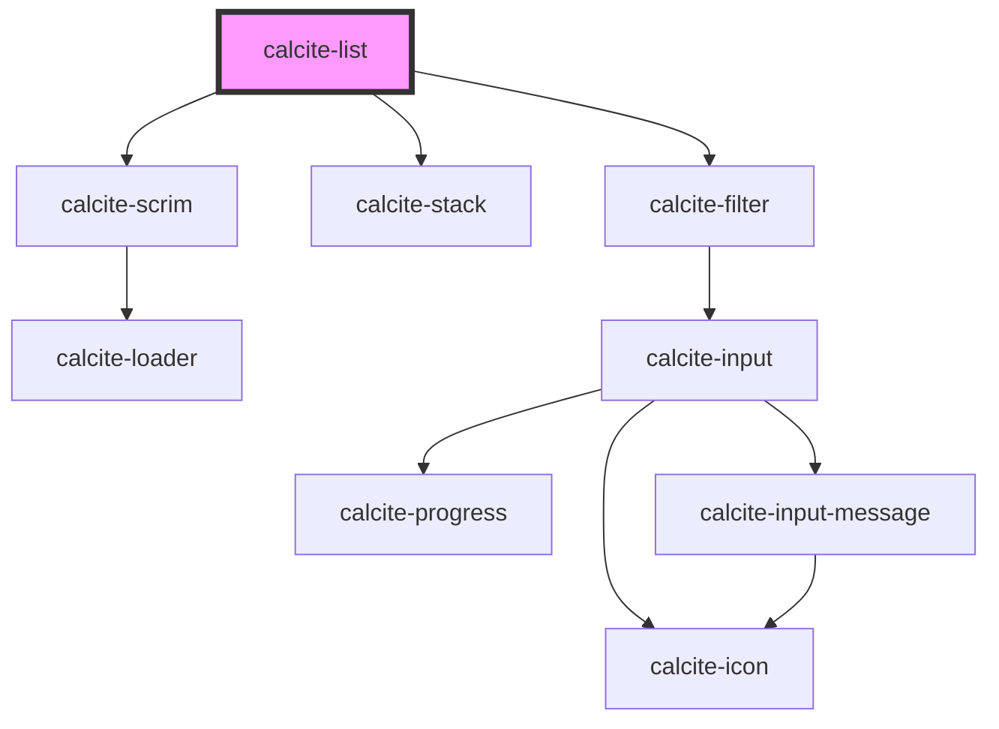

# calcite-list

For comprehensive guidance on using and implementing `calcite-list`, refer to the [documentation page](https://developers.arcgis.com/calcite-design-system/components/list/).

<!-- Auto Generated Below -->

## Overview

A general purpose list that enables users to construct list items that conform to Calcite styling.

## Properties

| Property              | Attribute              | Description                                                                                                                                                                                                                                              | Type                                                                                          | Default     |
| --------------------- | ---------------------- | -------------------------------------------------------------------------------------------------------------------------------------------------------------------------------------------------------------------------------------------------------- | --------------------------------------------------------------------------------------------- | ----------- |
| `canPull`             | --                     | When provided, the method will be called to determine whether the element can move from the list.                                                                                                                                                        | `(detail: ListDragDetail) => boolean`                                                         | `undefined` |
| `canPut`              | --                     | When provided, the method will be called to determine whether the element can be added from another list.                                                                                                                                                | `(detail: ListDragDetail) => boolean`                                                         | `undefined` |
| `disabled`            | `disabled`             | When `true`, interaction is prevented and the component is displayed with lower opacity.                                                                                                                                                                 | `boolean`                                                                                     | `false`     |
| `dragEnabled`         | `drag-enabled`         | When `true`, `calcite-list-item`s are sortable via a draggable button.                                                                                                                                                                                   | `boolean`                                                                                     | `false`     |
| `filterEnabled`       | `filter-enabled`       | When `true`, an input appears at the top of the component that can be used by end users to filter `calcite-list-item`s.                                                                                                                                  | `boolean`                                                                                     | `false`     |
| `filterPlaceholder`   | `filter-placeholder`   | Placeholder text for the component's filter input field.                                                                                                                                                                                                 | `string`                                                                                      | `undefined` |
| `filterProps`         | --                     | Specifies the properties to match against when filtering. If not set, all properties will be matched (label, description, metadata, value).                                                                                                              | `string[]`                                                                                    | `undefined` |
| `filterText`          | `filter-text`          | Text for the component's filter input field.                                                                                                                                                                                                             | `string`                                                                                      | `undefined` |
| `filteredData`        | --                     | The currently filtered `calcite-list-item` data.                                                                                                                                                                                                         | `{ label: string; description: string; metadata: Record<string, unknown>; value: string; }[]` | `[]`        |
| `filteredItems`       | --                     | The currently filtered `calcite-list-item`s.                                                                                                                                                                                                             | `HTMLCalciteListItemElement[]`                                                                | `[]`        |
| `group`               | `group`                | The list's group identifier. To drag elements from one list into another, both lists must have the same group value.                                                                                                                                     | `string`                                                                                      | `undefined` |
| `label`               | `label`                | Specifies an accessible name for the component.                                                                                                                                                                                                          | `string`                                                                                      | `undefined` |
| `loading`             | `loading`              | When `true`, a busy indicator is displayed.                                                                                                                                                                                                              | `boolean`                                                                                     | `false`     |
| `messageOverrides`    | `message-overrides`    | Use this property to override individual strings used by the component.                                                                                                                                                                                  | `ListMessages`                                                                                | `undefined` |
| `numberingSystem`     | `numbering-system`     | Specifies the Unicode numeral system used by the component for localization.                                                                                                                                                                             | `"arab" \| "arabext" \| "latn"`                                                               | `undefined` |
| `selectedItems`       | --                     | The currently selected items.                                                                                                                                                                                                                            | `HTMLCalciteListItemElement[]`                                                                | `[]`        |
| `selectionAppearance` | `selection-appearance` | Specifies the selection appearance - `"icon"` (displays a checkmark or dot) or `"border"` (displays a border).                                                                                                                                           | `"border" \| "icon"`                                                                          | `"icon"`    |
| `selectionMode`       | `selection-mode`       | Specifies the selection mode of the component, where: `"multiple"` allows any number of selections, `"single"` allows only one selection, `"single-persist"` allows one selection and prevents de-selection, and `"none"` does not allow any selections. | `"multiple" \| "none" \| "single" \| "single-persist"`                                        | `"none"`    |

## Events

| Event                                  | Description                                                              | Type                          |
| -------------------------------------- | ------------------------------------------------------------------------ | ----------------------------- |
| `calciteInternalListDefaultSlotChange` | Fires when the default slot has changes in order to notify parent lists. | `CustomEvent<void>`           |
| `calciteListChange`                    | Fires when the component's selected items have changed.                  | `CustomEvent<void>`           |
| `calciteListDragEnd`                   | Fires when the component's dragging has ended.                           | `CustomEvent<ListDragDetail>` |
| `calciteListDragStart`                 | Fires when the component's dragging has started.                         | `CustomEvent<ListDragDetail>` |
| `calciteListFilter`                    | Fires when the component's filter has changed.                           | `CustomEvent<void>`           |
| `calciteListOrderChange`               | Fires when the component's item order changes.                           | `CustomEvent<ListDragDetail>` |

## Methods

### `setFocus() => Promise<void>`

Sets focus on the component's first focusable element.

#### Returns

Type: `Promise<void>`

## Slots

| Slot                     | Description                                                                                     |
| ------------------------ | ----------------------------------------------------------------------------------------------- |
|                          | A slot for adding `calcite-list-item` elements.                                                 |
| `"filter-actions-end"`   | A slot for adding actionable `calcite-action` elements after the filter component.              |
| `"filter-actions-start"` | A slot for adding actionable `calcite-action` elements before the filter component.             |
| `"filter-no-results"`    | When `filterEnabled` is `true`, a slot for adding content to display when no results are found. |

## Dependencies

### Depends on

- [calcite-scrim](../scrim)
- [calcite-stack](../stack)
- [calcite-filter](../filter)

### Graph

---

*Built with [StencilJS](https://stenciljs.com/)*
