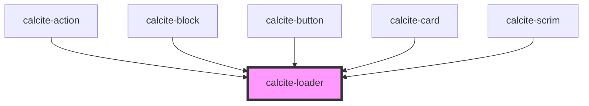

# calcite-loader

For comprehensive guidance on using and implementing `calcite-loader`, refer to the [documentation page](https://developers.arcgis.com/calcite-design-system/components/loader/).

<!-- Auto Generated Below -->

## Properties

| Property             | Attribute | Description                                                                                         | Type                               | Default     |
| -------------------- | --------- | --------------------------------------------------------------------------------------------------- | ---------------------------------- | ----------- |
| `inline`             | `inline`  | When `true`, displays smaller and appears to the left of the text.                                  | `boolean`                          | `false`     |
| `label` *(required)* | `label`   | Accessible name for the component.                                                                  | `string`                           | `undefined` |
| `scale`              | `scale`   | Specifies the size of the component.                                                                | `"l" \| "m" \| "s"`                | `"m"`       |
| `text`               | `text`    | Text that displays under the component's indicator.                                                 | `string`                           | `""`        |
| `type`               | `type`    | Specifies the component type. Use `"indeterminate"` if finding actual progress value is impossible. | `"determinate" \| "indeterminate"` | `undefined` |
| `value`              | `value`   | The component's value. Valid only for `"determinate"` indicators. Percent complete of 100.          | `number`                           | `0`         |

## CSS Custom Properties

| Name                           | Description                                                                     |
| ------------------------------ | ------------------------------------------------------------------------------- |
| `--calcite-loader-font-size`   | Specifies the font size of the loading percentage when type is `"determinate"`. |
| `--calcite-loader-padding`     | Specifies the padding of the loader.                                            |
| `--calcite-loader-size`        | The width and height of a non-inline loader.                                    |
| `--calcite-loader-size-inline` | The width and height of an inline loader                                        |

## Dependencies

### Used by

- [calcite-action](../action)
- [calcite-block](../block)
- [calcite-button](../button)
- [calcite-card](../card)
- [calcite-scrim](../scrim)

### Graph

---

*Built with [StencilJS](https://stenciljs.com/)*
