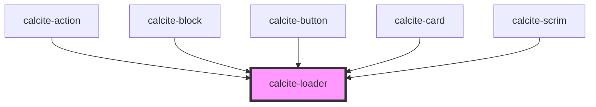

# calcite-loader

The `calcite-loader` component can act as a determinate or indeterminate loading indicator.

<!-- Auto Generated Below -->

## Usage

### Basic

You can use the `active` attribute to toggle visibility:

```html
<calcite-loader text="Fetching data..."></calcite-loader>
```

### Compact

For instances when you don't have room for the full loader, you can use the smaller `inline` version of the loader. The inline version is meant to sit to the left of text:

```html
<p><calcite-loader inline></calcite-loader>Inline loader</p>
```

### Determinate

If you can calculate your progress, it's best to use the determinate version of the loader. Update the `value` of the element when progress is made. This will display a progress bar along the perimeter of the loader showing 32% complete:

```html
<calcite-loader type="determinate" value="32"></calcite-loader>
```

## Properties

| Property             | Attribute | Description                                                                                         | Type                               | Default     |
| -------------------- | --------- | --------------------------------------------------------------------------------------------------- | ---------------------------------- | ----------- |
| `inline`             | `inline`  | When `true`, displays smaller and appears to the left of the text.                                  | `boolean`                          | `false`     |
| `label` *(required)* | `label`   | Accessible name for the component.                                                                  | `string`                           | `undefined` |
| `scale`              | `scale`   | Specifies the size of the component.                                                                | `"l" \| "m" \| "s"`                | `"m"`       |
| `text`               | `text`    | Text that displays under the component's indicator.                                                 | `string`                           | `""`        |
| `type`               | `type`    | Specifies the component type. Use `"indeterminate"` if finding actual progress value is impossible. | `"determinate" \| "indeterminate"` | `undefined` |
| `value`              | `value`   | The component's value. Valid only for `"determinate"` indicators. Percent complete of 100.          | `number`                           | `0`         |

## CSS Custom Properties

| Name                                       | Description                                                                                                  |
| ------------------------------------------ | ------------------------------------------------------------------------------------------------------------ |
| `--calcite-loader-bar-width`               | [Deprecated] defines the width of the loader animation.                                                      |
| `--calcite-loader-color-end`               | defines the color of a loader. Applies to --calcite-loader-color between 66% - 99% of the animation.         |
| `--calcite-loader-color-middle`            | defines the color of a loader. Applies to --calcite-loader-color between 33% - 66% of the animation.         |
| `--calcite-loader-color-start`             | defines the starting color of a loader. Applies to --calcite-loader-color between 0% - 33% of the animation. |
| `--calcite-loader-font-size`               | [Deprecated] Specifies the font size of the loading percentage when type is `"determinate"`.                 |
| `--calcite-loader-padding`                 | [Deprecated] Specifies the padding of the loader.                                                            |
| `--calcite-loader-size`                    | [Deprecated] The width and height of a non-inline loader.                                                    |
| `--calcite-loader-size-inline`             | [Deprecated] The width and height of an inline loader.                                                       |
| `--calcite-loader-text-color`              | var(--calcite-color-text-1); defines the text color of a loader.                                             |
| `--calcite-loader-track-color-determinate` | var(--calcite-color-border-3); defines the track color of a "determinate" loader                             |

## Dependencies

### Used by

- [calcite-action](../action)
- [calcite-block](../block)
- [calcite-button](../button)
- [calcite-card](../card)
- [calcite-scrim](../scrim)

### Graph



---

*Built with [StencilJS](https://stenciljs.com/)*
