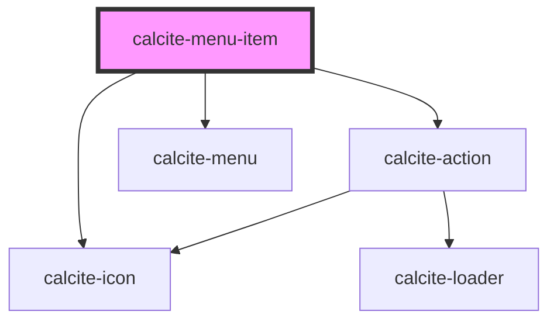

# calcite-menu-item

<!-- Auto Generated Below -->

## Properties

| Property             | Attribute           | Description                                                                                                 | Type                         | Default     |
| -------------------- | ------------------- | ----------------------------------------------------------------------------------------------------------- | ---------------------------- | ----------- |
| `active`             | `active`            | When `true`, the component is highlighted.                                                                  | `boolean`                    | `undefined` |
| `breadcrumb`         | `breadcrumb`        | When `true`, the component displays a breadcrumb trail for use as a navigational aid.                       | `boolean`                    | `undefined` |
| `href`               | `href`              | Specifies the URL destination of the component, which can be set as an absolute or relative path.           | `string`                     | `undefined` |
| `iconEnd`            | `icon-end`          | Specifies an icon to display at the end of the component.                                                   | `string`                     | `undefined` |
| `iconFlipRtl`        | `icon-flip-rtl`     | Displays the `iconStart` and/or `iconEnd` as flipped when the element direction is right-to-left (`"rtl"`). | `"both" \| "end" \| "start"` | `undefined` |
| `iconStart`          | `icon-start`        | Specifies an icon to display at the start of the component.                                                 | `string`                     | `undefined` |
| `label` *(required)* | `label`             | Accessible name for the component.                                                                          | `string`                     | `undefined` |
| `messageOverrides`   | `message-overrides` | Use this property to override individual strings used by the component.                                     | `MenuItemMessages`           | `undefined` |
| `open`               | `open`              | When `true`, the component will display any slotted `calcite-menu-item` in an open overflow menu.           | `boolean`                    | `false`     |
| `rel`                | `rel`               | Defines the relationship between the `href` value and the current document.                                 | `string`                     | `undefined` |
| `target`             | `target`            | Specifies where to open the linked document defined in the `href` property.                                 | `string`                     | `undefined` |
| `text`               | `text`              | Specifies the text to display.                                                                              | `string`                     | `undefined` |

## Events

| Event                   | Description                           | Type                |
| ----------------------- | ------------------------------------- | ------------------- |
| `calciteMenuItemSelect` | Emits when the component is selected. | `CustomEvent<void>` |

## Methods

### `setFocus() => Promise<void>`

Sets focus on the component.

#### Returns

Type: `Promise<void>`

## Slots

| Slot             | Description                                          |
| ---------------- | ---------------------------------------------------- |
| `"submenu-item"` | A slot for adding `calcite-menu-item`s in a submenu. |

## Dependencies

### Depends on

- [calcite-icon](../icon)
- [calcite-action](../action)
- [calcite-menu](../menu)

### Graph

---

*Built with [StencilJS](https://stenciljs.com/)*
