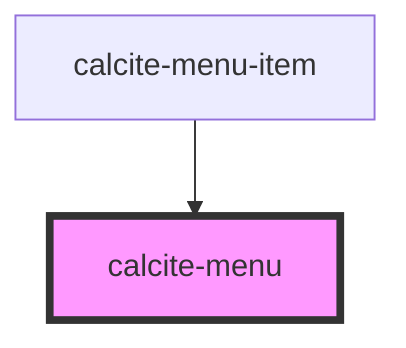

# calcite-menu

<!-- Auto Generated Below -->

## Usage

### Basic

```html
<calcite-menu><calcite-menu-item text="Nature"></calcite-menu-item></calcite-menu>
```

## Properties

| Property             | Attribute | Description                                                             | Type                         | Default        |
| -------------------- | --------- | ----------------------------------------------------------------------- | ---------------------------- | -------------- |
| `label` *(required)* | `label`   | Accessible name for the component.                                      | `string`                     | `undefined`    |
| `layout`             | `layout`  | Specifies the layout of the component.                                  | `"horizontal" \| "vertical"` | `"horizontal"` |
| `messageOverrides`   | --        | Use this property to override individual strings used by the component. | `{ more?: string; }`         | `undefined`    |

## Methods

### `setFocus() => Promise<void>`

Sets focus on the component's first focusable element.

#### Returns

Type: `Promise<void>`

## Dependencies

### Used by

- [calcite-menu-item](../menu-item)

### Graph



---

*Built with [StencilJS](https://stenciljs.com/)*
