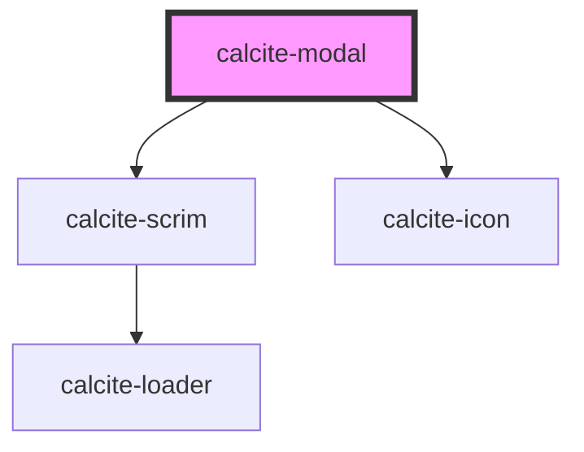

# calcite-modal

`calcite-modal` allows you to show a modal/dialog to your users. The modal handles fencing focus and animating in/out.

<style>
  html {
      overflow:auto !important;
  }
</style>
<!-- Auto Generated Below -->

## Usage

### Basic

Customize the modal by passing your content into multiple named slots: `header` (title-area of the modal), `content` (main body of the modal), and up to three modal actions: primary, secondary, and back. Notice below we use the `aria-labelledby` attribute, relating it to the title of the modal. In order to ensure good accessibility, it's recommended that you use either an `aria-label` or `aria-labelledby` attribute so screen readers can infer what the subject matter of your modal is.

```html
<calcite-modal aria-labelledby="modal-title" open>
  <h3 slot="header" id="modal-title">Edit profile</h3>
  <div slot="content">Please update your profile information below:</div>
  <calcite-button slot="back" kind="neutral" appearance="outline" icon="chevron-left" width="full">
    Back
  </calcite-button>
  <calcite-button slot="secondary" width="full" appearance="outline">Cancel</calcite-button>
  <calcite-button slot="primary" width="full">Save changes</calcite-button>
</calcite-modal>
```

### Open

To open a modal, add the `open` prop. Once the opening animation is complete, the `calciteModalOpen` event will be fired.

To close the modal, simply remove the attribute. This will run your before close method (if provided, see below) and fire the `calciteModalClose` event after the animation and teardown is complete.

```html
<calcite-modal open></calcite-modal>
```

### Reacting-before-close

If you'd like to perform some actions prior to closing (ie. warning users they will lose their changes) you can pass a function to the `beforeClose` property. This method will be called prior to close and should return a [`Promise`](https://developer.mozilla.org/en-US/docs/Web/JavaScript/Reference/Global_Objects/Promise):

```js
function beforeClose() {
  return new Promise((resolve) => {
    // do something async
    resolve(); // this will trigger the close animation
  });
}

const modal = document.getElementById("my-modal");
modal.beforeClose = beforeClose;
```

## Properties

| Property               | Attribute                | Description                                                                                                                 | Type                                                      | Default     |
| ---------------------- | ------------------------ | --------------------------------------------------------------------------------------------------------------------------- | --------------------------------------------------------- | ----------- |
| `beforeClose`          | --                       | Passes a function to run before the component closes.                                                                       | `(el: HTMLCalciteModalElement) => Promise<void>`          | `undefined` |
| `closeButtonDisabled`  | `close-button-disabled`  | When `true`, disables the component's close button.                                                                         | `boolean`                                                 | `false`     |
| `docked`               | `docked`                 | When `true`, prevents the component from expanding to the entire screen on mobile devices.                                  | `boolean`                                                 | `undefined` |
| `escapeDisabled`       | `escape-disabled`        | When `true`, disables the default close on escape behavior.                                                                 | `boolean`                                                 | `false`     |
| `focusTrapDisabled`    | `focus-trap-disabled`    | When `true`, prevents focus trapping.                                                                                       | `boolean`                                                 | `false`     |
| `fullscreen`           | `fullscreen`             | Sets the component to always be fullscreen (overrides `widthScale` and `--calcite-modal-width` / `--calcite-modal-height`). | `boolean`                                                 | `undefined` |
| `kind`                 | `kind`                   | Specifies the kind of the component (will apply to top border).                                                             | `"brand" \| "danger" \| "info" \| "success" \| "warning"` | `undefined` |
| `messageOverrides`     | --                       | Use this property to override individual strings used by the component.                                                     | `{ close?: string; }`                                     | `undefined` |
| `open`                 | `open`                   | When `true`, displays and positions the component.                                                                          | `boolean`                                                 | `false`     |
| `outsideCloseDisabled` | `outside-close-disabled` | When `true`, disables the closing of the component when clicked outside.                                                    | `boolean`                                                 | `false`     |
| `scale`                | `scale`                  | Specifies the size of the component.                                                                                        | `"l" \| "m" \| "s"`                                       | `"m"`       |
| `widthScale`           | `width-scale`            | Specifies the width of the component.                                                                                       | `"l" \| "m" \| "s"`                                       | `"m"`       |

## Events

| Event                     | Description                                                                                              | Type                |
| ------------------------- | -------------------------------------------------------------------------------------------------------- | ------------------- |
| `calciteModalBeforeClose` | Fires when the component is requested to be closed and before the closing transition begins.             | `CustomEvent<void>` |
| `calciteModalBeforeOpen`  | Fires when the component is added to the DOM but not rendered, and before the opening transition begins. | `CustomEvent<void>` |
| `calciteModalClose`       | Fires when the component is closed and animation is complete.                                            | `CustomEvent<void>` |
| `calciteModalOpen`        | Fires when the component is open and animation is complete.                                              | `CustomEvent<void>` |

## Methods

### `scrollContent(top?: number, left?: number) => Promise<void>`

Sets the scroll top of the component's content.

#### Parameters

| Name   | Type     | Description |
| ------ | -------- | ----------- |
| `top`  | `number` |             |
| `left` | `number` |             |

#### Returns

Type: `Promise<void>`

### `setFocus() => Promise<void>`

Sets focus on the component's "close" button (the first focusable item).

#### Returns

Type: `Promise<void>`

### `updateFocusTrapElements() => Promise<void>`

Updates the element(s) that are used within the focus-trap of the component.

#### Returns

Type: `Promise<void>`

## Slots

| Slot               | Description                                                                                                                                  |
| ------------------ | -------------------------------------------------------------------------------------------------------------------------------------------- |
| `"back"`           | A slot for adding a back button.                                                                                                             |
| `"content"`        | A slot for adding the component's content.                                                                                                   |
| `"content-bottom"` | A slot for adding content to the component's sticky footer, where content remains at the bottom of the component when scrolling up and down. |
| `"content-top"`    | A slot for adding content to the component's sticky header, where content remains at the top of the component when scrolling up and down.    |
| `"header"`         | A slot for adding header text.                                                                                                               |
| `"primary"`        | A slot for adding a primary button.                                                                                                          |
| `"secondary"`      | A slot for adding a secondary button.                                                                                                        |

## CSS Custom Properties

| Name                                 | Description                                                                                                                                                  |
| ------------------------------------ | ------------------------------------------------------------------------------------------------------------------------------------------------------------ |
| `--calcite-modal-content-background` | Specifies the background color of content placed in the `content` slot.                                                                                      |
| `--calcite-modal-content-padding`    | Specifies the padding of the modal `content` slot.                                                                                                           |
| `--calcite-modal-height`             | Specifies a height of the modal, using `px`, `em`, `rem`, `vh`, or `%`. Will never exceed the height of the viewport. Will not apply if `fullscreen` if set. |
| `--calcite-modal-scrim-background`   | Specifies the background color of the modal scrim.                                                                                                           |
| `--calcite-modal-width`              | Specifies a width of the modal, using `px`, `em`, `rem`, `vw`, or `%`. Will never exceed the width of the viewport. Will not apply if `fullscreen` if set.   |

## Dependencies

### Depends on

- [calcite-scrim](../scrim)
- [calcite-icon](../icon)

### Graph



---

*Built with [StencilJS](https://stenciljs.com/)*
