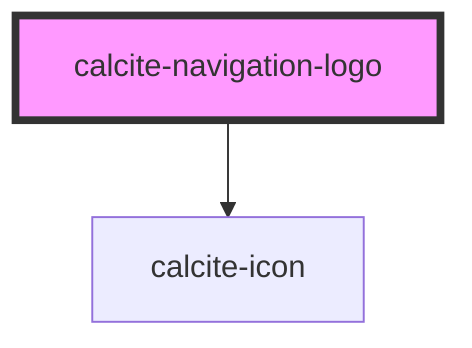

# calcite-navigation-logo

<!-- Auto Generated Below -->

## Usage

### Basic

```html
<calcite-navigation-logo active thumbnail="./_assets/images/esri-logo.svg"></calcite-navigation-user>
```

## Properties

| Property      | Attribute       | Description                                                                                                                               | Type      | Default     |
| ------------- | --------------- | ----------------------------------------------------------------------------------------------------------------------------------------- | --------- | ----------- |
| `active`      | `active`        | When `true`, the component is highlighted.                                                                                                | `boolean` | `undefined` |
| `description` | `description`   | A description for the component, which displays below the `heading`.                                                                      | `string`  | `undefined` |
| `heading`     | `heading`       | Specifies heading text for the component, such as a product or organization name.                                                         | `string`  | `undefined` |
| `href`        | `href`          | Specifies the URL destination of the component, which can be set as an absolute or relative path.                                         | `string`  | `undefined` |
| `icon`        | `icon`          | Specifies an icon to display.                                                                                                             | `string`  | `undefined` |
| `iconFlipRtl` | `icon-flip-rtl` | When `true`, the icon will be flipped when the element direction is right-to-left (`"rtl"`).                                              | `boolean` | `false`     |
| `label`       | `label`         | Describes the appearance or function of the `thumbnail`. If no label is provided, context will not be provided to assistive technologies. | `string`  | `undefined` |
| `rel`         | `rel`           | Defines the relationship between the `href` value and the current document.                                                               | `string`  | `undefined` |
| `target`      | `target`        | Specifies where to open the linked document defined in the `href` property.                                                               | `string`  | `undefined` |
| `thumbnail`   | `thumbnail`     | Specifies the `src` to an image.                                                                                                          | `string`  | `undefined` |

## Methods

### `setFocus() => Promise<void>`

Sets focus on the component.

#### Returns

Type: `Promise<void>`

## Dependencies

### Depends on

- [calcite-icon](../icon)

### Graph



---

*Built with [StencilJS](https://stenciljs.com/)*
