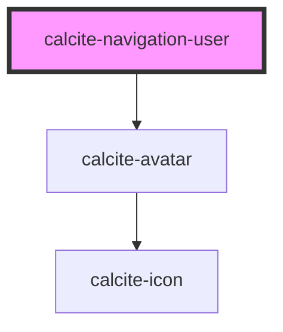

# calcite-navigation-user

<!-- Auto Generated Below -->

## Usage

### Basic

```html
<calcite-navigation-user full-name="Jhon Doe" user-id="Jhon123" active></calcite-navigation-user>
```

## Properties

| Property       | Attribute       | Description                                                                                                              | Type      | Default     |
| -------------- | --------------- | ------------------------------------------------------------------------------------------------------------------------ | --------- | ----------- |
| `active`       | `active`        | When `true`, the component is highlighted.                                                                               | `boolean` | `undefined` |
| `fullName`     | `full-name`     | Specifies the full name of the user.                                                                                     | `string`  | `undefined` |
| `label`        | `label`         | Describes the appearance of the avatar. If no label is provided, context will not be provided to assistive technologies. | `string`  | `undefined` |
| `textDisabled` | `text-disabled` | When `true`, hides the `fullName` and `username` contents.                                                               | `boolean` | `false`     |
| `thumbnail`    | `thumbnail`     | Specifies the `src` to an image (remember to add a token if the user is private).                                        | `string`  | `undefined` |
| `userId`       | `user-id`       | Specifies the unique id of the user.                                                                                     | `string`  | `undefined` |
| `username`     | `username`      | Specifies the username of the user.                                                                                      | `string`  | `undefined` |

## Methods

### `setFocus() => Promise<void>`

Sets focus on the component.

#### Returns

Type: `Promise<void>`

## CSS Custom Properties

| Name                                             | Description                                 |
| ------------------------------------------------ | ------------------------------------------- |
| `--calcite-navigation-user-avatar-corner-radius` | defines the corner radius of the component. |
| `--calcite-navigation-user-avatar-text-color`    | defines the text color of the component.    |

## Dependencies

### Depends on

- [calcite-avatar](../avatar)

### Graph



---

*Built with [StencilJS](https://stenciljs.com/)*
