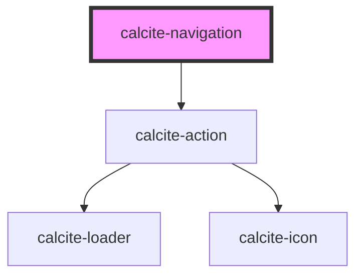

# calcite-navigation

<!-- Auto Generated Below -->

## Usage

### Basic

```html
<calcite-shell>
  <calcite-navigation slot="header">
    <calcite-chip-group slot="content-center">
      <calcite-chip>nav item 1</calcite-chip>
      <calcite-chip>nav item 2</calcite-chip>
      <calcite-chip>nav item 3</calcite-chip>
    </calcite-chip-group>
  </calcite-navigation>
</calcite-shell>
```

## Properties

| Property           | Attribute           | Description                                                                                              | Type      | Default     |
| ------------------ | ------------------- | -------------------------------------------------------------------------------------------------------- | --------- | ----------- |
| `label`            | `label`             | When `navigationAction` is `true`, specifies the label of the `calcite-action`.                          | `string`  | `undefined` |
| `navigationAction` | `navigation-action` | When `true`, displays a `calcite-action` and emits a `calciteNavActionSelect` event on selection change. | `boolean` | `false`     |

## Events

| Event                           | Description                                                                         | Type                |
| ------------------------------- | ----------------------------------------------------------------------------------- | ------------------- |
| `calciteNavigationActionSelect` | When `navigationAction` is true, emits when the displayed action selection changes. | `CustomEvent<void>` |

## Methods

### `setFocus() => Promise<void>`

When `navigation-action` is `true`, sets focus on the component's action element.

#### Returns

Type: `Promise<void>`

## Slots

| Slot                     | Description                                                                                                                                                                                        |
| ------------------------ | -------------------------------------------------------------------------------------------------------------------------------------------------------------------------------------------------- |
| `"content-center"`       | A slot for adding a `calcite-menu`, `calcite-action`, or other interactive elements in the center position of the primary navigation level.                                                        |
| `"content-end"`          | A slot for adding a `calcite-menu`, `calcite-action`, or other interactive elements in the end position of any navigation level.                                                                   |
| `"content-start"`        | A slot for adding a `calcite-menu`, `calcite-action`, or other interactive elements in the start position of any navigation level.                                                                 |
| `"logo"`                 | A slot for adding a `calcite-logo` component to the primary navigation level.                                                                                                                      |
| `"navigation-action"`    | A slot for adding a `calcite-action` component to the primary navigation level.                                                                                                                    |
| `"navigation-secondary"` | A slot for adding a `calcite-navigation` component in the secondary navigation level. Components rendered here will not display `calcite-navigation-logo` or `calcite-navigation-user` components. |
| `"navigation-tertiary"`  | A slot for adding a `calcite-navigation` component in the tertiary navigation level. Components rendered here will not display `calcite-navigation-logo` or `calcite-navigation-user` components.  |
| `"progress"`             | A slot for adding a `calcite-progress` component to the primary navigation level.                                                                                                                  |
| `"user"`                 | A slot for adding a `calcite-user` component to the primary navigation level.                                                                                                                      |

## CSS Custom Properties

| Name                                | Description                                          |
| ----------------------------------- | ---------------------------------------------------- |
| `--calcite-navigation-background`   | Specifies the background color of the component.     |
| `--calcite-navigation-border-color` | Specifies the border color of the component.         |
| `--calcite-navigation-width`        | Specifies the width of the component's content area. |

## Dependencies

### Depends on

- [calcite-action](../action)

### Graph



---

*Built with [StencilJS](https://stenciljs.com/)*
