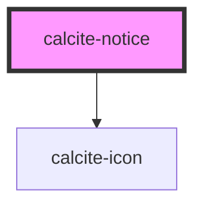

# calcite-notice

For comprehensive guidance on using and implementing `calcite-notice`, refer to the [documentation page](https://developers.arcgis.com/calcite-design-system/components/notice/).

<!-- Auto Generated Below -->

## Properties

| Property           | Attribute           | Description                                                                                                           | Type                                                      | Default     |
| ------------------ | ------------------- | --------------------------------------------------------------------------------------------------------------------- | --------------------------------------------------------- | ----------- |
| `closable`         | `closable`          | When `true`, a close button is added to the component.                                                                | `boolean`                                                 | `false`     |
| `icon`             | `icon`              | When `true`, shows a default recommended icon. Alternatively, pass a Calcite UI Icon name to display a specific icon. | `boolean \| IconName`                                     | `undefined` |
| `iconFlipRtl`      | `icon-flip-rtl`     | When `true`, the icon will be flipped when the element direction is right-to-left (`"rtl"`).                          | `boolean`                                                 | `false`     |
| `kind`             | `kind`              | Specifies the kind of the component, which will apply to top border and icon.                                         | `"brand" \| "danger" \| "info" \| "success" \| "warning"` | `"brand"`   |
| `messageOverrides` | `message-overrides` | Use this property to override individual strings used by the component.                                               | `NoticeMessages`                                          | `undefined` |
| `open`             | `open`              | When `true`, the component is visible.                                                                                | `boolean`                                                 | `false`     |
| `scale`            | `scale`             | Specifies the size of the component.                                                                                  | `"l" \| "m" \| "s"`                                       | `"m"`       |
| `width`            | `width`             | Specifies the width of the component.                                                                                 | `"auto" \| "full" \| "half"`                              | `"auto"`    |

## Events

| Event                      | Description                                                                                              | Type                |
| -------------------------- | -------------------------------------------------------------------------------------------------------- | ------------------- |
| `calciteNoticeBeforeClose` | Fires when the component is requested to be closed and before the closing transition begins.             | `CustomEvent<void>` |
| `calciteNoticeBeforeOpen`  | Fires when the component is added to the DOM but not rendered, and before the opening transition begins. | `CustomEvent<void>` |
| `calciteNoticeClose`       | Fires when the component is closed and animation is complete.                                            | `CustomEvent<void>` |
| `calciteNoticeOpen`        | Fires when the component is open and animation is complete.                                              | `CustomEvent<void>` |

## Methods

### `setFocus() => Promise<void>`

Sets focus on the component's first focusable element.

#### Returns

Type: `Promise<void>`

## Slots

| Slot            | Description                                                                                                    |
| --------------- | -------------------------------------------------------------------------------------------------------------- |
| `"actions-end"` | A slot for adding `calcite-action`s to the end of the component. It is recommended to use two or less actions. |
| `"link"`        | A slot for adding a `calcite-action` to take, such as: "undo", "try again", "link to page", etc.               |
| `"message"`     | A slot for adding the message.                                                                                 |
| `"title"`       | A slot for adding the title.                                                                                   |

## CSS Custom Properties

| Name                     | Description                 |
| ------------------------ | --------------------------- |
| `--calcite-notice-width` | The width of the component. |

## Dependencies

### Depends on

- [calcite-icon](../icon)

### Graph

---

*Built with [StencilJS](https://stenciljs.com/)*
