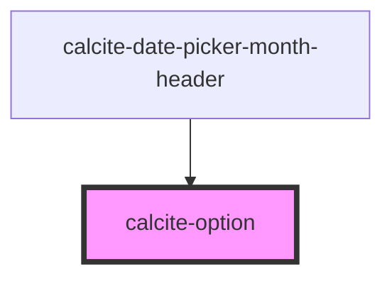

# calcite-option

For comprehensive guidance on using and implementing `calcite-option`, refer to the [documentation page](https://developers.arcgis.com/calcite-design-system/components/option/).

<!-- Auto Generated Below -->

## Properties

| Property   | Attribute  | Description                                                                              | Type      | Default     |
| ---------- | ---------- | ---------------------------------------------------------------------------------------- | --------- | ----------- |
| `disabled` | `disabled` | When `true`, interaction is prevented and the component is displayed with lower opacity. | `boolean` | `false`     |
| `label`    | `label`    | Accessible name for the component.                                                       | `string`  | `undefined` |
| `selected` | `selected` | When `true`, the component is selected.                                                  | `boolean` | `undefined` |
| `value`    | `value`    | The component's value.                                                                   | `any`     | `undefined` |

## Dependencies

### Used by

- [calcite-date-picker-month-header](../date-picker-month-header)

### Graph

---
