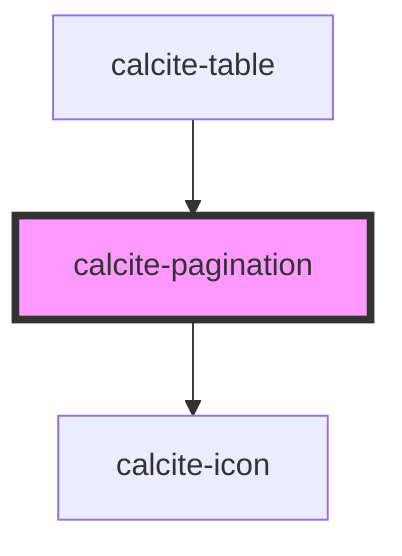

# calcite-pagination

`calcite-pagination` allows users to select a page from a paginated API.

<!-- Auto Generated Below -->

## Usage

### Basic

The component is meant to interface with responses from ArcGIS REST services, so the props share names with [response properties](https://developers.arcgis.com/rest/users-groups-and-items/search.htm) from various search endpoints.

For example, after querying the search API, you'll get back a response similar to JSON below. The response can be passed straight to the `calcite-pagination` component.

```JSON
{
  "total": 2021,
  "start": 1,
  "num": 100,
  "results": []
}
```

```html
<calcite-pagination start-item="1" page-size="100" total-items="2021"></calcite-pagination>
```

## Properties

| Property           | Attribute          | Description                                                                                                       | Type                                                                   | Default     |
| ------------------ | ------------------ | ----------------------------------------------------------------------------------------------------------------- | ---------------------------------------------------------------------- | ----------- |
| `groupSeparator`   | `group-separator`  | When `true`, number values are displayed with a group separator corresponding to the language and country format. | `boolean`                                                              | `false`     |
| `messageOverrides` | --                 | Use this property to override individual strings used by the component.                                           | `{ next?: string; previous?: string; first?: string; last?: string; }` | `undefined` |
| `numberingSystem`  | `numbering-system` | Specifies the Unicode numeral system used by the component for localization.                                      | `"arab" \| "arabext" \| "latn"`                                        | `undefined` |
| `pageSize`         | `page-size`        | Specifies the number of items per page.                                                                           | `number`                                                               | `20`        |
| `scale`            | `scale`            | Specifies the size of the component.                                                                              | `"l" \| "m" \| "s"`                                                    | `"m"`       |
| `startItem`        | `start-item`       | Specifies the starting item number.                                                                               | `number`                                                               | `1`         |
| `totalItems`       | `total-items`      | Specifies the total number of items.                                                                              | `number`                                                               | `0`         |

## Events

| Event                     | Description                           | Type                |
| ------------------------- | ------------------------------------- | ------------------- |
| `calcitePaginationChange` | Emits when the selected page changes. | `CustomEvent<void>` |

## Methods

### `nextPage() => Promise<void>`

Go to the next page of results.

#### Returns

Type: `Promise<void>`

### `previousPage() => Promise<void>`

Go to the previous page of results.

#### Returns

Type: `Promise<void>`

### `setFocus() => Promise<void>`

Sets focus on the component's first focusable element.

#### Returns

Type: `Promise<void>`

## Dependencies

### Used by

- [calcite-table](../table)

### Depends on

- [calcite-icon](../icon)

### Graph



---

*Built with [StencilJS](https://stenciljs.com/)*
