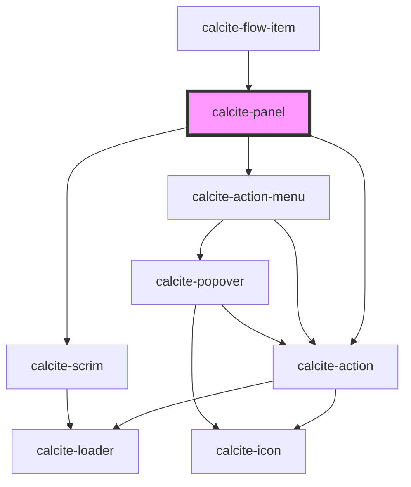

# calcite-panel

The `calcite-panel` component is a container for a header, content and optional footer. The header will have centered content as well as optional leading and trailing content. The panel can also be setup to be dismissible which allows it to be closed by a user.

<!-- Auto Generated Below -->

## Usage

### Basic

Renders a basic panel with a header.

```html
<calcite-panel>
  <div slot="header-content">Header!</div>
  <p>Slotted content!</p>
</calcite-panel>
```

### Closable

Renders a panel that is closable with a click of the "x".

```html
<calcite-panel closable id="closable-panel">
  <div slot="header-content">Closable Header</div>
  <p>Click the X and I go away!</p>
</calcite-panel>
```

### Header-with-actions

Renders a panel with leading and trailing `calcite-action`s.

```html
<calcite-panel>
  <calcite-action
    label="Performs my custom action"
    text="Perform Action!"
    text-enabled
    icon="home"
    slot="header-actions-start"
  ></calcite-action>
  <div slot="header-content">Header!</div>
  <calcite-action
    label="Performs another custom action"
    text="Perform Another Action!"
    text-enabled
    icon="blog"
    slot="header-actions-end"
  ></calcite-action>
  <p>Actions are in the top left and right.</p>
</calcite-panel>
```

### With-footer

Renders a panel with a header and a footer.

```html
<calcite-panel>
  <div slot="header-content">Header!</div>
  <p>I have a footer.</p>
  <div slot="footer">Footer!</div>
</calcite-panel>
```

## Properties

| Property           | Attribute       | Description                                                                              | Type                                    | Default     |
| ------------------ | --------------- | ---------------------------------------------------------------------------------------- | --------------------------------------- | ----------- |
| `closable`         | `closable`      | When `true`, displays a close button in the trailing side of the header.                 | `boolean`                               | `false`     |
| `closed`           | `closed`        | When `true`, the component will be hidden.                                               | `boolean`                               | `false`     |
| `description`      | `description`   | A description for the component.                                                         | `string`                                | `undefined` |
| `disabled`         | `disabled`      | When `true`, interaction is prevented and the component is displayed with lower opacity. | `boolean`                               | `false`     |
| `heading`          | `heading`       | The component header text.                                                               | `string`                                | `undefined` |
| `headingLevel`     | `heading-level` | Specifies the number at which section headings should start.                             | `1 \| 2 \| 3 \| 4 \| 5 \| 6`            | `undefined` |
| `loading`          | `loading`       | When `true`, a busy indicator is displayed.                                              | `boolean`                               | `false`     |
| `menuOpen`         | `menu-open`     | When `true`, the action menu items in the `header-menu-actions` slot are open.           | `boolean`                               | `false`     |
| `messageOverrides` | --              | Use this property to override individual strings used by the component.                  | `{ close?: string; options?: string; }` | `undefined` |

## Events

| Event                | Description                             | Type                |
| -------------------- | --------------------------------------- | ------------------- |
| `calcitePanelClose`  | Fires when the close button is clicked. | `CustomEvent<void>` |
| `calcitePanelScroll` | Fires when the content is scrolled.     | `CustomEvent<void>` |

## Methods

### `scrollContentTo(options?: ScrollToOptions) => Promise<void>`

Scrolls the component's content to a specified set of coordinates.

#### Returns

Type: `Promise<void>`

### `setFocus() => Promise<void>`

Sets focus on the component's first focusable element.

#### Returns

Type: `Promise<void>`

## Slots

| Slot                     | Description                                                                                                  |
| ------------------------ | ------------------------------------------------------------------------------------------------------------ |
|                          | A slot for adding custom content.                                                                            |
| `"action-bar"`           | A slot for adding a `calcite-action-bar` to the component.                                                   |
| `"fab"`                  | A slot for adding a `calcite-fab` (floating action button) to perform an action.                             |
| `"footer"`               | A slot for adding custom content to the footer.                                                              |
| `"footer-actions"`       | [Deprecated] Use the `"footer"` slot instead. A slot for adding `calcite-button`s to the component's footer. |
| `"header-actions-end"`   | A slot for adding actions or content to the end side of the header.                                          |
| `"header-actions-start"` | A slot for adding actions or content to the start side of the header.                                        |
| `"header-content"`       | A slot for adding custom content to the header.                                                              |
| `"header-menu-actions"`  | A slot for adding an overflow menu with actions inside a `calcite-dropdown`.                                 |

## CSS Custom Properties

| Name                             | Description                                      |
| -------------------------------- | ------------------------------------------------ |
| `--calcite-panel-footer-padding` | Specifies the padding of the component's footer. |

## Dependencies

### Used by

- [calcite-flow-item](../flow-item)

### Depends on

- [calcite-action](../action)
- [calcite-action-menu](../action-menu)
- [calcite-scrim](../scrim)

### Graph



---

*Built with [StencilJS](https://stenciljs.com/)*
