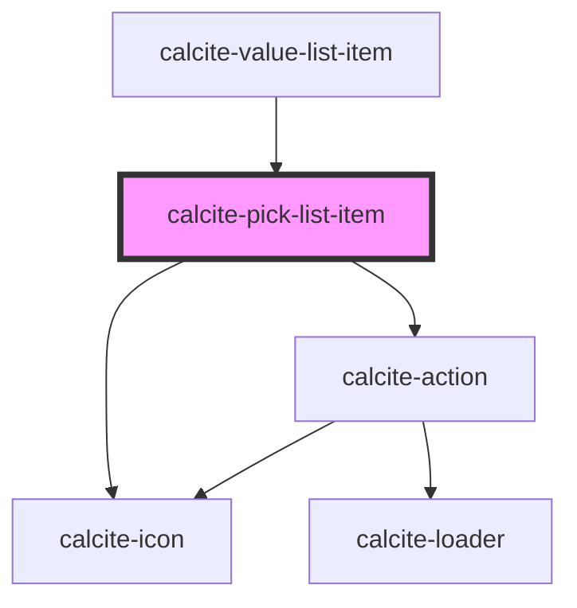

# calcite-pick-list-item

`calcite-pick-list-item`s are cards contained in a `calcite-pick-list`. They each can have a label, description and an icon. The developer can disable or preselect each list item and give it a value.

<!-- Auto Generated Below -->

> **[DEPRECATED]** Use the `list` component instead.

## Properties

| Property             | Attribute           | Description                                                                                                | Type                                                        | Default     |
| -------------------- | ------------------- | ---------------------------------------------------------------------------------------------------------- | ----------------------------------------------------------- | ----------- |
| `description`        | `description`       | A description for the component that displays below the label text.                                        | `string`                                                    | `undefined` |
| `deselectDisabled`   | `deselect-disabled` | When `false`, the component cannot be deselected by user interaction.                                      | `boolean`                                                   | `false`     |
| `disabled`           | `disabled`          | When `true`, interaction is prevented and the component is displayed with lower opacity.                   | `boolean`                                                   | `false`     |
| `icon`               | `icon`              | Determines the icon SVG symbol that will be shown. Options are `"circle"`, `"square"`, `"grip"` or `null`. | `ICON_TYPES.circle \| ICON_TYPES.grip \| ICON_TYPES.square` | `null`      |
| `iconFlipRtl`        | `icon-flip-rtl`     | When `true`, the icon will be flipped when the element direction is right-to-left (`"rtl"`).               | `boolean`                                                   | `false`     |
| `label` *(required)* | `label`             | Label and accessible name for the component. Appears next to the icon.                                     | `string`                                                    | `undefined` |
| `messageOverrides`   | --                  | Use this property to override individual strings used by the component.                                    | `{ remove?: string; }`                                      | `undefined` |
| `metadata`           | --                  | Provides additional metadata to the component. Primary use is for a filter on the parent list.             | `{ [x: string]: unknown; }`                                 | `undefined` |
| `removable`          | `removable`         | When `true`, displays a remove action that removes the item from the list.                                 | `boolean`                                                   | `false`     |
| `selected`           | `selected`          | When `true`, selects an item. Toggles when an item is checked/unchecked.                                   | `boolean`                                                   | `false`     |
| `value` *(required)* | `value`             | The component's value.                                                                                     | `any`                                                       | `undefined` |

## Events

| Event                   | Description                                         | Type                                                                                                           |
| ----------------------- | --------------------------------------------------- | -------------------------------------------------------------------------------------------------------------- |
| `calciteListItemChange` | Fires when the component is selected or unselected. | `CustomEvent<{ item: HTMLCalcitePickListItemElement; value: any; selected: boolean; shiftPressed: boolean; }>` |
| `calciteListItemRemove` | Fires when the remove button is pressed.            | `CustomEvent<void>`                                                                                            |

## Methods

### `setFocus() => Promise<void>`

Sets focus on the component.

#### Returns

Type: `Promise<void>`

### `toggleSelected(coerce?: boolean) => Promise<void>`

Toggles the selection state. By default this won't trigger an event.
The first argument allows the value to be coerced, rather than swapping values.

#### Returns

Type: `Promise<void>`

## Slots

| Slot              | Description                                                                        |
| ----------------- | ---------------------------------------------------------------------------------- |
| `"actions-end"`   | A slot for adding `calcite-action`s or content to the end side of the component.   |
| `"actions-start"` | A slot for adding `calcite-action`s or content to the start side of the component. |

## Dependencies

### Used by

- [calcite-value-list-item](../value-list-item)

### Depends on

- [calcite-icon](../icon)
- [calcite-action](../action)

### Graph

---

*Built with [StencilJS](https://stenciljs.com/)*
