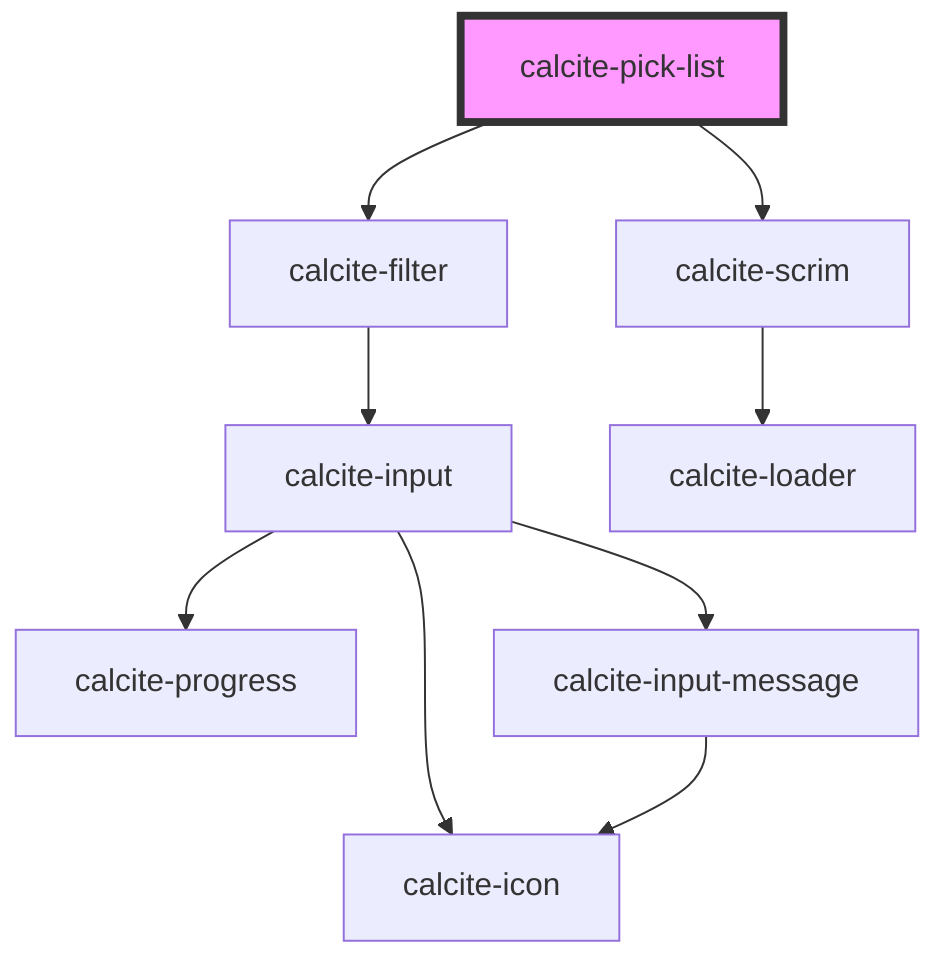

# calcite-pick-list

`calcite-pick-list` lives in a panel and contains `calcite-pick-list-item`s. Each item is able to be be selected via radio button or checkboxes (which have a multiselect and shift-click capability). There is also an option for a filter at the top of the list for searching.

<!-- Auto Generated Below -->

> **[DEPRECATED]** Use the `list` component instead.

## Usage

### Basic

Renders a basic pick list with radio buttons on the left and actions on the right side.

```html
<calcite-pick-list>
  <calcite-pick-list-item label="T. Rex" description="Arm strength impaired" value="trex">
    <calcite-action slot="actions-end" icon="circle"></calcite-action>
  </calcite-pick-list-item>
  <calcite-pick-list-item label="Triceratops" description="3 horn" value="triceratops" selected>
    <calcite-action slot="actions-end" icon="circle"></calcite-action>
  </calcite-pick-list-item>
  <calcite-pick-list-item label="Velociraptor" description="Swift seizer" value="velociraptor">
    <calcite-action slot="actions-end" icon="circle"></calcite-action>
  </calcite-pick-list-item>
</calcite-pick-list>
```

### Multi-select-and-filter-enabled

Renders a pick list with a sticky filter and checkboxes for multiple selection of items.

```html
<calcite-pick-list multiple filter-enabled>
  <calcite-pick-list-item label="Chocolate" value="chocolate">
    <calcite-action slot="actions-end" icon="ellipsis-circle"></calcite-action>
  </calcite-pick-list-item>
  <calcite-pick-list-item label="Vanilla" description="Oldie but goodie" value="vanilla">
    <calcite-action slot="actions-end" icon="ellipsis-circle"></calcite-action>
  </calcite-pick-list-item>
  <calcite-pick-list-item label="Strawberry" description="no metadata on this one" value="strawberry">
    <calcite-action slot="actions-end" icon="ellipsis-circle"></calcite-action>
  </calcite-pick-list-item>
</calcite-pick-list>
```

### Sub-groups

Renders groups of pick list items that are visually separated.

```html
<calcite-pick-list>
  <calcite-pick-list-group group-title="numbers">
    <calcite-pick-list-item label="one" description="fish" value="one" icon="grip">
      <calcite-action slot="actions-end" icon="ellipsis"></calcite-action>
    </calcite-pick-list-item>
    <calcite-pick-list-item label="two" description="fish" value="two" icon="grip">
      <calcite-action slot="actions-end" icon="ellipsis"></calcite-action>
    </calcite-pick-list-item>
  </calcite-pick-list-group>
  <calcite-pick-list-group group-title="colors">
    <calcite-pick-list-item label="red" description="fish" value="red" icon="grip">
      <calcite-action slot="actions-end" icon="ellipsis"></calcite-action>
    </calcite-pick-list-item>
    <calcite-pick-list-item label="blue" description="fish" value="blue" icon="grip">
      <calcite-action slot="actions-end" icon="ellipsis"></calcite-action>
    </calcite-pick-list-item>
  </calcite-pick-list-group>
</calcite-pick-list>
```

## Properties

| Property                | Attribute                 | Description                                                                                                                                                                                                                                                           | Type                                                                                          | Default     |
| ----------------------- | ------------------------- | --------------------------------------------------------------------------------------------------------------------------------------------------------------------------------------------------------------------------------------------------------------------- | --------------------------------------------------------------------------------------------- | ----------- |
| `disabled`              | `disabled`                | When `true`, interaction is prevented and the component is displayed with lower opacity.                                                                                                                                                                              | `boolean`                                                                                     | `false`     |
| `filterEnabled`         | `filter-enabled`          | When `true`, an input appears at the top of the list that can be used by end users to filter items in the list.                                                                                                                                                       | `boolean`                                                                                     | `false`     |
| `filterPlaceholder`     | `filter-placeholder`      | Placeholder text for the filter input field.                                                                                                                                                                                                                          | `string`                                                                                      | `undefined` |
| `filterText`            | `filter-text`             | Text for the filter input field.                                                                                                                                                                                                                                      | `string`                                                                                      | `undefined` |
| `filteredData`          | --                        | The component's filtered data.                                                                                                                                                                                                                                        | `{ label: string; description: string; metadata: Record<string, unknown>; value: string; }[]` | `[]`        |
| `filteredItems`         | --                        | The component's filtered items.                                                                                                                                                                                                                                       | `HTMLCalcitePickListItemElement[]`                                                            | `[]`        |
| `headingLevel`          | `heading-level`           | Specifies the number at which section headings should start.                                                                                                                                                                                                          | `1 \| 2 \| 3 \| 4 \| 5 \| 6`                                                                  | `undefined` |
| `loading`               | `loading`                 | When `true`, a busy indicator is displayed.                                                                                                                                                                                                                           | `boolean`                                                                                     | `false`     |
| `multiple`              | `multiple`                | Similar to standard radio buttons and checkboxes. When `true`, a user can select multiple `calcite-pick-list-item`s at a time. When `false`, only a single `calcite-pick-list-item` can be selected at a time, and a new selection will deselect previous selections. | `boolean`                                                                                     | `false`     |
| `selectionFollowsFocus` | `selection-follows-focus` | When `true` and single selection is enabled, the selection changes when navigating `calcite-pick-list-item`s via keyboard.                                                                                                                                            | `boolean`                                                                                     | `false`     |

## Events

| Event               | Description                                                             | Type                                                       |
| ------------------- | ----------------------------------------------------------------------- | ---------------------------------------------------------- |
| `calciteListChange` | Emits when any of the `calcite-pick-list-item` selections have changed. | `CustomEvent<Map<string, HTMLCalcitePickListItemElement>>` |
| `calciteListFilter` | Emits when a filter has changed.                                        | `CustomEvent<void>`                                        |

## Methods

### `getSelectedItems() => Promise<Map<string, HTMLCalcitePickListItemElement>>`

Returns the component's selected `calcite-pick-list-item`s.

#### Returns

Type: `Promise<Map<string, HTMLCalcitePickListItemElement>>`

### `setFocus(focusId?: ListFocusId) => Promise<void>`

Sets focus on the component's first focusable element.

#### Parameters

| Name      | Type       | Description |
| --------- | ---------- | ----------- |
| `focusId` | `"filter"` |             |

#### Returns

Type: `Promise<void>`

## Slots

| Slot             | Description                                                                                                               |
| ---------------- | ------------------------------------------------------------------------------------------------------------------------- |
|                  | A slot for adding `calcite-pick-list-item` or `calcite-pick-list-group` elements. Items are displayed as a vertical list. |
| `"menu-actions"` | A slot for adding a button and menu combination for performing actions, such as sorting.                                  |

## Dependencies

### Depends on

- [calcite-filter](../filter)
- [calcite-scrim](../scrim)

### Graph



---

*Built with [StencilJS](https://stenciljs.com/)*
