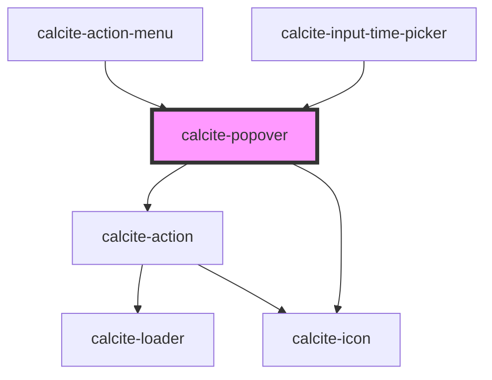

# calcite-popover

<!-- Auto Generated Below -->

## Usage

### Basic

```html
<calcite-popover reference-element="popover-button">Hello! I am some popover content!</calcite-popover>

<calcite-button id="popover-button">Clickable popover</calcite-button>
```

### Virtual

```html
<!-- virtually positioned popover -->
<calcite-popover id="virtual-popover" label="Hello world!" open>
  <p>Hello! I am some virtual popover content!</p>
</calcite-popover>

<script>
  function generateGetBoundingClientRect() {
    return () => ({
      width: 0,
      height: 0,
      top: 100,
      right: 100,
      bottom: 100,
      left: 600,
    });
  }

  const virtualElement = {
    getBoundingClientRect: generateGetBoundingClientRect(),
  };

  const popover = document.getElementById("virtual-popover");
  popover.referenceElement = virtualElement;
</script>
```

## Properties

| Property                        | Attribute             | Description                                                                                                                                                                                                                                                                                                                                                                       | Type                                                                                                                                                                                                                                                                                                              | Default                   |
| ------------------------------- | --------------------- | --------------------------------------------------------------------------------------------------------------------------------------------------------------------------------------------------------------------------------------------------------------------------------------------------------------------------------------------------------------------------------- | ----------------------------------------------------------------------------------------------------------------------------------------------------------------------------------------------------------------------------------------------------------------------------------------------------------------- | ------------------------- |
| `autoClose`                     | `auto-close`          | When `true`, clicking outside of the component automatically closes open `calcite-popover`s.                                                                                                                                                                                                                                                                                      | `boolean`                                                                                                                                                                                                                                                                                                         | `false`                   |
| `closable`                      | `closable`            | When `true`, display a close button within the component.                                                                                                                                                                                                                                                                                                                         | `boolean`                                                                                                                                                                                                                                                                                                         | `false`                   |
| `flipDisabled`                  | `flip-disabled`       | When `true`, prevents flipping the component's placement when overlapping its `referenceElement`.                                                                                                                                                                                                                                                                                 | `boolean`                                                                                                                                                                                                                                                                                                         | `false`                   |
| `flipPlacements`                | --                    | Defines the available placements that can be used when a flip occurs.                                                                                                                                                                                                                                                                                                             | `Placement[]`                                                                                                                                                                                                                                                                                                     | `undefined`               |
| `focusTrapDisabled`             | `focus-trap-disabled` | When `true`, prevents focus trapping.                                                                                                                                                                                                                                                                                                                                             | `boolean`                                                                                                                                                                                                                                                                                                         | `false`                   |
| `heading`                       | `heading`             | The component header text.                                                                                                                                                                                                                                                                                                                                                        | `string`                                                                                                                                                                                                                                                                                                          | `undefined`               |
| `headingLevel`                  | `heading-level`       | Specifies the number at which section headings should start.                                                                                                                                                                                                                                                                                                                      | `1 \| 2 \| 3 \| 4 \| 5 \| 6`                                                                                                                                                                                                                                                                                      | `undefined`               |
| `label` *(required)*            | `label`               | Accessible name for the component.                                                                                                                                                                                                                                                                                                                                                | `string`                                                                                                                                                                                                                                                                                                          | `undefined`               |
| `messageOverrides`              | --                    | Use this property to override individual strings used by the component.                                                                                                                                                                                                                                                                                                           | `{ close?: string; }`                                                                                                                                                                                                                                                                                             | `undefined`               |
| `offsetDistance`                | `offset-distance`     | Offsets the position of the popover away from the `referenceElement`.                                                                                                                                                                                                                                                                                                             | `number`                                                                                                                                                                                                                                                                                                          | `defaultOffsetDistance`   |
| `offsetSkidding`                | `offset-skidding`     | Offsets the position of the component along the `referenceElement`.                                                                                                                                                                                                                                                                                                               | `number`                                                                                                                                                                                                                                                                                                          | `0`                       |
| `open`                          | `open`                | When `true`, displays and positions the component.                                                                                                                                                                                                                                                                                                                                | `boolean`                                                                                                                                                                                                                                                                                                         | `false`                   |
| `overlayPositioning`            | `overlay-positioning` | Determines the type of positioning to use for the overlaid content. Using `"absolute"` will work for most cases. The component will be positioned inside of overflowing parent containers and will affect the container's layout. `"fixed"` value should be used to escape an overflowing parent container, or when the reference element's `position` CSS property is `"fixed"`. | `"absolute" \| "fixed"`                                                                                                                                                                                                                                                                                           | `"absolute"`              |
| `placement`                     | `placement`           | Determines where the component will be positioned relative to the `referenceElement`.                                                                                                                                                                                                                                                                                             | `"auto" \| "top" \| "right" \| "bottom" \| "left" \| "top-start" \| "top-end" \| "right-start" \| "right-end" \| "bottom-start" \| "bottom-end" \| "left-start" \| "left-end" \| "auto-start" \| "auto-end" \| "leading-start" \| "leading" \| "leading-end" \| "trailing-end" \| "trailing" \| "trailing-start"` | `defaultPopoverPlacement` |
| `pointerDisabled`               | `pointer-disabled`    | When `true`, removes the caret pointer.                                                                                                                                                                                                                                                                                                                                           | `boolean`                                                                                                                                                                                                                                                                                                         | `false`                   |
| `referenceElement` *(required)* | `reference-element`   | The `referenceElement` used to position the component according to its `placement` value. Setting to an `HTMLElement` is preferred so the component does not need to query the DOM. However, a string `id` of the reference element can also be used.                                                                                                                             | `Element \| VirtualElement \| string`                                                                                                                                                                                                                                                                             | `undefined`               |
| `scale`                         | `scale`               | Specifies the size of the component.                                                                                                                                                                                                                                                                                                                                              | `"l" \| "m" \| "s"`                                                                                                                                                                                                                                                                                               | `"m"`                     |
| `triggerDisabled`               | `trigger-disabled`    | When `true`, disables automatically toggling the component when its `referenceElement` has been triggered. This property can be set to `true` to manage when the component is open.                                                                                                                                                                                               | `boolean`                                                                                                                                                                                                                                                                                                         | `false`                   |

## Events

| Event                       | Description                                                                                              | Type                |
| --------------------------- | -------------------------------------------------------------------------------------------------------- | ------------------- |
| `calcitePopoverBeforeClose` | Fires when the component is requested to be closed and before the closing transition begins.             | `CustomEvent<void>` |
| `calcitePopoverBeforeOpen`  | Fires when the component is added to the DOM but not rendered, and before the opening transition begins. | `CustomEvent<void>` |
| `calcitePopoverClose`       | Fires when the component is closed and animation is complete.                                            | `CustomEvent<void>` |
| `calcitePopoverOpen`        | Fires when the component is open and animation is complete.                                              | `CustomEvent<void>` |

## Methods

### `reposition(delayed?: boolean) => Promise<void>`

Updates the position of the component.

#### Returns

Type: `Promise<void>`

### `setFocus() => Promise<void>`

Sets focus on the component's first focusable element.

#### Returns

Type: `Promise<void>`

### `updateFocusTrapElements() => Promise<void>`

Updates the element(s) that are used within the focus-trap of the component.

#### Returns

Type: `Promise<void>`

## Slots

| Slot | Description                       |
| ---- | --------------------------------- |
|      | A slot for adding custom content. |

## CSS Custom Properties

| Name                        | Description                               |
| --------------------------- | ----------------------------------------- |
| `--calcite-popover-z-index` | Sets the z-index value for the component. |

## Dependencies

### Used by

- [calcite-action-menu](../action-menu)
- [calcite-input-time-picker](../input-time-picker)

### Depends on

- [calcite-action](../action)
- [calcite-icon](../icon)

### Graph



---

*Built with [StencilJS](https://stenciljs.com/)*
