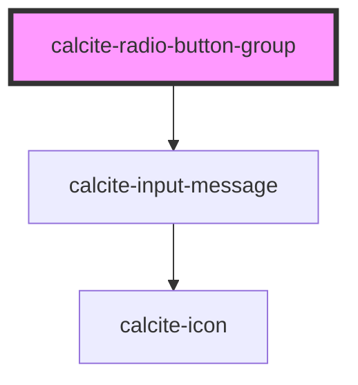

# calcite-radio-button-group

For comprehensive guidance on using and implementing `calcite-radio-button-group`, refer to the [documentation page](https://developers.arcgis.com/calcite-design-system/components/radio-button-group/).

<!-- Auto Generated Below -->

## Properties

| Property            | Attribute            | Description                                                                                          | Type                                   | Default        |
| ------------------- | -------------------- | ---------------------------------------------------------------------------------------------------- | -------------------------------------- | -------------- |
| `disabled`          | `disabled`           | When `true`, interaction is prevented and the component is displayed with lower opacity.             | `boolean`                              | `false`        |
| `layout`            | `layout`             | Defines the layout of the component.                                                                 | `"grid" \| "horizontal" \| "vertical"` | `"horizontal"` |
| `name` *(required)* | `name`               | Specifies the name of the component on form submission. Must be unique to other component instances. | `string`                               | `undefined`    |
| `required`          | `required`           | When `true`, the component must have a value in order for the form to submit.                        | `boolean`                              | `false`        |
| `scale`             | `scale`              | Specifies the size of the component.                                                                 | `"l" \| "m" \| "s"`                    | `"m"`          |
| `selectedItem`      | --                   | Specifies the component's selected item.                                                             | `HTMLCalciteRadioButtonElement`        | `null`         |
| `status`            | `status`             | Specifies the status of the validation message.                                                      | `"idle" \| "invalid" \| "valid"`       | `"idle"`       |
| `validationIcon`    | `validation-icon`    | Specifies the validation icon to display under the component.                                        | `boolean \| IconName`                  | `undefined`    |
| `validationMessage` | `validation-message` | Specifies the validation message to display under the component.                                     | `string`                               | `undefined`    |

## Events

| Event                           | Description                           | Type                |
| ------------------------------- | ------------------------------------- | ------------------- |
| `calciteRadioButtonGroupChange` | Fires when the component has changed. | `CustomEvent<void>` |

## Methods

### `setFocus() => Promise<void>`

Sets focus on the fist focusable `calcite-radio-button` element in the component.

#### Returns

Type: `Promise<void>`

## Slots

| Slot | Description                                |
| ---- | ------------------------------------------ |
|      | A slot for adding `calcite-radio-button`s. |

## Dependencies

### Depends on

- [calcite-input-message](../input-message)

### Graph

---

*Built with [StencilJS](https://stenciljs.com/)*
