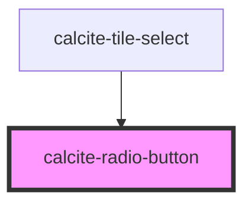

# calcite-radio-button

<!-- Auto Generated Below -->

## Usage

### Basic

```html
<calcite-label for="item-a" layout="inline">
  <calcite-radio-button id="item-a" name="preferred-feature" value="Maps" checked></calcite-radio-button>
  Maps
</calcite-label>
```

## Properties

| Property             | Attribute  | Description                                                                                                                                             | Type                | Default     |
| -------------------- | ---------- | ------------------------------------------------------------------------------------------------------------------------------------------------------- | ------------------- | ----------- |
| `checked`            | `checked`  | When `true`, the component is checked.                                                                                                                  | `boolean`           | `false`     |
| `disabled`           | `disabled` | When `true`, interaction is prevented and the component is displayed with lower opacity.                                                                | `boolean`           | `false`     |
| `form`               | `form`     | The `id` of the form that will be associated with the component. When not set, the component will be associated with its ancestor form element, if any. | `string`            | `undefined` |
| `guid`               | `guid`     | The `id` of the component. When omitted, a globally unique identifier is used.                                                                          | `string`            | `undefined` |
| `name`               | `name`     | Specifies the name of the component. Can be inherited from `calcite-radio-button-group`. Required to pass the component's `value` on form submission.   | `string`            | `undefined` |
| `required`           | `required` | When `true`, the component must have a value selected from the `calcite-radio-button-group` in order for the form to submit.                            | `boolean`           | `false`     |
| `scale`              | `scale`    | Specifies the size of the component inherited from the `calcite-radio-button-group`.                                                                    | `"l" \| "m" \| "s"` | `"m"`       |
| `value` *(required)* | `value`    | The component's value.                                                                                                                                  | `any`               | `undefined` |

## Events

| Event                      | Description                                                                                                                                                                                                                                                                                                                                                                                                                                                 | Type                |
| -------------------------- | ----------------------------------------------------------------------------------------------------------------------------------------------------------------------------------------------------------------------------------------------------------------------------------------------------------------------------------------------------------------------------------------------------------------------------------------------------------- | ------------------- |
| `calciteRadioButtonChange` | Fires only when the radio button is checked. This behavior is identical to the native HTML input element. Since this event does not fire when the radio button is unchecked, it's not recommended to attach a listener for this event directly on the element, but instead either attach it to a node that contains all of the radio buttons in the group or use the `calciteRadioButtonGroupChange` event if using this with `calcite-radio-button-group`. | `CustomEvent<void>` |

## Methods

### `setFocus() => Promise<void>`

Sets focus on the component.

#### Returns

Type: `Promise<void>`

## CSS Custom Properties

| Name                                      | Description                                      |
| ----------------------------------------- | ------------------------------------------------ |
| `--calcite-radio-button-background-color` | Specifies the background color of the component. |
| `--calcite-radio-button-border-radius`    | Specifies the border radius of the component.    |
| `--calcite-radio-button-shadow`           | Specifies the shadow of the component.           |
| `--calcite-radio-button-size`             | Specifies the size of the component.             |
| `--calcite-radio-focus`                   | Specifies the focus of the component.            |

## Dependencies

### Used by

- [calcite-tile-select](../tile-select)

### Graph



---

*Built with [StencilJS](https://stenciljs.com/)*
