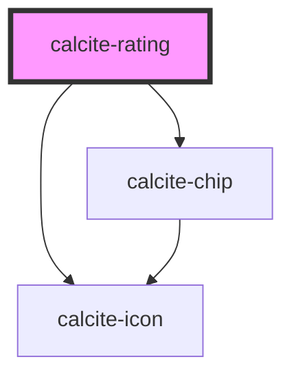

# calcite-rating

<!-- Auto Generated Below -->

## Usage

### Basic

```html
<calcite-rating show-chip scale="m" value="0" average="4.4" count="10"></calcite-rating>
```

## Properties

| Property           | Attribute   | Description                                                                                                                                             | Type                                   | Default     |
| ------------------ | ----------- | ------------------------------------------------------------------------------------------------------------------------------------------------------- | -------------------------------------- | ----------- |
| `average`          | `average`   | Specifies a cumulative average from previous ratings to display.                                                                                        | `number`                               | `undefined` |
| `count`            | `count`     | Specifies the number of previous ratings to display.                                                                                                    | `number`                               | `undefined` |
| `disabled`         | `disabled`  | When `true`, interaction is prevented and the component is displayed with lower opacity.                                                                | `boolean`                              | `false`     |
| `form`             | `form`      | The `id` of the form that will be associated with the component. When not set, the component will be associated with its ancestor form element, if any. | `string`                               | `undefined` |
| `messageOverrides` | --          | Use this property to override individual strings used by the component.                                                                                 | `{ rating?: string; stars?: string; }` | `undefined` |
| `name`             | `name`      | Specifies the name of the component. Required to pass the component's `value` on form submission.                                                       | `string`                               | `undefined` |
| `readOnly`         | `read-only` | When `true`, the component's value can be read, but cannot be modified.                                                                                 | `boolean`                              | `false`     |
| `scale`            | `scale`     | Specifies the size of the component.                                                                                                                    | `"l" \| "m" \| "s"`                    | `"m"`       |
| `showChip`         | `show-chip` | When `true`, and if available, displays the `average` and/or `count` data summary in a `calcite-chip`.                                                  | `boolean`                              | `false`     |
| `value`            | `value`     | The component's value.                                                                                                                                  | `number`                               | `0`         |

## Events

| Event                 | Description                               | Type                |
| --------------------- | ----------------------------------------- | ------------------- |
| `calciteRatingChange` | Fires when the component's value changes. | `CustomEvent<void>` |

## Methods

### `setFocus() => Promise<void>`

Sets focus on the component.

#### Returns

Type: `Promise<void>`

## CSS Custom Properties

| Name                                     | Description                                                                                                   |
| ---------------------------------------- | ------------------------------------------------------------------------------------------------------------- |
| `--calcite-rating-average-fill-color`    | Specifies the fill color for a rating item with average.                                                      |
| `--calcite-rating-chip-background-color` | Specifies the background color of the component's `show-chip` display.                                        |
| `--calcite-rating-chip-border-color`     | Specifies the border color of the component's `show-chip` display.                                            |
| `--calcite-rating-chip-corner-radius`    | Specifies the corner radius of the component's `show-chip` display.                                           |
| `--calcite-rating-chip-shadow`           | Specifies the box shadow of the component's `show-chip` display.                                              |
| `--calcite-rating-chip-text-color`       | Specifies the color of the component's `show-chip` display.                                                   |
| `--calcite-rating-outline-color`         | Specifies the outline color for a rating item.                                                                |
| `--calcite-rating-outline-color-hover`   | Specifies the outline color for a rating item while hovered.                                                  |
| `--calcite-rating-spacing`               | Specifies the amount of spacing between rating items.                                                         |
| `--calcite-rating-spacing-unit`          | [Deprecated] Use the `--calcite-rating-spacing` property instead. The amount of spacing between rating items. |
| `--calcite-rating-value-fill-color`      | Specifies the fill color for a rating item with value.                                                        |

## Dependencies

### Depends on

- [calcite-chip](../chip)
- [calcite-icon](../icon)

### Graph



---

*Built with [StencilJS](https://stenciljs.com/)*
