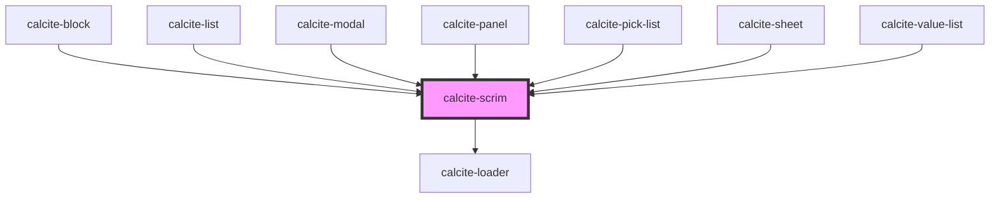

# calcite-scrim

<!-- Auto Generated Below -->

## Usage

### Basic

```html
<div
  tabindex="0"
  style="position: relative; width: 400px; margin: 25px; padding: 25px; resize: both; overflow: auto; background-color: lightBlue;"
>
  <calcite-scrim>
    <p>I'm a panel that is not loading.</p>
    <p>The content below can have any zIndex and it will not be placed above.</p>
  </calcite-scrim>
  <div style="width: 100%; height: 100%; overflow: auto; z-index: 99">
    <p>
      Lorem ipsum dolor sit amet consectetur adipisicing elit. Fugit libero sint eveniet suscipit voluptatibus esse
      neque ipsa cum placeat sequi deserunt hic facere sunt quisquam nostrum itaque officia, labore maiores obcaecati
      repudiandae rerum! Debitis, delectus enim, dignissimos excepturi, accusantium ullam aspernatur quae numquam optio
      porro laudantium. A eaque accusantium quo?
    </p>
    <ul>
      <li>
        Lorem ipsum dolor, sit amet consectetur adipisicing elit. Sit ipsum vitae doloribus praesentium numquam iure
        harum, sequi quibusdam at odio.
      </li>
      <li>
        Lorem, ipsum dolor sit amet consectetur adipisicing elit. Nesciunt at aliquam suscipit nostrum, nulla dolor sunt
        eum, quasi tenetur similique voluptatem corrupti neque voluptatum sint!
      </li>
      <li>
        Lorem ipsum dolor sit amet consectetur adipisicing elit. Nam corporis quos, dolorem veritatis aliquid aut nihil
        sint velit obcaecati praesentium?
      </li>
    </ul>
  </div>
</div>
```

### Loading-scrim-panel

```html
<div
  tabindex="0"
  style="position: relative; width: 400px; margin: 25px; padding: 25px; resize: both; overflow: auto; background-color: lightBlue;"
>
  <calcite-scrim loading>Loading</calcite-scrim>
  <div style="width: 100%; height: 100%; overflow: auto; z-index: 99">
    <p>
      Lorem ipsum dolor sit amet consectetur adipisicing elit. Fugit libero sint eveniet suscipit voluptatibus esse
      neque ipsa cum placeat sequi deserunt hic facere sunt quisquam nostrum itaque officia, labore maiores obcaecati
      repudiandae rerum! Debitis, delectus enim, dignissimos excepturi, accusantium ullam aspernatur quae numquam optio
      porro laudantium. A eaque accusantium quo?
    </p>
    <ul>
      <li>
        Lorem ipsum dolor, sit amet consectetur adipisicing elit. Sit ipsum vitae doloribus praesentium numquam iure
        harum, sequi quibusdam at odio.
      </li>
      <li>
        Lorem, ipsum dolor sit amet consectetur adipisicing elit. Nesciunt at aliquam suscipit nostrum, nulla dolor sunt
        eum, quasi tenetur similique voluptatem corrupti neque voluptatum sint!
      </li>
      <li>
        Lorem ipsum dolor sit amet consectetur adipisicing elit. Nam corporis quos, dolorem veritatis aliquid aut nihil
        sint velit obcaecati praesentium?
      </li>
    </ul>
  </div>
</div>
```

## Properties

| Property           | Attribute | Description                                                             | Type                    | Default     |
| ------------------ | --------- | ----------------------------------------------------------------------- | ----------------------- | ----------- |
| `loading`          | `loading` | When `true`, a busy indicator is displayed.                             | `boolean`               | `false`     |
| `messageOverrides` | --        | Use this property to override individual strings used by the component. | `{ loading?: string; }` | `undefined` |

## Slots

| Slot | Description                                                      |
| ---- | ---------------------------------------------------------------- |
|      | A slot for adding custom content, primarily loading information. |

## CSS Custom Properties

| Name                         | Description                                  |
| ---------------------------- | -------------------------------------------- |
| `--calcite-scrim-background` | Specifies the background color of the scrim. |

## Dependencies

### Used by

- [calcite-block](../block)
- [calcite-list](../list)
- [calcite-modal](../modal)
- [calcite-panel](../panel)
- [calcite-pick-list](../pick-list)
- [calcite-sheet](../sheet)
- [calcite-value-list](../value-list)

### Depends on

- [calcite-loader](../loader)

### Graph



---

*Built with [StencilJS](https://stenciljs.com/)*
