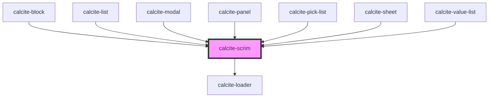

# calcite-scrim

For comprehensive guidance on using and implementing `calcite-scrim`, refer to the [documentation page](https://developers.arcgis.com/calcite-design-system/components/scrim/).

<!-- Auto Generated Below -->

## Properties

| Property           | Attribute           | Description                                                             | Type            | Default     |
| ------------------ | ------------------- | ----------------------------------------------------------------------- | --------------- | ----------- |
| `loading`          | `loading`           | When `true`, a busy indicator is displayed.                             | `boolean`       | `false`     |
| `messageOverrides` | `message-overrides` | Use this property to override individual strings used by the component. | `ScrimMessages` | `undefined` |

## Slots

| Slot | Description                                                      |
| ---- | ---------------------------------------------------------------- |
|      | A slot for adding custom content, primarily loading information. |

## CSS Custom Properties

| Name                         | Description                                  |
| ---------------------------- | -------------------------------------------- |
| `--calcite-scrim-background` | Specifies the background color of the scrim. |

## Dependencies

### Used by

- [calcite-block](../block)
- [calcite-list](../list)
- [calcite-modal](../modal)
- [calcite-panel](../panel)
- [calcite-pick-list](../pick-list)
- [calcite-sheet](../sheet)
- [calcite-value-list](../value-list)

### Depends on

- [calcite-loader](../loader)

### Graph

---

*Built with [StencilJS](https://stenciljs.com/)*
