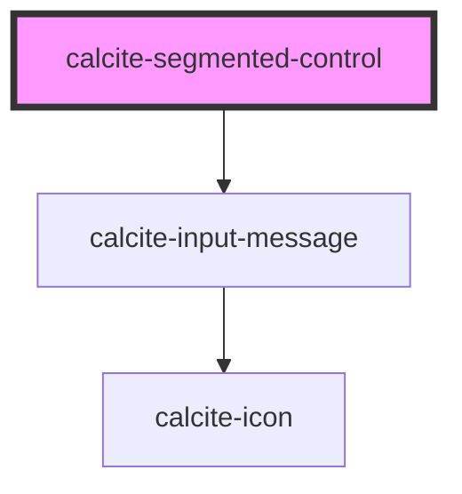

# calcite-segmented-control

<!-- Auto Generated Below -->

## Usage

### Basic

```html
<calcite-segmented-control layout="horizontal" appearance="solid" scale="m" width="auto">
  <calcite-segmented-control-item value="apple" checked>Apple</calcite-segmented-control-item>
  <calcite-segmented-control-item value="mango">Mango</calcite-segmented-control-item>
  <calcite-segmented-control-item value="tomato">Tomato</calcite-segmented-control-item>
  <calcite-segmented-control-item value="banana">Banana</calcite-segmented-control-item>
</calcite-segmented-control>
```

## Properties

| Property            | Attribute            | Description                                                                                                                                             | Type                                     | Default        |
| ------------------- | -------------------- | ------------------------------------------------------------------------------------------------------------------------------------------------------- | ---------------------------------------- | -------------- |
| `appearance`        | `appearance`         | Specifies the appearance style of the component.                                                                                                        | `"outline" \| "outline-fill" \| "solid"` | `"solid"`      |
| `disabled`          | `disabled`           | When `true`, interaction is prevented and the component is displayed with lower opacity.                                                                | `boolean`                                | `false`        |
| `form`              | `form`               | The `id` of the form that will be associated with the component. When not set, the component will be associated with its ancestor form element, if any. | `string`                                 | `undefined`    |
| `layout`            | `layout`             | Defines the layout of the component.                                                                                                                    | `"horizontal" \| "vertical"`             | `"horizontal"` |
| `name`              | `name`               | Specifies the name of the component. Required to pass the component's `value` on form submission.                                                       | `string`                                 | `undefined`    |
| `required`          | `required`           | When `true`, the component must have a value in order for the form to submit.                                                                           | `boolean`                                | `false`        |
| `scale`             | `scale`              | Specifies the size of the component.                                                                                                                    | `"l" \| "m" \| "s"`                      | `"m"`          |
| `selectedItem`      | --                   | The component's selected item `HTMLElement`.                                                                                                            | `HTMLCalciteSegmentedControlItemElement` | `undefined`    |
| `status`            | `status`             | Specifies the status of the validation message.                                                                                                         | `"idle" \| "invalid" \| "valid"`         | `"idle"`       |
| `validationIcon`    | `validation-icon`    | Specifies the validation icon to display under the component.                                                                                           | `boolean \| string`                      | `undefined`    |
| `validationMessage` | `validation-message` | Specifies the validation message to display under the component.                                                                                        | `string`                                 | `undefined`    |
| `value`             | `value`              | The component's `selectedItem` value.                                                                                                                   | `string`                                 | `null`         |
| `width`             | `width`              | Specifies the width of the component.                                                                                                                   | `"auto" \| "full"`                       | `"auto"`       |

## Events

| Event                           | Description                                                        | Type                |
| ------------------------------- | ------------------------------------------------------------------ | ------------------- |
| `calciteSegmentedControlChange` | Fires when the `calcite-segmented-control-item` selection changes. | `CustomEvent<void>` |

## Methods

### `setFocus() => Promise<void>`

Sets focus on the component.

#### Returns

Type: `Promise<void>`

## Slots

| Slot | Description                                          |
| ---- | ---------------------------------------------------- |
|      | A slot for adding `calcite-segmented-control-item`s. |

## CSS Custom Properties

| Name                                           | Description                                      |
| ---------------------------------------------- | ------------------------------------------------ |
| `--calcite-segmented-control-background-color` | Specifies the background color of the component. |
| `--calcite-segmented-control-border-color`     | Specifies the border color of the component.     |

## Dependencies

### Depends on

- [calcite-input-message](../input-message)

### Graph



---

*Built with [StencilJS](https://stenciljs.com/)*
