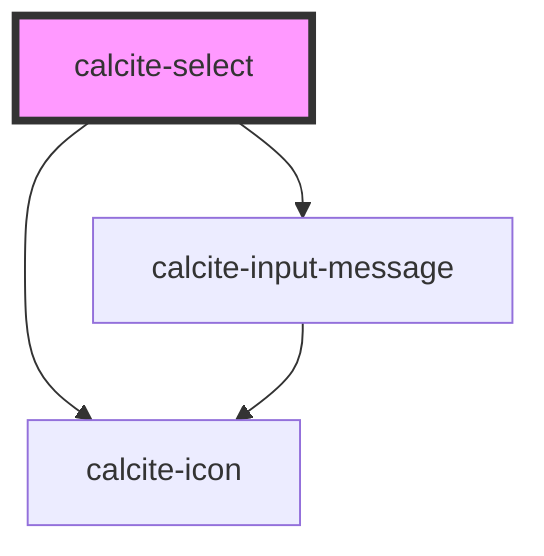

# calcite-select

For comprehensive guidance on using and implementing `calcite-select`, refer to the [documentation page](https://developers.arcgis.com/calcite-design-system/components/select/).

<!-- Auto Generated Below -->

## Properties

| Property             | Attribute            | Description                                                                                                                                             | Type                                                                                                                                                                                                                                                | Default                                                                                                                                                                                                                                                                     |
| -------------------- | -------------------- | ------------------------------------------------------------------------------------------------------------------------------------------------------- | --------------------------------------------------------------------------------------------------------------------------------------------------------------------------------------------------------------------------------------------------- | --------------------------------------------------------------------------------------------------------------------------------------------------------------------------------------------------------------------------------------------------------------------------- |
| `disabled`           | `disabled`           | When `true`, interaction is prevented and the component is displayed with lower opacity.                                                                | `boolean`                                                                                                                                                                                                                                           | `false`                                                                                                                                                                                                                                                                     |
| `form`               | `form`               | The `id` of the form that will be associated with the component. When not set, the component will be associated with its ancestor form element, if any. | `string`                                                                                                                                                                                                                                            | `undefined`                                                                                                                                                                                                                                                                 |
| `label` *(required)* | `label`              | Accessible name for the component.                                                                                                                      | `string`                                                                                                                                                                                                                                            | `undefined`                                                                                                                                                                                                                                                                 |
| `name`               | `name`               | Specifies the name of the component. Required to pass the component's `value` on form submission.                                                       | `string`                                                                                                                                                                                                                                            | `undefined`                                                                                                                                                                                                                                                                 |
| `required`           | `required`           | When `true`, the component must have a value in order for the form to submit.                                                                           | `boolean`                                                                                                                                                                                                                                           | `false`                                                                                                                                                                                                                                                                     |
| `scale`              | `scale`              | Specifies the size of the component.                                                                                                                    | `"l" \| "m" \| "s"`                                                                                                                                                                                                                                 | `"m"`                                                                                                                                                                                                                                                                       |
| `selectedOption`     | --                   | The component's selected option `HTMLElement`.                                                                                                          | `HTMLCalciteOptionElement`                                                                                                                                                                                                                          | `undefined`                                                                                                                                                                                                                                                                 |
| `status`             | `status`             | Specifies the status of the input field, which determines message and icons.                                                                            | `"idle" \| "invalid" \| "valid"`                                                                                                                                                                                                                    | `"idle"`                                                                                                                                                                                                                                                                    |
| `validationIcon`     | `validation-icon`    | Specifies the validation icon to display under the component.                                                                                           | `boolean \| IconName`                                                                                                                                                                                                                               | `undefined`                                                                                                                                                                                                                                                                 |
| `validationMessage`  | `validation-message` | Specifies the validation message to display under the component.                                                                                        | `string`                                                                                                                                                                                                                                            | `undefined`                                                                                                                                                                                                                                                                 |
| `validity`           | --                   | The current validation state of the component.                                                                                                          | `{ valid: boolean; badInput: boolean; customError: boolean; patternMismatch: boolean; rangeOverflow: boolean; rangeUnderflow: boolean; stepMismatch: boolean; tooLong: boolean; tooShort: boolean; typeMismatch: boolean; valueMissing: boolean; }` | `{     valid: false,     badInput: false,     customError: false,     patternMismatch: false,     rangeOverflow: false,     rangeUnderflow: false,     stepMismatch: false,     tooLong: false,     tooShort: false,     typeMismatch: false,     valueMissing: false,   }` |
| `value`              | `value`              | The component's `selectedOption` value.                                                                                                                 | `string`                                                                                                                                                                                                                                            | `null`                                                                                                                                                                                                                                                                      |
| `width`              | `width`              | Specifies the width of the component.                                                                                                                   | `"auto" \| "full" \| "half"`                                                                                                                                                                                                                        | `"auto"`                                                                                                                                                                                                                                                                    |

## Events

| Event                 | Description                              | Type                |
| --------------------- | ---------------------------------------- | ------------------- |
| `calciteSelectChange` | Fires when the `selectedOption` changes. | `CustomEvent<void>` |

## Methods

### `setFocus() => Promise<void>`

Sets focus on the component.

#### Returns

Type: `Promise<void>`

## Slots

| Slot | Description                          |
| ---- | ------------------------------------ |
|      | A slot for adding `calcite-option`s. |

## CSS Custom Properties

| Name                         | Description                                          |
| ---------------------------- | ---------------------------------------------------- |
| `--calcite-select-font-size` | The font size of `calcite-option`s in the component. |
| `--calcite-select-spacing`   | The padding around the selected option text.         |

## Dependencies

### Depends on

- [calcite-icon](../icon)
- [calcite-input-message](../input-message)

### Graph

---

*Built with [StencilJS](https://stenciljs.com/)*
