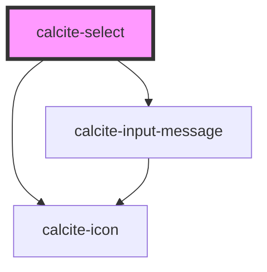

# calcite-select

This component represents a menu of options.

<!-- Auto Generated Below -->

## Usage

### Basic

```html
<calcite-select>
  <calcite-option label="Java" value="java"></calcite-option>
  <calcite-option label="Python" value="python"></calcite-option>
  <calcite-option label="JavaScript" value="javascript"></calcite-option>
  <calcite-option label="C#" value="csharp" disabled></calcite-option>
</calcite-select>
```

### Content

Specify the underlying value and content for each option.

```html
<calcite-select>
  <calcite-option label="Java" value="java">Java Programming</calcite-option>
  <calcite-option label="Python" value="python">Python Programming</calcite-option>
  <calcite-option label="JavaScript" value="javascript">JavaScript Development</calcite-option>
  <calcite-option label="C#" value="csharp" disabled>C# Programming (Disabled)</calcite-option>
</calcite-select>
```

### Disable

Disable specific items or groups.

```html
<calcite-select>
  <calcite-option-group label="Mammals">
    <calcite-option>Cat</calcite-option>
    <calcite-option>Dog</calcite-option>
    <calcite-option>Horse</calcite-option>
    <calcite-option disabled>Elephant (disabled)</calcite-option>
  </calcite-option-group>
  <calcite-option-group label="Birds">
    <calcite-option disabled>Penguin (disabled)</calcite-option>
    <calcite-option>Parrot</calcite-option>
    <calcite-option selected>Owl</calcite-option>
  </calcite-option-group>
  <calcite-option-group label="Reptiles">
    <calcite-option disabled>Crocodile (disabled)</calcite-option>
    <calcite-option>Lizard</calcite-option>
    <calcite-option>Snake</calcite-option>
  </calcite-option-group>
</calcite-select>
```

### Grouped

Separate the options into groups.

```html
<calcite-select>
  <calcite-option-group label="Continents">
    <calcite-option>Africa</calcite-option>
    <calcite-option>Asia</calcite-option>
    <calcite-option>Europe</calcite-option>
    <calcite-option>North America</calcite-option>
    <calcite-option>South America</calcite-option>
    <calcite-option>Australia</calcite-option>
    <calcite-option>Antarctica</calcite-option>
  </calcite-option-group>
  <calcite-option-group label="Oceans">
    <calcite-option>Atlantic Ocean</calcite-option>
    <calcite-option>Indian Ocean</calcite-option>
    <calcite-option selected>Pacific Ocean</calcite-option>
    <calcite-option>Southern Ocean</calcite-option>
    <calcite-option>Arctic Ocean</calcite-option>
  </calcite-option-group>
</calcite-select>
```

### Side-by-side

Separate the options side by side using a flex-box container.

```html
<div class="demo-side-by-side">
  <calcite-select width="half" label="Preferred Activity">
    <calcite-option selected>🚴 Cycling</calcite-option>
    <calcite-option>🏞️ Hiking</calcite-option>
    <calcite-option>🎣 Fishing</calcite-option>
  </calcite-select>
  <calcite-select width="half" label="Preferred Music Genre">
    <calcite-option>🎸 Rock</calcite-option>
    <calcite-option>🎷 Jazz</calcite-option>
    <calcite-option>🤠 Country</calcite-option>
  </calcite-select>
</div>
```

### Value

Specify the underlying value for each option.

```html
<calcite-select>
  <calcite-option value="3">High</calcite-option>
  <calcite-option value="2">Medium</calcite-option>
  <calcite-option value="1">Low</calcite-option>
</calcite-select>
```

## Properties

| Property             | Attribute            | Description                                                                                                                                           | Type                             | Default     |
| -------------------- | -------------------- | ----------------------------------------------------------------------------------------------------------------------------------------------------- | -------------------------------- | ----------- |
| `disabled`           | `disabled`           | When `true`, interaction is prevented and the component is displayed with lower opacity.                                                              | `boolean`                        | `false`     |
| `form`               | `form`               | The ID of the form that will be associated with the component. When not set, the component will be associated with its ancestor form element, if any. | `string`                         | `undefined` |
| `label` *(required)* | `label`              | Accessible name for the component.                                                                                                                    | `string`                         | `undefined` |
| `name`               | `name`               | Specifies the name of the component. Required to pass the component's `value` on form submission.                                                     | `string`                         | `undefined` |
| `required`           | `required`           | When `true`, the component must have a value in order for the form to submit.                                                                         | `boolean`                        | `false`     |
| `scale`              | `scale`              | Specifies the size of the component.                                                                                                                  | `"l" \| "m" \| "s"`              | `"m"`       |
| `selectedOption`     | --                   | The component's selected option `HTMLElement`.                                                                                                        | `HTMLCalciteOptionElement`       | `undefined` |
| `status`             | `status`             | Specifies the status of the input field, which determines message and icons.                                                                          | `"idle" \| "invalid" \| "valid"` | `"idle"`    |
| `validationIcon`     | `validation-icon`    | Specifies the validation icon to display under the component.                                                                                         | `boolean \| string`              | `undefined` |
| `validationMessage`  | `validation-message` | Specifies the validation message to display under the component.                                                                                      | `string`                         | `undefined` |
| `value`              | `value`              | The component's `selectedOption` value.                                                                                                               | `string`                         | `null`      |
| `width`              | `width`              | Specifies the width of the component.                                                                                                                 | `"auto" \| "full" \| "half"`     | `"auto"`    |

## Events

| Event                 | Description                              | Type                |
| --------------------- | ---------------------------------------- | ------------------- |
| `calciteSelectChange` | Fires when the `selectedOption` changes. | `CustomEvent<void>` |

## Methods

### `setFocus() => Promise<void>`

Sets focus on the component.

#### Returns

Type: `Promise<void>`

## Slots

| Slot | Description                          |
| ---- | ------------------------------------ |
|      | A slot for adding `calcite-option`s. |

## CSS Custom Properties

| Name                         | Description                                          |
| ---------------------------- | ---------------------------------------------------- |
| `--calcite-select-font-size` | The font size of `calcite-option`s in the component. |
| `--calcite-select-spacing`   | The padding around the selected option text.         |

## Dependencies

### Depends on

- [calcite-icon](../icon)
- [calcite-input-message](../input-message)

### Graph



---

*Built with [StencilJS](https://stenciljs.com/)*
