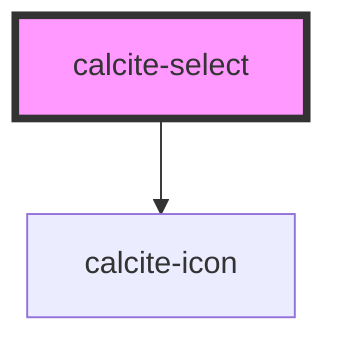

# calcite-select

This component represents a menu of options.

<!-- Auto Generated Below -->

## Usage

### Basic

```html
<calcite-select>
  <calcite-option>high</calcite-option>
  <calcite-option>medium</calcite-option>
  <calcite-option>low</calcite-option>
</calcite-select>
```

### Content

Specify the underlying value and content for each option.

```html
<calcite-select>
  <calcite-option label="high">1</calcite-option>
  <calcite-option label="medium">2</calcite-option>
  <calcite-option label="low">3</calcite-option>
</calcite-select>
```

### Disable

Disable specific items or groups.

```html
<calcite-select>
  <calcite-option-group label="letters">
    <calcite-option>a</calcite-option>
    <calcite-option>b</calcite-option>
    <calcite-option>c</calcite-option>
    <calcite-option disabled>d (disabled)</calcite-option>
  </calcite-option-group>
  <calcite-option-group label="numbers">
    <calcite-option disabled>1 (disabled)</calcite-option>
    <calcite-option>2</calcite-option>
    <calcite-option selected>2</calcite-option>
  </calcite-option-group>
  <calcite-option-group label="non-selectable" disabled>
    <calcite-option>You-Know-Who</calcite-option>
    <calcite-option selected>Tom Marvolo Riddle</calcite-option>
    <calcite-option>He-Who-Must-Not-Be-Named</calcite-option>
    <calcite-option>Voldemort</calcite-option>
  </calcite-option-group>
</calcite-select>
```

### Grouped

Separate the options into groups.

```html
<calcite-select>
  <calcite-option-group label="letters">
    <calcite-option>a</calcite-option>
    <calcite-option>b</calcite-option>
    <calcite-option>c</calcite-option>
  </calcite-option-group>
  <calcite-option-group label="numbers">
    <calcite-option>1</calcite-option>
    <calcite-option selected>2</calcite-option>
    <calcite-option>3</calcite-option>
  </calcite-option-group>
</calcite-select>
```

### Side-by-side

Separate the options side by side using a flex-box container.

```html
<div class="demo-side-by-side">
  <calcite-select width="half" label="half width">
    <calcite-option>☕️</calcite-option>
    <calcite-option>🍵</calcite-option>
    <calcite-option selected>🍻</calcite-option>
  </calcite-select>
  <calcite-select width="half" label="half width">
    <calcite-option selected>🌮</calcite-option>
    <calcite-option>🍔</calcite-option>
    <calcite-option>🌯</calcite-option>
  </calcite-select>
</div>
```

### Value

Specify the underlying value for each option.

```html
<calcite-select>
  <calcite-option value="high">😃</calcite-option>
  <calcite-option value="medium">😶</calcite-option>
  <calcite-option value="low">😭</calcite-option>
</calcite-select>
```

## Properties

| Property             | Attribute  | Description                                                                                                                                           | Type                         | Default     |
| -------------------- | ---------- | ----------------------------------------------------------------------------------------------------------------------------------------------------- | ---------------------------- | ----------- |
| `disabled`           | `disabled` | When `true`, interaction is prevented and the component is displayed with lower opacity.                                                              | `boolean`                    | `false`     |
| `form`               | `form`     | The ID of the form that will be associated with the component. When not set, the component will be associated with its ancestor form element, if any. | `string`                     | `undefined` |
| `label` *(required)* | `label`    | Accessible name for the component.                                                                                                                    | `string`                     | `undefined` |
| `name`               | `name`     | Specifies the name of the component. Required to pass the component's `value` on form submission.                                                     | `string`                     | `undefined` |
| `scale`              | `scale`    | Specifies the size of the component.                                                                                                                  | `"l" \| "m" \| "s"`          | `"m"`       |
| `selectedOption`     | --         | The component's selected option `HTMLElement`.                                                                                                        | `HTMLCalciteOptionElement`   | `undefined` |
| `value`              | `value`    | The component's `selectedOption` value.                                                                                                               | `string`                     | `null`      |
| `width`              | `width`    | Specifies the width of the component.                                                                                                                 | `"auto" \| "full" \| "half"` | `"auto"`    |

## Events

| Event                 | Description                              | Type                |
| --------------------- | ---------------------------------------- | ------------------- |
| `calciteSelectChange` | Fires when the `selectedOption` changes. | `CustomEvent<void>` |

## Methods

### `setFocus() => Promise<void>`

Sets focus on the component.

#### Returns

Type: `Promise<void>`

## Slots

| Slot | Description                          |
| ---- | ------------------------------------ |
|      | A slot for adding `calcite-option`s. |

## CSS Custom Properties

| Name                         | Description                                  |
| ---------------------------- | -------------------------------------------- |
| `--calcite-select-font-size` | The font size of items in the component.     |
| `--calcite-select-spacing`   | The padding around the selected option text. |

## Dependencies

### Depends on

- [calcite-icon](../icon)

### Graph



---

*Built with [StencilJS](https://stenciljs.com/)*
