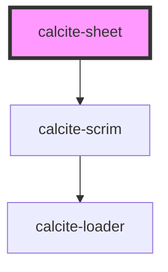

# calcite-sheet

For comprehensive guidance on using and implementing `calcite-sheet`, refer to the [documentation page](https://developers.arcgis.com/calcite-design-system/components/sheet/).

<!-- Auto Generated Below -->

## Properties

| Property               | Attribute                | Description                                                                                                                 | Type                                                             | Default          |
| ---------------------- | ------------------------ | --------------------------------------------------------------------------------------------------------------------------- | ---------------------------------------------------------------- | ---------------- |
| `beforeClose`          | --                       | Passes a function to run before the component closes.                                                                       | `(el: HTMLCalciteSheetElement) => Promise<void>`                 | `undefined`      |
| `displayMode`          | `display-mode`           | Specifies the display mode - `"float"` (content is separated detached), or `"overlay"` (displays on top of center content). | `"float" \| "overlay"`                                           | `"overlay"`      |
| `escapeDisabled`       | `escape-disabled`        | When `true`, disables the default close on escape behavior.                                                                 | `boolean`                                                        | `false`          |
| `focusTrapDisabled`    | `focus-trap-disabled`    | When `true`, prevents focus trapping.                                                                                       | `boolean`                                                        | `false`          |
| `heightScale`          | `height-scale`           | When `position` is `"block-start"` or `"block-end"`, specifies the height of the component.                                 | `"l" \| "m" \| "s"`                                              | `"m"`            |
| `label` *(required)*   | `label`                  | Specifies the label of the component.                                                                                       | `string`                                                         | `undefined`      |
| `open`                 | `open`                   | When `true`, displays and positions the component.                                                                          | `boolean`                                                        | `false`          |
| `outsideCloseDisabled` | `outside-close-disabled` | When `true`, disables the closing of the component when clicked outside.                                                    | `boolean`                                                        | `false`          |
| `position`             | `position`               | Determines where the component will be positioned.                                                                          | `"block-end" \| "block-start" \| "inline-end" \| "inline-start"` | `"inline-start"` |
| `widthScale`           | `width-scale`            | When `position` is `"inline-start"` or `"inline-end"`, specifies the width of the component.                                | `"l" \| "m" \| "s"`                                              | `"m"`            |

## Events

| Event                     | Description                                                                                              | Type                |
| ------------------------- | -------------------------------------------------------------------------------------------------------- | ------------------- |
| `calciteSheetBeforeClose` | Fires when the component is requested to be closed and before the closing transition begins.             | `CustomEvent<void>` |
| `calciteSheetBeforeOpen`  | Fires when the component is added to the DOM but not rendered, and before the opening transition begins. | `CustomEvent<void>` |
| `calciteSheetClose`       | Fires when the component is closed and animation is complete.                                            | `CustomEvent<void>` |
| `calciteSheetOpen`        | Fires when the component is open and animation is complete.                                              | `CustomEvent<void>` |

## Methods

### `setFocus() => Promise<void>`

Sets focus on the component's "close" button - the first focusable item.

#### Returns

Type: `Promise<void>`

### `updateFocusTrapElements() => Promise<void>`

Updates the element(s) that are used within the focus-trap of the component.

#### Returns

Type: `Promise<void>`

## CSS Custom Properties

| Name                               | Description                                                                                          |
| ---------------------------------- | ---------------------------------------------------------------------------------------------------- |
| `--calcite-sheet-height`           | When `position` is `"block-start"` or `"block-end"`, specifies the height of the component.          |
| `--calcite-sheet-max-height`       | When `position` is `"block-start"` or `"block-end"`, specifies the maximum height of the component.  |
| `--calcite-sheet-max-width`        | When `position` is `"inline-start"` or `"inline-end"`, specifies the maximum width of the component. |
| `--calcite-sheet-min-height`       | When `position` is `"block-start"` or `"block-end"`, specifies the minimum height of the component.  |
| `--calcite-sheet-min-width`        | When `position` is `"inline-start"` or `"inline-end"`, specifies the minimum width of the component. |
| `--calcite-sheet-scrim-background` | Specifies the background color of the sheet scrim.                                                   |
| `--calcite-sheet-width`            | When `position` is `"inline-start"` or `"inline-end"`, specifies the width of the component.         |

## Dependencies

### Depends on

- [calcite-scrim](../scrim)

### Graph

---

*Built with [StencilJS](https://stenciljs.com/)*
