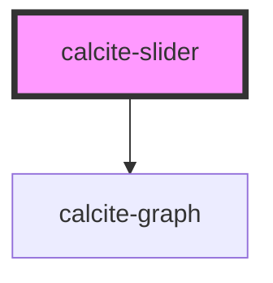

# calcite-slider

Range selection component for selecting single or multiple numeric values inside a given range.

<!-- Auto Generated Below -->

## Usage

### Basic

```html
<calcite-slider min="1" max="100" value="50" step="1"></calcite-slider>
```

### Two-handles

If you'd like to allow an upper and lower value selection (two handles), you can set `min-value` and `max-value` rather than `value`. Note: these are mutually exclusive.

```html
<calcite-slider
  min="1"
  max="100"
  min-value="50"
  max-value="85"
  step="1"
  min-label="Temperature (lower)"
  max-label="Temperature (upper)"
></calcite-slider>
```

## Properties

| Property          | Attribute          | Description                                                                                                                                           | Type                            | Default     |
| ----------------- | ------------------ | ----------------------------------------------------------------------------------------------------------------------------------------------------- | ------------------------------- | ----------- |
| `disabled`        | `disabled`         | When `true`, interaction is prevented and the component is displayed with lower opacity.                                                              | `boolean`                       | `false`     |
| `form`            | `form`             | The ID of the form that will be associated with the component. When not set, the component will be associated with its ancestor form element, if any. | `string`                        | `undefined` |
| `groupSeparator`  | `group-separator`  | When `true`, number values are displayed with a group separator corresponding to the language and country format.                                     | `boolean`                       | `false`     |
| `hasHistogram`    | `has-histogram`    | When `true`, indicates a histogram is present.                                                                                                        | `boolean`                       | `false`     |
| `histogram`       | --                 | A list of the histogram's x,y coordinates within the component's `min` and `max`. Displays above the component's track.                               | `Point[]`                       | `undefined` |
| `histogramStops`  | --                 | A set of single color stops for a histogram, sorted by offset ascending.                                                                              | `ColorStop[]`                   | `undefined` |
| `labelHandles`    | `label-handles`    | When `true`, displays label handles with their numeric value.                                                                                         | `boolean`                       | `false`     |
| `labelTicks`      | `label-ticks`      | When `true` and `ticks` is specified, displays label tick marks with their numeric value.                                                             | `boolean`                       | `false`     |
| `max`             | `max`              | The component's maximum selectable value.                                                                                                             | `number`                        | `100`       |
| `maxLabel`        | `max-label`        | For multiple selections, the accessible name for the second handle, such as `"Temperature, upper bound"`.                                             | `string`                        | `undefined` |
| `maxValue`        | `max-value`        | For multiple selections, the component's upper value.                                                                                                 | `number`                        | `undefined` |
| `min`             | `min`              | The component's minimum selectable value.                                                                                                             | `number`                        | `0`         |
| `minLabel`        | `min-label`        | Accessible name for first (or only) handle, such as `"Temperature, lower bound"`.                                                                     | `string`                        | `undefined` |
| `minValue`        | `min-value`        | For multiple selections, the component's lower value.                                                                                                 | `number`                        | `undefined` |
| `mirrored`        | `mirrored`         | When `true`, the slider will display values from high to low. Note that this value will be ignored if the slider has an associated histogram.         | `boolean`                       | `false`     |
| `name`            | `name`             | Specifies the name of the component. Required to pass the component's `value` on form submission.                                                     | `string`                        | `undefined` |
| `numberingSystem` | `numbering-system` | Specifies the Unicode numeral system used by the component for localization.                                                                          | `"arab" \| "arabext" \| "latn"` | `undefined` |
| `pageStep`        | `page-step`        | Specifies the interval to move with the page up, or page down keys.                                                                                   | `number`                        | `undefined` |
| `precise`         | `precise`          | When `true`, sets a finer point for handles.                                                                                                          | `boolean`                       | `false`     |
| `required`        | `required`         | When `true`, the component must have a value in order for the form to submit.                                                                         | `boolean`                       | `false`     |
| `scale`           | `scale`            | Specifies the size of the component.                                                                                                                  | `"l" \| "m" \| "s"`             | `"m"`       |
| `snap`            | `snap`             | When `true`, enables snap selection in coordination with `step` via a mouse.                                                                          | `boolean`                       | `false`     |
| `step`            | `step`             | Specifies the interval to move with the up, or down keys.                                                                                             | `number`                        | `1`         |
| `ticks`           | `ticks`            | Displays tick marks on the number line at a specified interval.                                                                                       | `number`                        | `undefined` |
| `value`           | `value`            | The component's value.                                                                                                                                | `number \| number[]`            | `0`         |

## Events

| Event                 | Description                                                                                                                                                                                                      | Type                |
| --------------------- | ---------------------------------------------------------------------------------------------------------------------------------------------------------------------------------------------------------------- | ------------------- |
| `calciteSliderChange` | Fires when the thumb is released on the component. **Note:** If you need to constantly listen to the drag event, use `calciteSliderInput` instead.                                                               | `CustomEvent<void>` |
| `calciteSliderInput`  | Fires on all updates to the component. **Note:** Will be fired frequently during drag. If you are performing any expensive operations consider using a debounce or throttle to avoid locking up the main thread. | `CustomEvent<void>` |

## Methods

### `setFocus() => Promise<void>`

Sets focus on the component.

#### Returns

Type: `Promise<void>`

## Dependencies

### Depends on

- [calcite-graph](../graph)

### Graph



---

*Built with [StencilJS](https://stenciljs.com/)*
