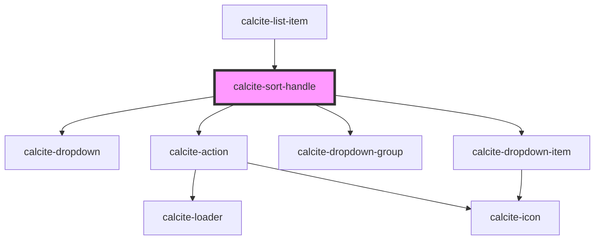

# calcite-sort-handle

<!-- Auto Generated Below -->

## Properties

| Property             | Attribute             | Description                                                                                                                                                                                                                                                                                                                                                                 | Type                                                                              | Default                |
| -------------------- | --------------------- | --------------------------------------------------------------------------------------------------------------------------------------------------------------------------------------------------------------------------------------------------------------------------------------------------------------------------------------------------------------------------- | --------------------------------------------------------------------------------- | ---------------------- |
| `disabled`           | `disabled`            | When `true`, interaction is prevented and the component is displayed with lower opacity.                                                                                                                                                                                                                                                                                    | `boolean`                                                                         | `false`                |
| `flipPlacements`     | --                    | Specifies the component's fallback `calcite-dropdown-item` `placement` when it's initial or specified `placement` has insufficient space available.                                                                                                                                                                                                                         | `FlipPlacement[]`                                                                 | `undefined`            |
| `label`              | `label`               | Specifies the label of the component.                                                                                                                                                                                                                                                                                                                                       | `string`                                                                          | `undefined`            |
| `maxItems`           | `max-items`           | Specifies the maximum number of `calcite-dropdown-item`s to display before showing a scroller. Value must be greater than `0`, and does not include `groupTitle`'s from `calcite-dropdown-group`.                                                                                                                                                                           | `number`                                                                          | `0`                    |
| `messageOverrides`   | `message-overrides`   | Use this property to override individual strings used by the component.                                                                                                                                                                                                                                                                                                     | `SortHandleMessages`                                                              | `undefined`            |
| `moveToItems`        | --                    | Defines the "Move to" items.                                                                                                                                                                                                                                                                                                                                                | `MoveTo[]`                                                                        | `undefined`            |
| `open`               | `open`                | When `true`, displays and positions the component.                                                                                                                                                                                                                                                                                                                          | `boolean`                                                                         | `false`                |
| `overlayPositioning` | `overlay-positioning` | Determines the type of positioning to use for the overlaid content. Using `"absolute"` will work for most cases. The component will be positioned inside of overflowing parent containers and will affect the container's layout. `"fixed"` should be used to escape an overflowing parent container, or when the reference element's `position` CSS property is `"fixed"`. | `"absolute" \| "fixed"`                                                           | `"absolute"`           |
| `placement`          | `placement`           | Determines where the component will be positioned relative to the container element.                                                                                                                                                                                                                                                                                        | `"bottom" \| "bottom-end" \| "bottom-start" \| "top" \| "top-end" \| "top-start"` | `defaultMenuPlacement` |
| `scale`              | `scale`               | Specifies the size of the component.                                                                                                                                                                                                                                                                                                                                        | `"l" \| "m" \| "s"`                                                               | `"m"`                  |
| `setPosition`        | `set-position`        | The current position of the handle.                                                                                                                                                                                                                                                                                                                                         | `number`                                                                          | `undefined`            |
| `setSize`            | `set-size`            | The total number of sortable items.                                                                                                                                                                                                                                                                                                                                         | `number`                                                                          | `undefined`            |
| `widthScale`         | `width-scale`         | Specifies the width of the component.                                                                                                                                                                                                                                                                                                                                       | `"l" \| "m" \| "s"`                                                               | `undefined`            |

## Events

| Event                          | Description                                                                                              | Type                              |
| ------------------------------ | -------------------------------------------------------------------------------------------------------- | --------------------------------- |
| `calciteSortHandleBeforeClose` | Fires when the component is requested to be closed and before the closing transition begins.             | `CustomEvent<void>`               |
| `calciteSortHandleBeforeOpen`  | Fires when the component is added to the DOM but not rendered, and before the opening transition begins. | `CustomEvent<void>`               |
| `calciteSortHandleClose`       | Fires when the component is closed and animation is complete.                                            | `CustomEvent<void>`               |
| `calciteSortHandleMove`        | Fires when a move item has been selected.                                                                | `CustomEvent<MoveEventDetail>`    |
| `calciteSortHandleOpen`        | Fires when the component is open and animation is complete.                                              | `CustomEvent<void>`               |
| `calciteSortHandleReorder`     | Fires when a reorder has been selected.                                                                  | `CustomEvent<ReorderEventDetail>` |

## Methods

### `setFocus() => Promise<void>`

Sets focus on the component.

#### Returns

Type: `Promise<void>`

## Dependencies

### Used by

- [calcite-list-item](../list-item)

### Depends on

- [calcite-dropdown](../dropdown)
- [calcite-action](../action)
- [calcite-dropdown-group](../dropdown-group)
- [calcite-dropdown-item](../dropdown-item)

### Graph

---

*Built with [StencilJS](https://stenciljs.com/)*
