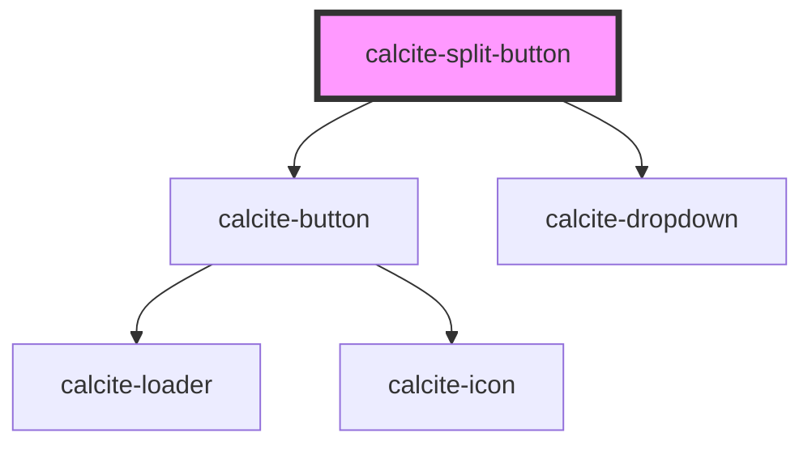

# calcite-split-button

The calcite-split-button control is one that combines a button with a dropdown menu in order to provide a primary action along with one or more related secondary options / actions. It's useful for grouping related actions or options for users, while elevating a commonly-used or default action for easier access. Its inner content populates the control's dropdown menu, and is thus expected to be valid `calcite-dropdown` content.

<!-- Auto Generated Below -->

## Usage

### Basic

```html
<calcite-split-button primary-icon-start="addLayer" primary-text="Add a layer">
  <calcite-dropdown-group selection-mode="none">
    <calcite-dropdown-item>Trails</calcite-dropdown-item>
    <calcite-dropdown-item>Lakes</calcite-dropdown-item>
    <calcite-dropdown-item>Rivers</calcite-dropdown-item>
  </calcite-dropdown-group>
</calcite-split-button>
```

## Properties

| Property             | Attribute               | Description                                                                                                                                                                                                                                                                                                                                                                 | Type                                                      | Default      |
| -------------------- | ----------------------- | --------------------------------------------------------------------------------------------------------------------------------------------------------------------------------------------------------------------------------------------------------------------------------------------------------------------------------------------------------------------------- | --------------------------------------------------------- | ------------ |
| `appearance`         | `appearance`            | Specifies the appearance style of the component.                                                                                                                                                                                                                                                                                                                            | `"outline" \| "outline-fill" \| "solid" \| "transparent"` | `"solid"`    |
| `disabled`           | `disabled`              | When `true`, interaction is prevented and the component is displayed with lower opacity.                                                                                                                                                                                                                                                                                    | `boolean`                                                 | `false`      |
| `dropdownIconType`   | `dropdown-icon-type`    | Specifies the icon used for the dropdown menu.                                                                                                                                                                                                                                                                                                                              | `"caret" \| "chevron" \| "ellipsis" \| "overflow"`        | `"chevron"`  |
| `dropdownLabel`      | `dropdown-label`        | Accessible name for the dropdown menu.                                                                                                                                                                                                                                                                                                                                      | `string`                                                  | `undefined`  |
| `kind`               | `kind`                  | Specifies the kind of the component (will apply to border and background if applicable).                                                                                                                                                                                                                                                                                    | `"brand" \| "danger" \| "inverse" \| "neutral"`           | `"brand"`    |
| `loading`            | `loading`               | When `true`, a busy indicator is displayed on the primary button.                                                                                                                                                                                                                                                                                                           | `boolean`                                                 | `false`      |
| `overlayPositioning` | `overlay-positioning`   | Determines the type of positioning to use for the overlaid content. Using `"absolute"` will work for most cases. The component will be positioned inside of overflowing parent containers and will affect the container's layout. `"fixed"` should be used to escape an overflowing parent container, or when the reference element's `position` CSS property is `"fixed"`. | `"absolute" \| "fixed"`                                   | `"absolute"` |
| `primaryIconEnd`     | `primary-icon-end`      | Specifies an icon to display at the end of the primary button.                                                                                                                                                                                                                                                                                                              | `string`                                                  | `undefined`  |
| `primaryIconFlipRtl` | `primary-icon-flip-rtl` | Displays the `primaryIconStart` and/or `primaryIconEnd` as flipped when the element direction is right-to-left (`"rtl"`).                                                                                                                                                                                                                                                   | `"both" \| "end" \| "start"`                              | `undefined`  |
| `primaryIconStart`   | `primary-icon-start`    | Specifies an icon to display at the start of the primary button.                                                                                                                                                                                                                                                                                                            | `string`                                                  | `undefined`  |
| `primaryLabel`       | `primary-label`         | Accessible name for the primary button.                                                                                                                                                                                                                                                                                                                                     | `string`                                                  | `undefined`  |
| `primaryText`        | `primary-text`          | Text displayed in the primary button.                                                                                                                                                                                                                                                                                                                                       | `string`                                                  | `undefined`  |
| `scale`              | `scale`                 | Specifies the size of the component.                                                                                                                                                                                                                                                                                                                                        | `"l" \| "m" \| "s"`                                       | `"m"`        |
| `width`              | `width`                 | Specifies the width of the component.                                                                                                                                                                                                                                                                                                                                       | `"auto" \| "full" \| "half"`                              | `"auto"`     |

## Events

| Event                              | Description                               | Type                |
| ---------------------------------- | ----------------------------------------- | ------------------- |
| `calciteSplitButtonPrimaryClick`   | Fires when the primary button is clicked. | `CustomEvent<void>` |
| `calciteSplitButtonSecondaryClick` | Fires when the dropdown menu is clicked.  | `CustomEvent<void>` |

## Methods

### `setFocus() => Promise<void>`

Sets focus on the component's first focusable element.

#### Returns

Type: `Promise<void>`

## Slots

| Slot | Description                                   |
| ---- | --------------------------------------------- |
|      | A slot for adding `calcite-dropdown` content. |

## Dependencies

### Depends on

- [calcite-button](../button)
- [calcite-dropdown](../dropdown)

### Graph



---

*Built with [StencilJS](https://stenciljs.com/)*
