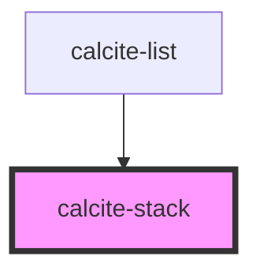

# calcite-stack

<!-- Auto Generated Below -->

## Properties

| Property   | Attribute  | Description                                                                     | Type      | Default |
| ---------- | ---------- | ------------------------------------------------------------------------------- | --------- | ------- |
| `disabled` | `disabled` | When `true`, content interaction is prevented and displayed with lower opacity. | `boolean` | `false` |

## Slots

| Slot              | Description                                                                                 |
| ----------------- | ------------------------------------------------------------------------------------------- |
|                   | A slot for adding content.                                                                  |
| `"actions-end"`   | A slot for adding actionable `calcite-action` elements after the content of the component.  |
| `"actions-start"` | A slot for adding actionable `calcite-action` elements before the content of the component. |
| `"content-end"`   | A slot for adding non-actionable elements after content of the component.                   |
| `"content-start"` | A slot for adding non-actionable elements before content of the component.                  |

## CSS Custom Properties

| Name                             | Description                                              |
| -------------------------------- | -------------------------------------------------------- |
| `--calcite-stack-padding-block`  | Specifies the block padding of the component's content.  |
| `--calcite-stack-padding-inline` | Specifies the inline padding of the component's content. |

## Dependencies

### Used by

- [calcite-list](../list)

### Graph

---

*Built with [StencilJS](https://stenciljs.com/)*
