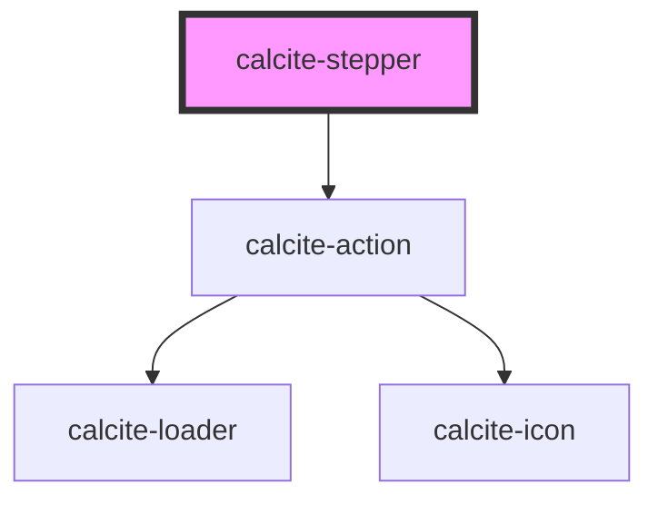

# calcite-stepper

Calcite stepper can be used to present a stepper workflow to a user. It has configurable display options for layout (horizontal or vertical), and the ability to automatically render status icons, and step numbers.

<!-- Auto Generated Below -->

## Usage

### Basic

```html
<calcite-stepper icon numbered id="my-example-stepper">
  <calcite-stepper-item heading="Choose Group" description="Select a group to make changes" complete>
    <calcite-notice width="full" open>
      <div slot="title">
        In this step, choose a group from the list to make changes. Make sure to select the right one for your updates.
      </div>
    </calcite-notice>
  </calcite-stepper-item>
  <calcite-stepper-item heading="Compile Member List" description="Add or remove members from the list" complete>
    <calcite-notice width="full" open>
      <div slot="title">
        Now, compile the member list. Add or remove members as needed. Ensure the list is accurate before proceeding to
        the next step.
      </div>
    </calcite-notice>
  </calcite-stepper-item>
  <calcite-stepper-item heading="Set Member Properties" description="Specify properties for each member" selected>
    <calcite-notice width="full" open>
      <div slot="title">
        In this step, set individual properties for each member. Customize their details to meet your requirements.
      </div>
    </calcite-notice>
  </calcite-stepper-item>
  <calcite-stepper-item heading="Confirm and Complete" description="Review and finalize your changes" disabled>
    <calcite-notice width="full" open>
      <div slot="title">
        Review the changes you've made in the previous steps. Once confirmed, proceed to complete the process. This step
        is currently disabled.
      </div>
    </calcite-notice>
  </calcite-stepper-item>
</calcite-stepper>
```

## Properties

| Property           | Attribute          | Description                                                                  | Type                                                            | Default        |
| ------------------ | ------------------ | ---------------------------------------------------------------------------- | --------------------------------------------------------------- | -------------- |
| `icon`             | `icon`             | When `true`, displays a status icon in the `calcite-stepper-item` heading.   | `boolean`                                                       | `false`        |
| `layout`           | `layout`           | Defines the layout of the component.                                         | `"horizontal" \| "horizontal-single" \| "vertical"`             | `"horizontal"` |
| `messageOverrides` | --                 | Use this property to override individual strings used by the component.      | `{ label?: string; previousStep?: string; nextStep?: string; }` | `undefined`    |
| `numbered`         | `numbered`         | When `true`, displays the step number in the `calcite-stepper-item` heading. | `boolean`                                                       | `false`        |
| `numberingSystem`  | `numbering-system` | Specifies the Unicode numeral system used by the component for localization. | `"arab" \| "arabext" \| "latn"`                                 | `undefined`    |
| `scale`            | `scale`            | Specifies the size of the component.                                         | `"l" \| "m" \| "s"`                                             | `"m"`          |
| `selectedItem`     | --                 | Specifies the component's selected item.                                     | `HTMLCalciteStepperItemElement`                                 | `null`         |

## Events

| Event                      | Description                                           | Type                |
| -------------------------- | ----------------------------------------------------- | ------------------- |
| `calciteStepperItemChange` | Fires when the active `calcite-stepper-item` changes. | `CustomEvent<void>` |

## Methods

### `endStep() => Promise<void>`

Set the last `calcite-stepper-item` as active.

#### Returns

Type: `Promise<void>`

### `goToStep(step: number) => Promise<void>`

Set a specified `calcite-stepper-item` as active.

#### Parameters

| Name   | Type     | Description |
| ------ | -------- | ----------- |
| `step` | `number` |             |

#### Returns

Type: `Promise<void>`

### `nextStep() => Promise<void>`

Set the next `calcite-stepper-item` as active.

#### Returns

Type: `Promise<void>`

### `prevStep() => Promise<void>`

Set the previous `calcite-stepper-item` as active.

#### Returns

Type: `Promise<void>`

### `startStep() => Promise<void>`

Set the first `calcite-stepper-item` as active.

#### Returns

Type: `Promise<void>`

## Slots

| Slot | Description                                        |
| ---- | -------------------------------------------------- |
|      | A slot for adding `calcite-stepper-item` elements. |

## CSS Custom Properties

| Name                                               | Description                                                                      |
| -------------------------------------------------- | -------------------------------------------------------------------------------- |
| `--calcite-stepper-action-background-color`        | defines the background color of an action sub-component inside the component.    |
| `--calcite-stepper-action-background-color-active` | defines the background color of an action sub-component when active.             |
| `--calcite-stepper-action-background-color-hover`  | defines the background color of an action sub-component when hovered or focused. |

## Dependencies

### Depends on

- [calcite-action](../action)

### Graph



---

*Built with [StencilJS](https://stenciljs.com/)*
