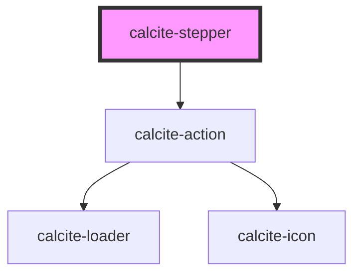

# calcite-stepper

For comprehensive guidance on using and implementing `calcite-stepper`, refer to the [documentation page](https://developers.arcgis.com/calcite-design-system/components/stepper/).

<!-- Auto Generated Below -->

## Properties

| Property           | Attribute           | Description                                                                  | Type                                                | Default        |
| ------------------ | ------------------- | ---------------------------------------------------------------------------- | --------------------------------------------------- | -------------- |
| `icon`             | `icon`              | When `true`, displays a status icon in the `calcite-stepper-item` heading.   | `boolean`                                           | `false`        |
| `layout`           | `layout`            | Defines the layout of the component.                                         | `"horizontal" \| "horizontal-single" \| "vertical"` | `"horizontal"` |
| `messageOverrides` | `message-overrides` | Use this property to override individual strings used by the component.      | `StepperMessages`                                   | `undefined`    |
| `numbered`         | `numbered`          | When `true`, displays the step number in the `calcite-stepper-item` heading. | `boolean`                                           | `false`        |
| `numberingSystem`  | `numbering-system`  | Specifies the Unicode numeral system used by the component for localization. | `"arab" \| "arabext" \| "latn"`                     | `undefined`    |
| `scale`            | `scale`             | Specifies the size of the component.                                         | `"l" \| "m" \| "s"`                                 | `"m"`          |
| `selectedItem`     | --                  | Specifies the component's selected item.                                     | `HTMLCalciteStepperItemElement`                     | `null`         |

## Events

| Event                      | Description                                                                                                                                                                                       | Type                |
| -------------------------- | ------------------------------------------------------------------------------------------------------------------------------------------------------------------------------------------------- | ------------------- |
| `calciteStepperChange`     | Fires when the active `calcite-stepper-item` changes.                                                                                                                                             | `CustomEvent<void>` |
| `calciteStepperItemChange` | **[DEPRECATED]** use `calciteStepperChange` instead or `calciteStepperItemChange` on items instead.  Fires when the active `calcite-stepper-item` changes. | `CustomEvent<void>` |

## Methods

### `endStep() => Promise<void>`

Set the last `calcite-stepper-item` as active.

#### Returns

Type: `Promise<void>`

### `goToStep(step: number) => Promise<void>`

Set a specified `calcite-stepper-item` as active.

#### Parameters

| Name   | Type     | Description |
| ------ | -------- | ----------- |
| `step` | `number` |             |

#### Returns

Type: `Promise<void>`

### `nextStep() => Promise<void>`

Set the next `calcite-stepper-item` as active.

#### Returns

Type: `Promise<void>`

### `prevStep() => Promise<void>`

Set the previous `calcite-stepper-item` as active.

#### Returns

Type: `Promise<void>`

### `startStep() => Promise<void>`

Set the first `calcite-stepper-item` as active.

#### Returns

Type: `Promise<void>`

## Slots

| Slot | Description                                        |
| ---- | -------------------------------------------------- |
|      | A slot for adding `calcite-stepper-item` elements. |

## Dependencies

### Depends on

- [calcite-action](../action)

### Graph

---

*Built with [StencilJS](https://stenciljs.com/)*
