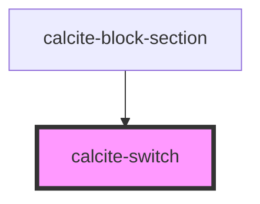

# calcite-switch

`calcite-switch` is used to toggle a value on or off.

<!-- Auto Generated Below -->

## Usage

### Basic

```html
<label>
  Off
  <calcite-switch checked></calcite-switch>
  On
</label>
```

## Properties

| Property   | Attribute  | Description                                                                                                                                             | Type                | Default     |
| ---------- | ---------- | ------------------------------------------------------------------------------------------------------------------------------------------------------- | ------------------- | ----------- |
| `checked`  | `checked`  | When `true`, the component is checked.                                                                                                                  | `boolean`           | `false`     |
| `disabled` | `disabled` | When `true`, interaction is prevented and the component is displayed with lower opacity.                                                                | `boolean`           | `false`     |
| `form`     | `form`     | The `id` of the form that will be associated with the component. When not set, the component will be associated with its ancestor form element, if any. | `string`            | `undefined` |
| `label`    | `label`    | Accessible name for the component.                                                                                                                      | `string`            | `undefined` |
| `name`     | `name`     | Specifies the name of the component. Required to pass the component's `value` on form submission.                                                       | `string`            | `undefined` |
| `scale`    | `scale`    | Specifies the size of the component.                                                                                                                    | `"l" \| "m" \| "s"` | `"m"`       |
| `value`    | `value`    | The component's value.                                                                                                                                  | `any`               | `undefined` |

## Events

| Event                 | Description                                 | Type                |
| --------------------- | ------------------------------------------- | ------------------- |
| `calciteSwitchChange` | Fires when the `checked` value has changed. | `CustomEvent<void>` |

## Methods

### `setFocus() => Promise<void>`

Sets focus on the component.

#### Returns

Type: `Promise<void>`

## Dependencies

### Used by

- [calcite-block-section](../block-section)

### Graph



---

*Built with [StencilJS](https://stenciljs.com/)*
