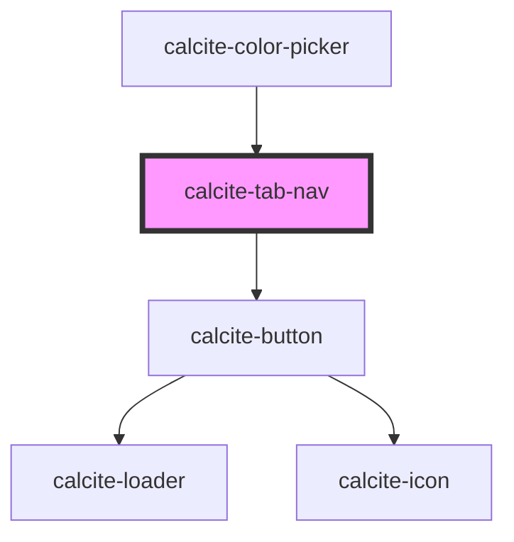

# calcite-tab-nav

For comprehensive guidance on using and implementing `calcite-tab-nav`, refer to the [documentation page](https://developers.arcgis.com/calcite-design-system/components/tab-nav/).

<!-- Auto Generated Below -->

## Usage

### Basic

Tabs `scale` and `position` properties are inherited by it's child components, tab-nav and tab-title.

```html
<calcite-tabs scale="l" position="bottom">
  <calcite-tab-nav>
    <calcite-tab-title>Layers</calcite-tab-title>
    <calcite-tab-title>Maps</calcite-tab-title>
    <calcite-tab-title selected>Data</calcite-tab-title>
  </calcite-tab-nav>
</calcite-tabs>
```

## Properties

| Property           | Attribute           | Description                                                                   | Type                         | Default     |
| ------------------ | ------------------- | ----------------------------------------------------------------------------- | ---------------------------- | ----------- |
| `messageOverrides` | `message-overrides` | Use this property to override individual strings used by the component.       | `TabNavMessages`             | `undefined` |
| `selectedTitle`    | --                  | Specifies the component's selected `calcite-tab-title`.                       | `HTMLCalciteTabTitleElement` | `null`      |
| `storageId`        | `storage-id`        | Specifies the name when saving selected `calcite-tab` data to `localStorage`. | `string`                     | `undefined` |
| `syncId`           | `sync-id`           | Specifies text to update multiple components to keep in sync if one changes.  | `string`                     | `undefined` |

## Events

| Event              | Description                                    | Type                |
| ------------------ | ---------------------------------------------- | ------------------- |
| `calciteTabChange` | Emits when the selected `calcite-tab` changes. | `CustomEvent<void>` |

## Slots

| Slot | Description                             |
| ---- | --------------------------------------- |
|      | A slot for adding `calcite-tab-title`s. |

## Dependencies

### Used by

- [calcite-color-picker](../color-picker)

### Depends on

- [calcite-button](../button)

### Graph



---

*Built with [StencilJS](https://stenciljs.com/)*
