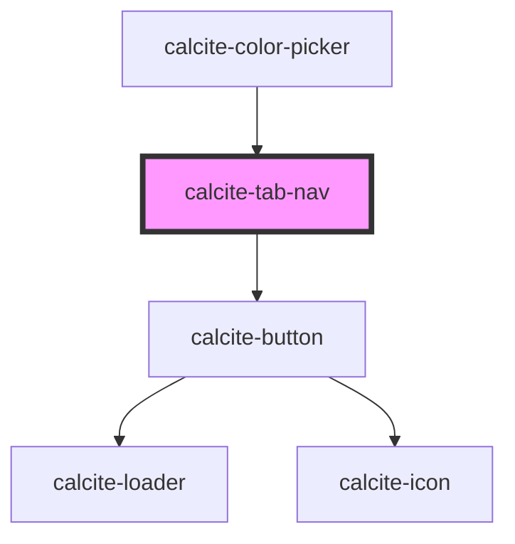

# calcite-tab-nav

The tab-nav groups several [calcite-tab-title](../tab-title) components and builds out the navigation. You can optionally use attibutes on the tab-nav to configure client side storage of the selected tab.

<!-- Auto Generated Below -->

## Usage

### Basic

Tabs `scale` and `position` properties are inherited by it's child components, tab-nav and tab-title.

```html
<calcite-tabs scale="l" position="bottom">
  <calcite-tab-nav>
    <calcite-tab-title>Layers</calcite-tab-title>
    <calcite-tab-title>Maps</calcite-tab-title>
    <calcite-tab-title selected>Data</calcite-tab-title>
  </calcite-tab-nav>
</calcite-tabs>
```

## Properties

| Property           | Attribute    | Description                                                                   | Type                                                      | Default     |
| ------------------ | ------------ | ----------------------------------------------------------------------------- | --------------------------------------------------------- | ----------- |
| `messageOverrides` | --           | Use this property to override individual strings used by the component.       | `{ nextTabTitles?: string; previousTabTitles?: string; }` | `undefined` |
| `selectedTitle`    | --           | Specifies the component's selected `calcite-tab-title`.                       | `HTMLCalciteTabTitleElement`                              | `null`      |
| `storageId`        | `storage-id` | Specifies the name when saving selected `calcite-tab` data to `localStorage`. | `string`                                                  | `undefined` |
| `syncId`           | `sync-id`    | Specifies text to update multiple components to keep in sync if one changes.  | `string`                                                  | `undefined` |

## Events

| Event              | Description                                    | Type                |
| ------------------ | ---------------------------------------------- | ------------------- |
| `calciteTabChange` | Emits when the selected `calcite-tab` changes. | `CustomEvent<void>` |

## Slots

| Slot | Description                             |
| ---- | --------------------------------------- |
|      | A slot for adding `calcite-tab-title`s. |

## CSS Custom Properties

| Name                                               | Description                                                      |
| -------------------------------------------------- | ---------------------------------------------------------------- |
| `--calcite-tab-nav-button-background-color`        | defines the scroll button's background color.                    |
| `--calcite-tab-nav-button-background-color-active` | defines the scroll button's background color in an active state. |
| `--calcite-tab-nav-button-background-color-hover`  | defines the scroll button's background color in a hover state.   |
| `--calcite-tab-nav-button-border-color`            | defines the scroll button's border color.                        |
| `--calcite-tab-nav-button-border-color-active`     | defines the scroll button's border color in an active state.     |
| `--calcite-tab-nav-button-border-color-focus`      | defines the scroll button's border color in a focus state.       |
| `--calcite-tab-nav-button-border-color-hover`      | defines the scroll button's border color in a hover state.       |
| `--calcite-tab-nav-button-corner-radius`           | defines the scroll button's corner radius.                       |
| `--calcite-tab-nav-button-icon-color`              | Specifies the color of the scroll buttons' icon.                 |
| `--calcite-tab-nav-button-icon-color-active`       | Specifies the color of the scroll buttons' icon when active.     |
| `--calcite-tab-nav-button-icon-color-focus`        | Specifies the color of the scroll buttons' icon when focused.    |
| `--calcite-tab-nav-button-icon-color-hover`        | Specifies the color of the scroll buttons' icon when hovered.    |
| `--calcite-tab-nav-button-loader-color`            | defines the scroll button's loader color.                        |
| `--calcite-tab-nav-button-shadow`                  | defines the scroll button's shadow.                              |
| `--calcite-tab-nav-button-shadow-active`           | defines the scroll button's shadow color in an active state.     |
| `--calcite-tab-nav-button-shadow-focus`            | defines the scroll button's shadow color in a focus state.       |
| `--calcite-tab-nav-button-shadow-hover`            | defines the scroll button's shadow color in a hover state.       |
| `--calcite-tab-nav-button-text-color`              | defines the scroll button's text color.                          |
| `--calcite-tab-nav-button-text-color-active`       | defines the scroll button's text color in an active state.       |
| `--calcite-tab-nav-button-text-color-focus`        | defines the scroll button's text color in a focus state.         |
| `--calcite-tab-nav-button-text-color-hover`        | defines the scroll button's text color in a hover state.         |
| `--calcite-tab-nav-indicator-color`                | Specifies the color of the active tab indicator.                 |

## Dependencies

### Used by

- [calcite-color-picker](../color-picker)

### Depends on

- [calcite-button](../button)

### Graph



---

*Built with [StencilJS](https://stenciljs.com/)*
