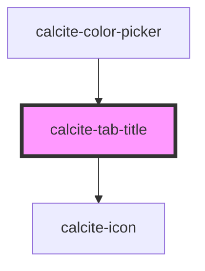

# calcite-tab-title

The tab-title is the link that switches between panes in [calcite-tabs](../tabs).

<!-- Auto Generated Below -->

## Properties

| Property           | Attribute           | Description                                                                                                                                       | Type                         | Default     |
| ------------------ | ------------------- | ------------------------------------------------------------------------------------------------------------------------------------------------- | ---------------------------- | ----------- |
| `closable`         | `closable`          | When `true`, a close button is added to the component.                                                                                            | `boolean`                    | `false`     |
| `closed`           | `closed`            | When `true`, does not display or position the component.                                                                                          | `boolean`                    | `false`     |
| `disabled`         | `disabled`          | When `true`, interaction is prevented and the component is displayed with lower opacity.                                                          | `boolean`                    | `false`     |
| `iconEnd`          | `icon-end`          | Specifies an icon to display at the end of the component.                                                                                         | `string`                     | `undefined` |
| `iconFlipRtl`      | `icon-flip-rtl`     | Displays the `iconStart` and/or `iconEnd` as flipped when the element direction is right-to-left (`"rtl"`).                                       | `"both" \| "end" \| "start"` | `undefined` |
| `iconStart`        | `icon-start`        | Specifies an icon to display at the start of the component.                                                                                       | `string`                     | `undefined` |
| `messageOverrides` | `message-overrides` | Use this property to override individual strings used by the component.                                                                           | `TabTitleMessages`           | `undefined` |
| `selected`         | `selected`          | When `true`, the component and its respective `calcite-tab` contents are selected. Only one tab can be selected within the `calcite-tabs` parent. | `boolean`                    | `false`     |
| `tab`              | `tab`               | Specifies a unique name for the component. When specified, use the same value on the `calcite-tab`.                                               | `string`                     | `undefined` |

## Events

| Event                 | Description                             | Type                |
| --------------------- | --------------------------------------- | ------------------- |
| `calciteTabsActivate` | Fires when a `calcite-tab` is selected. | `CustomEvent<void>` |
| `calciteTabsClose`    | Fires when a `calcite-tab` is closed.   | `CustomEvent<void>` |

## Methods

### `getTabIndex() => Promise<number>`

Returns the index of the title within the `calcite-tab-nav`.

#### Returns

Type: `Promise<number>`

## Slots

| Slot | Description             |
| ---- | ----------------------- |
|      | A slot for adding text. |

## Dependencies

### Used by

- [calcite-color-picker](../color-picker)

### Depends on

- [calcite-icon](../icon)

### Graph

---

*Built with [StencilJS](https://stenciljs.com/)*
