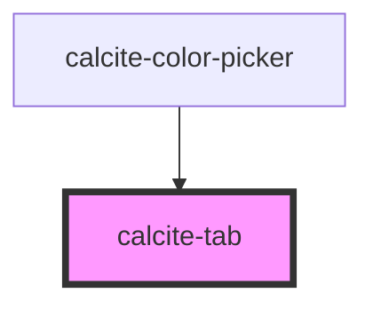

# calcite-tab

<!-- Auto Generated Below -->

## Usage

### Basic

`calcite-tab` wraps the content you would like to appear when that tab is selected:

```html
<calcite-tab>My stuff!</calcite-tab>
```

## Properties

| Property   | Attribute  | Description                                                                                                        | Type      | Default     |
| ---------- | ---------- | ------------------------------------------------------------------------------------------------------------------ | --------- | ----------- |
| `selected` | `selected` | When `true`, the component's contents are selected. Only one tab can be selected within the `calcite-tabs` parent. | `boolean` | `false`     |
| `tab`      | `tab`      | Specifies a unique name for the component. When specified, use the same value on the `calcite-tab-title`.          | `string`  | `undefined` |

## Methods

### `getTabIndex() => Promise<number>`

Returns the index of the component item within the tab array.

#### Returns

Type: `Promise<number>`

## Slots

| Slot | Description                       |
| ---- | --------------------------------- |
|      | A slot for adding custom content. |

## Dependencies

### Used by

- [calcite-color-picker](../color-picker)

### Graph



---

*Built with [StencilJS](https://stenciljs.com/)*
