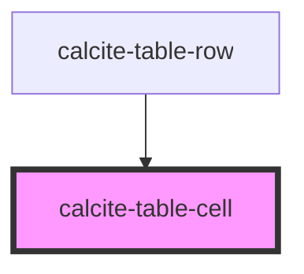

# calcite-table-cell

<!-- Auto Generated Below -->

## Properties

| Property           | Attribute   | Description                                                                               | Type                           | Default     |
| ------------------ | ----------- | ----------------------------------------------------------------------------------------- | ------------------------------ | ----------- |
| `alignment`        | `alignment` | Specifies the alignment of the component.                                                 | `"center" \| "end" \| "start"` | `"start"`   |
| `colSpan`          | `col-span`  |                                                                                           | `number`                       | `undefined` |
| `messageOverrides` | --          | Use this property to override individual strings used by the component.                   | `{ focusReadout?: string; }`   | `undefined` |
| `rowSpan`          | `row-span`  |                                                                                           | `number`                       | `undefined` |
| `scale`            | `scale`     | Specifies the size of the component.                                                      | `"l" \| "m" \| "s"`            | `"m"`       |
| `value`            | `value`     | Provide a value to the component - used to sort when table header is sortable and active. | `""`                           | `undefined` |

## Methods

### `setFocus() => Promise<void>`

Sets focus on the component's first focusable element.

#### Returns

Type: `Promise<void>`

## Slots

| Slot | Description                                      |
| ---- | ------------------------------------------------ |
|      | A slot for adding content, usually text content. |

## CSS Custom Properties

| Name                                | Description                                      |
| ----------------------------------- | ------------------------------------------------ |
| `--calcite-table-cell-background`   | Specifies the background color of the component. |
| `--calcite-table-cell-border-color` | Specifies the border color of the component.     |

## Dependencies

### Used by

- [calcite-table-row](../table-row)

### Graph

---

_Built with [StencilJS](https://stenciljs.com/)_
