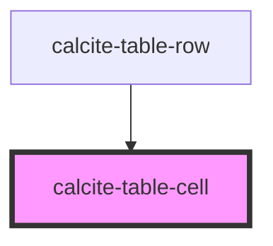

# calcite-table-cell

<!-- Auto Generated Below -->

## Properties

| Property           | Attribute           | Description                                                             | Type                           | Default     |
| ------------------ | ------------------- | ----------------------------------------------------------------------- | ------------------------------ | ----------- |
| `alignment`        | `alignment`         | Specifies the alignment of the component.                               | `"center" \| "end" \| "start"` | `"start"`   |
| `colSpan`          | `col-span`          | Specifies the number of columns the component should span.              | `number`                       | `undefined` |
| `messageOverrides` | `message-overrides` | Use this property to override individual strings used by the component. | `TableCellMessages`            | `undefined` |
| `rowSpan`          | `row-span`          | Specifies the number of rows the component should span.                 | `number`                       | `undefined` |

## Methods

### `setFocus() => Promise<void>`

Sets focus on the component.

#### Returns

Type: `Promise<void>`

## Slots

| Slot | Description                                      |
| ---- | ------------------------------------------------ |
|      | A slot for adding content, usually text content. |

## CSS Custom Properties

| Name                              | Description                                      |
| --------------------------------- | ------------------------------------------------ |
| `--calcite-table-cell-background` | Specifies the background color of the component. |

## Dependencies

### Used by

- [calcite-table-row](../table-row)

### Graph

---

*Built with [StencilJS](https://stenciljs.com/)*
