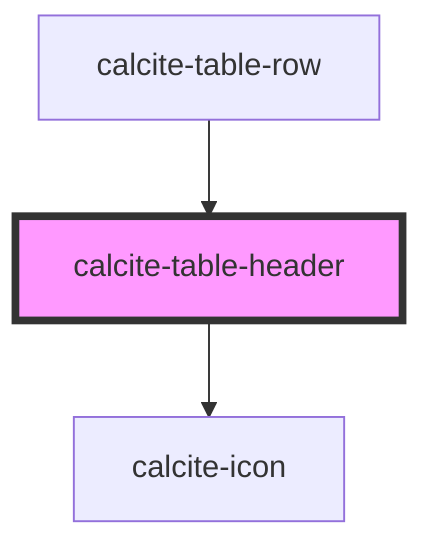

# calcite-table-header

<!-- Auto Generated Below -->

## Properties

| Property           | Attribute     | Description                                                             | Type                                                                                                                                           | Default     |
| ------------------ | ------------- | ----------------------------------------------------------------------- | ---------------------------------------------------------------------------------------------------------------------------------------------- | ----------- |
| `alignment`        | `alignment`   | Specifies the alignment of the component.                               | `"center" \| "end" \| "start"`                                                                                                                 | `"start"`   |
| `colSpan`          | `col-span`    | Specifies the number of columns the component should span.              | `number`                                                                                                                                       | `undefined` |
| `description`      | `description` | A description to display beneath heading content.                       | `string`                                                                                                                                       | `undefined` |
| `heading`          | `heading`     | A heading to display above description content.                         | `string`                                                                                                                                       | `undefined` |
| `messageOverrides` | --            | Use this property to override individual strings used by the component. | `{ all?: string; keyboardDeselectAll?: string; keyboardSelectAll?: string; rowNumber?: string; selected?: string; selectionColumn?: string; }` | `undefined` |
| `rowSpan`          | `row-span`    | Specifies the number of rows the component should span.                 | `number`                                                                                                                                       | `undefined` |

## Methods

### `setFocus() => Promise<void>`

Sets focus on the component.

#### Returns

Type: `Promise<void>`

## CSS Custom Properties

| Name                                  | Description                                      |
| ------------------------------------- | ------------------------------------------------ |
| `--calcite-table-header-background`   | Specifies the background color of the component. |
| `--calcite-table-header-border-color` | Specifies the border color of the component.     |

## Dependencies

### Used by

- [calcite-table-row](../table-row)

### Depends on

- [calcite-icon](../icon)

### Graph

---

*Built with [StencilJS](https://stenciljs.com/)*
