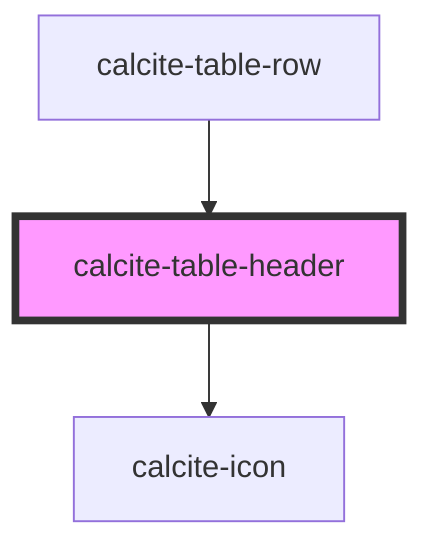

# calcite-table-header

<!-- Auto Generated Below -->

## Properties

| Property           | Attribute     | Description                                                                                               | Type                                                                                             | Default     |
| ------------------ | ------------- | --------------------------------------------------------------------------------------------------------- | ------------------------------------------------------------------------------------------------ | ----------- |
| `alignment`        | `alignment`   | Specifies the alignment of the component.                                                                 | `"center" \| "end" \| "start"`                                                                   | `"start"`   |
| `colSpan`          | `col-span`    |                                                                                                           | `number`                                                                                         | `undefined` |
| `description`      | `description` | A description to display beneath heading content.                                                         | `string`                                                                                         | `undefined` |
| `heading`          | `heading`     | A heading to display above description content.                                                           | `string`                                                                                         | `undefined` |
| `label`            | `label`       |                                                                                                           | `string`                                                                                         | `""`        |
| `messageOverrides` | --            | Use this property to override individual strings used by the component.                                   | `{ focusReadout?: string; sortAscending?: string; sortDescending?: string; sortNone?: string; }` | `undefined` |
| `rowSpan`          | `row-span`    |                                                                                                           | `number`                                                                                         | `undefined` |
| `scale`            | `scale`       | Specifies the size of the component.                                                                      | `"l" \| "m" \| "s"`                                                                              | `"m"`       |
| `sortable`         | `sortable`    | Specifies if the component should be able to sort associated `calcite-table-cell` ascending or descending | `boolean`                                                                                        | `false`     |

## Methods

### `setFocus() => Promise<void>`

Sets focus on the component's first focusable element.

#### Returns

Type: `Promise<void>`

## Slots

| Slot            | Description                                      |
| --------------- | ------------------------------------------------ |
| `"actions-end"` | A slot for adding content, usually text content. |

## CSS Custom Properties

| Name                                  | Description                                      |
| ------------------------------------- | ------------------------------------------------ |
| `--calcite-table-header-background`   | Specifies the background color of the component. |
| `--calcite-table-header-border-color` | Specifies the border color of the component.     |

## Dependencies

### Used by

- [calcite-table-row](../table-row)

### Depends on

- [calcite-icon](../icon)

### Graph

---

_Built with [StencilJS](https://stenciljs.com/)_
