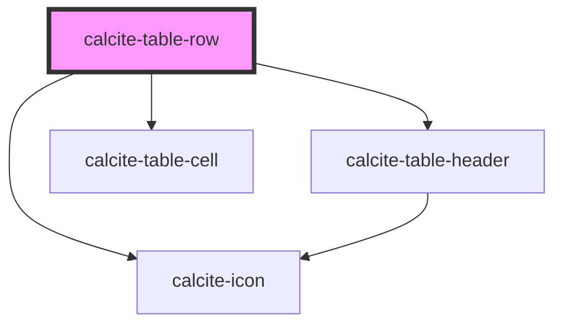

# calcite-table-row

<!-- Auto Generated Below -->

## Properties

| Property   | Attribute  | Description                                                                              | Type      | Default |
| ---------- | ---------- | ---------------------------------------------------------------------------------------- | --------- | ------- |
| `disabled` | `disabled` | When `true`, interaction is prevented and the component is displayed with lower opacity. | `boolean` | `false` |
| `selected` | `selected` | When `true`, the component is selected.                                                  | `boolean` | `false` |

## Events

| Event                   | Description                                             | Type                |
| ----------------------- | ------------------------------------------------------- | ------------------- |
| `calciteTableRowSelect` | Fires when the selected state of the component changes. | `CustomEvent<void>` |

## Slots

| Slot | Description                                                                |
| ---- | -------------------------------------------------------------------------- |
|      | A slot for adding `calcite-table-cell` or `calcite-table-header` elements. |

## CSS Custom Properties

| Name                               | Description                                      |
| ---------------------------------- | ------------------------------------------------ |
| `--calcite-table-row-background`   | Specifies the background color of the component. |
| `--calcite-table-row-border-color` | Specifies the border color of the component.     |

## Dependencies

### Depends on

- [calcite-icon](../icon)
- [calcite-table-header](../table-header)
- [calcite-table-cell](../table-cell)

### Graph

---

_Built with [StencilJS](https://stenciljs.com/)_
