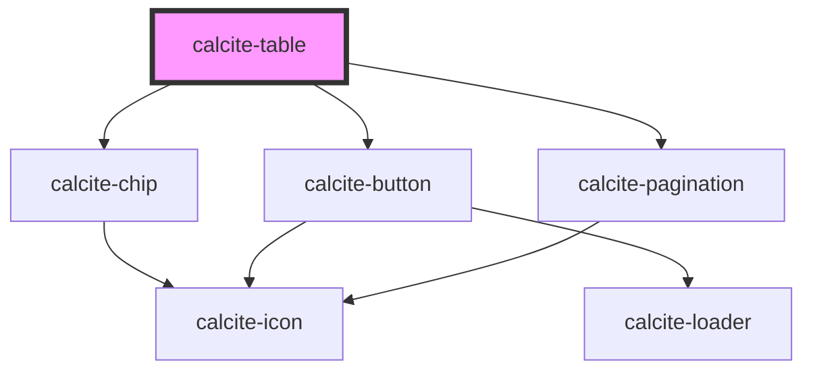

# calcite-table

<!-- Auto Generated Below -->

## Usage

### Advanced

A complex table component, with selection modes and slotted actions, pagination, and various display options configured.

```html
<calcite-table page-size="4" selection-mode="multiple" numbered bordered caption="Example table">
  <calcite-action slot="selection-actions" icon="layer"></calcite-action>
  <calcite-action slot="selection-actions" icon="send"></calcite-action>
  <calcite-action slot="selection-actions" icon="copy"></calcite-action>
  <calcite-action slot="selection-actions" icon="plus"></calcite-action>
  <calcite-table-row slot="table-header">
    <calcite-table-header heading="Heading"></calcite-table-header>
    <calcite-table-header heading="Heading"></calcite-table-header>
    <calcite-table-header heading="Heading"></calcite-table-header>
    <calcite-table-header heading="Heading"></calcite-table-header>
  </calcite-table-row>
  <calcite-table-row>
    <calcite-table-cell>cell</calcite-table-cell>
    <calcite-table-cell>cell</calcite-table-cell>
    <calcite-table-cell>cell</calcite-table-cell>
    <calcite-table-cell>cell</calcite-table-cell>
  </calcite-table-row>
  <calcite-table-row selected>
    <calcite-table-cell>cell</calcite-table-cell>
    <calcite-table-cell>cell</calcite-table-cell>
    <calcite-table-cell>cell</calcite-table-cell>
    <calcite-table-cell>cell</calcite-table-cell>
  </calcite-table-row>
  <calcite-table-row selected>
    <calcite-table-cell>cell</calcite-table-cell>
    <calcite-table-cell>cell</calcite-table-cell>
    <calcite-table-cell>cell</calcite-table-cell>
    <calcite-table-cell>cell</calcite-table-cell>
  </calcite-table-row>
  <calcite-table-row>
    <calcite-table-cell>cell</calcite-table-cell>
    <calcite-table-cell>cell</calcite-table-cell>
    <calcite-table-cell>cell</calcite-table-cell>
    <calcite-table-cell>cell</calcite-table-cell>
  </calcite-table-row>
  <calcite-table-row>
    <calcite-table-cell>cell</calcite-table-cell>
    <calcite-table-cell>cell</calcite-table-cell>
    <calcite-table-cell>cell</calcite-table-cell>
    <calcite-table-cell>cell</calcite-table-cell>
  </calcite-table-row>
  <calcite-table-row>
    <calcite-table-cell>cell</calcite-table-cell>
    <calcite-table-cell>cell</calcite-table-cell>
    <calcite-table-cell>cell</calcite-table-cell>
    <calcite-table-cell>cell</calcite-table-cell>
  </calcite-table-row>
  <calcite-table-row selected>
    <calcite-table-cell>cell</calcite-table-cell>
    <calcite-table-cell>cell</calcite-table-cell>
    <calcite-table-cell>cell</calcite-table-cell>
    <calcite-table-cell>cell</calcite-table-cell>
  </calcite-table-row>
  <calcite-table-row selected>
    <calcite-table-cell>cell</calcite-table-cell>
    <calcite-table-cell>cell</calcite-table-cell>
    <calcite-table-cell>cell</calcite-table-cell>
    <calcite-table-cell>cell</calcite-table-cell>
  </calcite-table-row>
  <calcite-table-row slot="table-footer">
    <calcite-table-cell></calcite-table-cell>
    <calcite-table-cell alignment="end">24,212</calcite-table-cell>
    <calcite-table-cell><calcite-chip scale="s" icon="smile">58% happiness</calcite-chip></calcite-table-cell>
    <calcite-table-cell> </calcite-table-cell>
  </calcite-table-row>
</calcite-table>
```

### Basic

A simple table component.

```html
<calcite-table caption="Example table">
  <calcite-table-row slot="table-header">
    <calcite-table-header heading="Heading" description="Description"></calcite-table-header>
    <calcite-table-header heading="Heading" description="Description"></calcite-table-header>
    <calcite-table-header heading="Heading" description="Description"></calcite-table-header>
    <calcite-table-header heading="Heading" description="Description"></calcite-table-header>
  </calcite-table-row>
  <calcite-table-row>
    <calcite-table-cell>cell</calcite-table-cell>
    <calcite-table-cell>cell</calcite-table-cell>
    <calcite-table-cell>cell</calcite-table-cell>
    <calcite-table-cell>cell</calcite-table-cell>
  </calcite-table-row>
  <calcite-table-row>
    <calcite-table-cell>cell</calcite-table-cell>
    <calcite-table-cell>cell</calcite-table-cell>
    <calcite-table-cell>cell</calcite-table-cell>
    <calcite-table-cell>cell</calcite-table-cell>
  </calcite-table-row>
  <calcite-table-row>
    <calcite-table-cell>cell</calcite-table-cell>
    <calcite-table-cell>cell</calcite-table-cell>
    <calcite-table-cell>cell</calcite-table-cell>
    <calcite-table-cell>cell</calcite-table-cell>
  </calcite-table-row>
</calcite-table>
```

## Properties

| Property               | Attribute          | Description                                                                                                                                                                                              | Type                                                                                           | Default     |
| ---------------------- | ------------------ | -------------------------------------------------------------------------------------------------------------------------------------------------------------------------------------------------------- | ---------------------------------------------------------------------------------------------- | ----------- |
| `bordered`             | `bordered`         | When `true`, displays borders in the component.                                                                                                                                                          | `boolean`                                                                                      | `false`     |
| `caption` *(required)* | `caption`          | Specifies an accessible title for the component.                                                                                                                                                         | `string`                                                                                       | `undefined` |
| `groupSeparator`       | `group-separator`  | When `true`, number values are displayed with a group separator corresponding to the language and country format.                                                                                        | `boolean`                                                                                      | `false`     |
| `layout`               | `layout`           | Specifies the layout of the component.                                                                                                                                                                   | `"auto" \| "fixed"`                                                                            | `"auto"`    |
| `messageOverrides`     | --                 | Use this property to override individual strings used by the component.                                                                                                                                  | `{ clear?: string; hiddenSelected?: string; page?: string; row?: string; selected?: string; }` | `undefined` |
| `numbered`             | `numbered`         | When `true`, displays the position of the row in numeric form.                                                                                                                                           | `boolean`                                                                                      | `false`     |
| `numberingSystem`      | `numbering-system` | Specifies the Unicode numeral system used by the component for localization.                                                                                                                             | `"arab" \| "arabext" \| "latn"`                                                                | `undefined` |
| `pageSize`             | `page-size`        | Specifies the page size of the component. When `true`, renders `calcite-pagination`.                                                                                                                     | `number`                                                                                       | `0`         |
| `scale`                | `scale`            | Specifies the size of the component.                                                                                                                                                                     | `"l" \| "m" \| "s"`                                                                            | `"m"`       |
| `selectedItems`        | --                 | Specifies the component's selected items.                                                                                                                                                                | `HTMLCalciteTableRowElement[]`                                                                 | `[]`        |
| `selectionMode`        | `selection-mode`   | Specifies the selection mode - `"none"` (no `calcite-table-row` selections), `"single"` (allow one `calcite-table-row` selection), or `"multiple"` (allow any number of `calcite-table-row` selections). | `"multiple" \| "none" \| "single"`                                                             | `"none"`    |
| `striped`              | `striped`          | When `true`, displays striped styling in the component.                                                                                                                                                  | `boolean`                                                                                      | `false`     |
| `zebra`                | `zebra`            | <span style="color:red">**[DEPRECATED]**</span> Use the `striped` property instead.<br/><br/>When `true`, displays striped styling in the component.                                                     | `boolean`                                                                                      | `false`     |

## Events

| Event                    | Description                                        | Type                |
| ------------------------ | -------------------------------------------------- | ------------------- |
| `calciteTablePageChange` | Emits when the component's page selection changes. | `CustomEvent<void>` |
| `calciteTableSelect`     | Emits when the component's selected rows change.   | `CustomEvent<void>` |

## Slots

| Slot                  | Description                                                                                                            |
| --------------------- | ---------------------------------------------------------------------------------------------------------------------- |
|                       | A slot for adding `calcite-table-row` elements containing `calcite-table-cell` and/or `calcite-table-header` elements. |
| `"selection-actions"` | A slot for adding a `calcite-action-bar` or other elements to display when `selectionMode` is not `"none"`.            |
| `"table-footer"`      | A slot for adding `calcite-table-row` elements containing `calcite-table-cell` and/or `calcite-table-header` elements. |
| `"table-header"`      | A slot for adding `calcite-table-row` elements containing `calcite-table-header` elements.                             |

## Dependencies

### Depends on

- [calcite-chip](../chip)
- [calcite-button](../button)
- [calcite-pagination](../pagination)

### Graph



---

*Built with [StencilJS](https://stenciljs.com/)*
